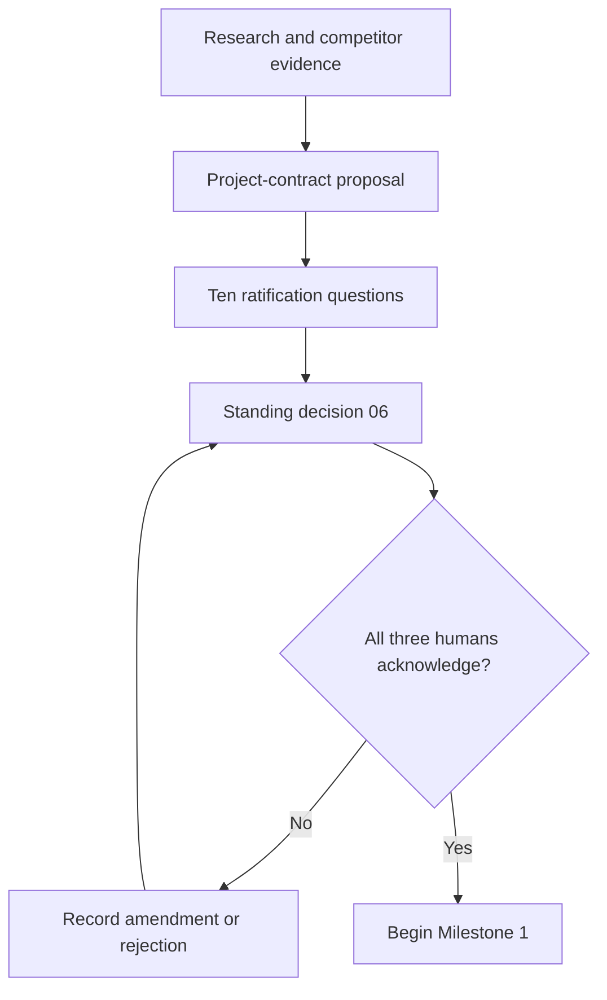

# Milestone 0 — Ratification and Standards Boundary

Target: **2–3 working days**

Status: **Complete — ratified by all three developers on August 20, 2026**

Governing decision: [`../06-contract-ratification-decision.md`](../06-contract-ratification-decision.md)

## Outcome

All three developers agree on the object ANVILMARK owns, the standards it exports, the security claims it may make, and the narrow Atlas acceptance test before product code begins.

Milestone 0 prevents three developers and their agents from implementing three incompatible interpretations of ANVILMARK.

## Gate

Coding agents may summarize or challenge the decision. They may not record acceptance on behalf of a developer.

## Decisions frozen for the first slice

- `packages/project-contract` is an independent schema line beginning at `0.1.0-draft.1`.
- Workload is the primary decision unit; component and project scopes are also valid.
- Constraint severity is hard, soft, or informational; soft constraints include direction.
- User priority order is explicit and does not become an opaque global score.
- ANVILMARK architecture is authoritative; Mermaid and CALM 1.2 are generated exports.
- Approval is interactive local CLI only, over resolved content, with no noninteractive bypass.
- Evidence uses T0–T3 tiers and per-subject floors.
- TypeScript and JavaScript share the first compiler-API detector; Python follows later.
- promptfoo and llmfit are optional subprocess adapters.
- Remote intelligence receives a safe public projection by default.
- The provider allowlist and deliberately partial direct-data-flow analysis are separate rules.
- The Atlas suite includes compliant, directly violating, and ambiguous variants.

## Completed design evidence

- [`../01-shared-benchmark-scenario.md`](../01-shared-benchmark-scenario.md) fixes the Atlas problem.
- [`../02-competitor-hands-on-matrix.md`](../02-competitor-hands-on-matrix.md) records observed substitute coverage.
- [`../03-decision-contract-proposal.md`](../03-decision-contract-proposal.md) defines the contract shape.
- [`../05-contract-ratification-answers.md`](../05-contract-ratification-answers.md) preserves the reasoning record.
- [`../06-contract-ratification-decision.md`](../06-contract-ratification-decision.md) records the accepted and amended standing decisions.
- [`../fixtures/atlas-project.draft.yaml`](../fixtures/atlas-project.draft.yaml) proves the benchmark is representable.
- [`../spikes/atlas-calm-1.2.export.json`](../spikes/atlas-calm-1.2.export.json) validates the CALM export boundary.

## Recorded acknowledgements

| Developer | Decision   | Date            |
| --------- | ---------- | --------------- |
| Anurag    | **Accept** | August 20, 2026 |
| Navaneeth | **Accept** | August 20, 2026 |
| Aaradhya  | **Accept** | August 20, 2026 |

No amendment or rejection was recorded. Any future amendment must identify the affected contract field, invariant, milestone, and Atlas acceptance test. Broad preferences without an executable consequence do not reopen the baseline.

## Exit checklist

- [x] All three human developers have acknowledged document 06.
- [x] No amendment or rejection remains unresolved.
- [x] No core field is tied to one model, provider, agent, cloud, or optional tool.
- [x] The historical contract remains frozen.
- [x] CALM is recorded as export-only for the first slice.
- [x] Approval limitations are understood and documented.
- [x] Evidence floors are accepted as the basis of pass/fail/unknown.
- [x] The deliberate Atlas violation is representable by two separate rules.
- [x] Milestone 1 responsibilities and review ownership are defined in its guide.

## Out of scope

- product implementation;
- additional broad competitor research;
- selecting a commercial business model;
- choosing a landing-page design;
- solving post-prototype licensing, hosting, or team-account questions.

## Handoff to Milestone 1

Milestone 1 is authorized to start from the accepted contract proposal and Atlas draft. It must not redesign the product through incidental schema choices. Any newly discovered contradiction returns to a written team decision before implementation continues.
