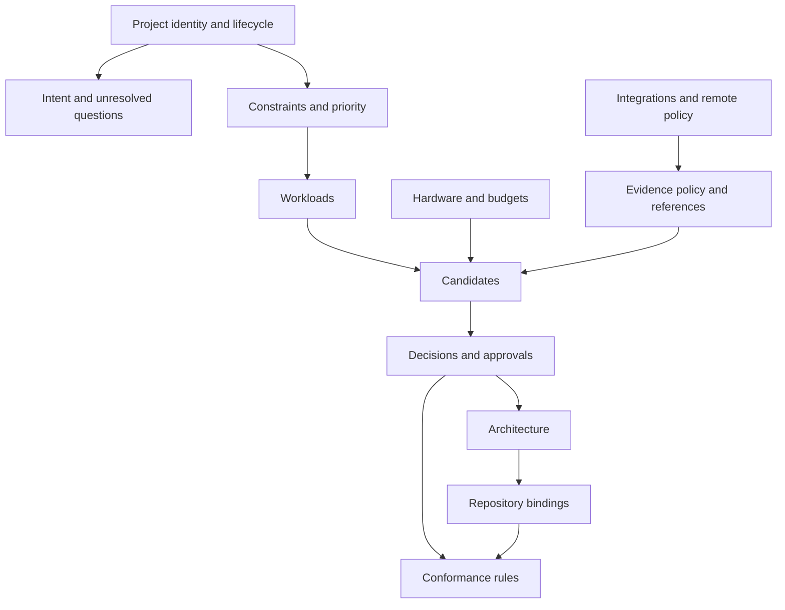

# Milestone 1 — Contract Package and Fixture

Target: **Week 1**

Status: **Complete — originally implemented in `packages/project-contract` at `0.1.0-draft.1`, corrected after independent review. The implementation has since moved to `0.1.0-draft.3` through amendments 1–4, ratified on September 13, 2026 under the scoped acknowledgement exception in [`../07-schema-amendment-proposal.md`](../07-schema-amendment-proposal.md), and to `0.1.0-draft.4` through amendments 6–7 in [`../08-milestone-3-scope-proposal.md`](../08-milestone-3-scope-proposal.md), accepted on September 14, 2026 under a separate scoped exception.**

Depends on: **Milestone 0 human gate (closed August 20, 2026)**

Primary owner: **Developer A — contract and evidence**

## Outcome

Convert the ratified project-contract design into a tested TypeScript package that can validate and deterministically serialize the Atlas project.

This milestone creates the trustworthy object every later feature reads. It does not create recommendations, repository scanning, diagrams, or a polished user workflow.

## Contract structure

## Required package

Create `packages/project-contract` with:

- `PROJECT_SCHEMA_VERSION = "0.1.0-draft.1"`;
- Zod runtime schemas and inferred TypeScript types;
- a public parse/validate API;
- YAML and JSON loaders;
- deterministic serializers;
- referential-integrity validation;
- resolved-content hashing for approvals;
- secret-pattern rejection;
- tests and documented exports.

Do not modify `packages/contract`, its `SCHEMA_VERSION`, or its public types.

## Required schema subjects

The first draft must represent:

- project identity, revision, state, owners, and repository references;
- intent, users, outcomes, non-goals, and unresolved questions;
- hard, soft, and informational constraints;
- soft direction and project priority order;
- workload inputs, outputs, usage assumptions, quality gates, and latency requirements;
- hardware and budgets;
- T0–T3 evidence policy and per-subject floors;
- managed, open-weight, and local candidates;
- workload, component, and project decision scopes;
- selected and rejected alternatives;
- authoritative architecture nodes and relationships;
- repository bindings and conformance rule declarations;
- integration credential references without secret values;
- remote-intelligence allow/deny projection;
- append-only approval records.

Unknown fields are rejected during the draft phase.

## Validation pipeline

```mermaid
flowchart LR
    Input[YAML or JSON] --> Syntax[Syntax parse]
    Syntax --> Schema[Zod schema]
    Schema --> Refs[Reference integrity]
    Refs --> Secrets[Secret rejection]
    Secrets --> Evidence[Evidence-floor invariants]
    Evidence --> Approval[Approval hash/currentness]
    Approval --> Normalized[Normalized contract]
    Normalized --> Stable[Deterministic serialization]
```

Each stage returns structured, actionable errors. Validation must not mutate the input silently.

## Core invariants

- IDs are unique within their subject collection.
- Every reference resolves to the correct subject type.
- Workload decisions cannot reference a candidate for another workload.
- Evidence below the relevant floor cannot produce `pass`.
- Declared target hardware and detected local hardware remain different subjects.
- Estimates and measurements remain distinguishable.
- Credential references are allowed; credential values are rejected.
- Approval covers the decision revision, selected candidate revision, cited evidence content, and constraint results.
- Editing resolved approved content makes the previous approval non-current without deleting history.
- Stable input produces byte-stable normalized output.

## Atlas fixture

Promote [`../fixtures/atlas-project.draft.yaml`](../fixtures/atlas-project.draft.yaml) into a package test fixture without inventing model selections or measurements.

The fixture must preserve:

- five application workloads;
- quality evaluation as an evidence-producing process rather than a workload;
- raw-ticket privacy and provider-independence hard constraints;
- cost and latency as directional soft constraints;
- the declared RTX 4090 target;
- empty decisions and approvals where the evidence is not yet present;
- ANVILMARK architecture authority and generated-view paths;
- remote-intelligence projection defaults.

## Required negative tests

- duplicate IDs;
- missing and wrong-type references;
- unknown fields;
- invalid decision scope;
- candidate/workload mismatch;
- evidence below a hard-gate floor;
- detected hardware presented as a different target;
- estimate presented as measurement;
- secret-shaped values in persistent fields;
- approval hash mismatch;
- approved content edited without a new revision;
- nondeterministic ordering or serialization.

## Suggested team split

### Developer A

- schema modules and public types;
- evidence tiers/floors;
- decision and approval model.

### Developer B

- referential-integrity validator;
- invariant and negative-test matrix;
- Atlas fixture review from future scanner/conformance needs.

### Developer C

- YAML/JSON loading and serialization;
- error envelope and package integration;
- consumer-ergonomics review for CLI and MCP.

Agree the public package exports and structured-error shape before parallel work begins.

## Out of scope

- calling Claude Code, Codex, promptfoo, or llmfit;
- selecting candidates;
- interactive approval CLI;
- Mermaid or CALM generation;
- MCP changes;
- repository parsing;
- conformance execution;
- landing page or product UI.

## Exit checklist

- [x] `packages/project-contract` exists (created at `0.1.0-draft.1`; now `0.1.0-draft.4`).
- [x] Historical `packages/contract` is unchanged.
- [x] Atlas validates without fabricated decisions or evidence.
- [x] Invalid references fail with structured errors.
- [x] Unknown evidence never satisfies a hard constraint.
- [x] Target inventory, compatibility estimate, and measured performance remain distinct.
- [x] Soft direction and priority order survive round trips.
- [x] Secret values are rejected.
- [x] Approval currentness changes when resolved content changes.
- [x] Repeated serialization is stable.
- [x] Formatting, lint, unit tests, and monorepo build pass.

## Implementation record

The package is documented in [`packages/project-contract/README.md`](../../../packages/project-contract/README.md).

Two schema amendments were made beyond the proposal, recorded here so they are
not mistaken for incidental choices. Both concern explicit evidence
attribution.

**First amendment.** Every evidence record carries an optional
`applies_to` block naming the candidate, workload, and hardware it describes.
Decision 06 section 6 states a requirement per subject rather than a universal
tier rule, and `subject` is free text; without structured attribution the
package could not honestly check that a measurement describes the candidate it
is cited for. Admissibility is therefore evaluated per floor subject, and
inadmissible evidence is excluded rather than counted at a lower tier.

**Second amendment.** `applies_to` also carries `constraint_refs: string[]`,
naming the claims the artifact supports. Kind and subject prevent broad
mismatches but cannot stop evidence gathered for one constraint being reused
for another in the same domain: an unrelated source-code observation was
satisfying a privacy gate, and a macro-F1 evaluation was satisfying a latency
gate because its candidate and workload matched. Evidence whose
`constraint_refs` omits the constraint under evaluation is now excluded and
yields `unknown`. The field is an array because one artifact may legitimately
support several claims; duplicates are rejected and every entry must resolve to
a declared constraint. Evidence cited by a constraint result must name that
result's constraint; direct `measurements.*` references remain exempt because
they describe the candidate rather than a claim.

Because `applies_to` is part of the evidence record, and approval hashes cover
each cited record's full content, re-attributing evidence invalidates an
existing approval.

The evidence evaluation API fails closed. `assessEvidence` and
`evaluateConstraint` take a mandatory `EvidenceContext`, and every context
field a subject depends on is treated as insufficient evidence when absent
rather than as a reason to skip the check. An earlier revision skipped the
candidate, workload, and hardware checks when the caller omitted those fields,
which let an unattributed evaluation, an unpriced cost comparison, and an
unlocated benchmark all reach `pass`. Milestone 2 adapters must supply context
to obtain a `pass`; omitting it can only ever produce `unknown`.

A projected-cost pass requires official pricing together with a recorded
projected monthly cost, a calculation basis, and workload usage inputs that are
recorded with their assumptions. Usage strength is read from the workload's
`expected_usage.basis`, not from candidate prose, and only `user_assumption`
or `measured` qualifies: a vendor cannot establish how many calls the user's
application will make, and an agent inference establishes nothing.

Two conventions were settled where the source documents were silent or in
tension, both resolved in favour of decision 06 as the governing authority:

- `decision.scope` uses an explicit `kind` discriminator. Decision 06 section 1
  ratifies a discriminated union; the untagged example in document 03 is
  ambiguous when both or neither reference is present.
- `scope.component_ref` resolves to an architecture node, which is how this
  contract represents a component.

Open questions carried into Milestone 2:

- soft constraints outside cost have no ratified evidence floor, so they are
  treated as directional comparison inputs and never as gates;
- a reported `fail` is preserved at any evidence tier, since decision 06
  constrains only `pass`.

## Handoff to Milestone 2

Milestone 2 may depend only on the reviewed public exports of `packages/project-contract`. Adapter-specific fields must not be inserted into the core schema to make one integration easier.
