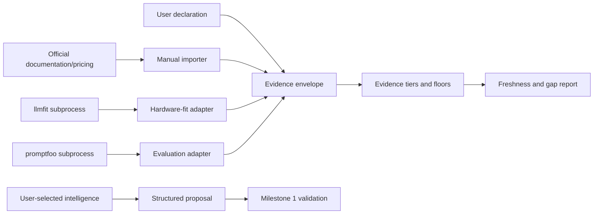
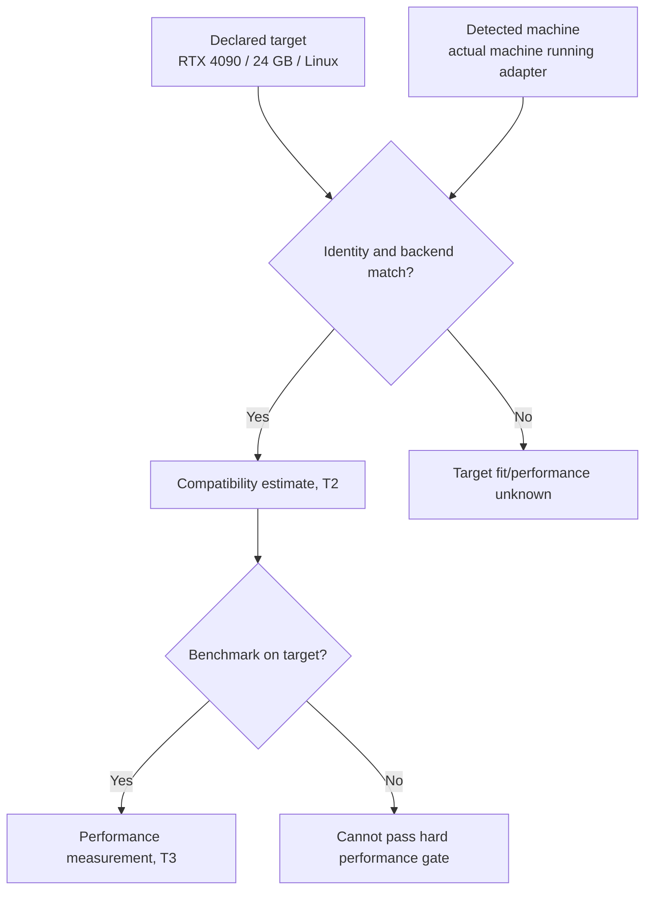

# Milestone 2 — Evidence and Adapter Boundaries

Target: **Weeks 2–3**  
Depends on: **Milestone 1 public contract exports**  
Primary owner: **Developer A — evidence and comparison**

## Outcome

ANVILMARK can collect user declarations, authoritative facts, tool observations, and measurements through replaceable adapters without persisting secrets or confusing estimates with proof.

ANVILMARK must still function when every optional adapter is absent. Absence produces an explicit evidence gap, not a crash and not a pass.

## Adapter boundary

Optional tools never write the authoritative contract directly. They return validated envelopes that ANVILMARK may reference.

## Intelligence-adapter interface

Define a provider-neutral interface for Claude Code, Codex, a user API endpoint, an OpenAI-compatible endpoint, or a local model.

The interface must expose:

- adapter identity and capabilities;
- whether execution is local or remote;
- the exact outbound projection;
- structured request and response versions;
- timeout, cancellation, and failure results;
- usage/evidence metadata when the adapter provides it;
- no hosted ANVILMARK default.

An intelligence response is a proposal. It may suggest constraints, candidates, questions, or rationale. It cannot approve, weaken hard constraints, or classify its own inference as measured evidence.

## Evidence-adapter interface

Every adapter result must identify:

- subject and claim;
- evidence tier and kind;
- producer and exact version;
- observation/retrieval time;
- source locator or redacted command manifest;
- target environment and detected environment where relevant;
- value and units;
- assumptions and exclusions;
- raw-result/content hash;
- confidence and caveats;
- freshness/refresh policy;
- available, unavailable, unsupported, failed, or unknown standing.

Subprocess output is untrusted input and must pass schema validation.

## llmfit adapter

Run llmfit only as an optional subprocess. Record its version, sanitized command manifest, raw-result hash, model/configuration identity, and caveats.

Keep these subjects separate:

llmfit's generic quality signal cannot satisfy a workload quality gate. An estimated tokens-per-second value cannot satisfy hard Atlas latency or throughput requirements.

## promptfoo adapter

Run promptfoo only as an optional subprocess.

Requirements:

- isolated ANVILMARK-controlled data directory;
- optional sharing/telemetry disabled by default where supported;
- exact CLI version recorded;
- credentials supplied through approved runtime references only;
- dataset, workload, candidate, model/configuration, prompt, and evaluator hashes attached;
- token, cost, latency, schema, and quality metrics mapped without changing their evidence meaning;
- result cannot be reused after any identity-defining input changes.

Promptfoo absence creates an evaluation evidence gap. It does not prevent contract inspection or manual evidence import.

## Manual evidence importer

Support structured import for official pricing, license, residency, provider capability, model documentation, and other attributable facts.

Require:

- publisher and source locator;
- retrieval time;
- exact subject/version;
- region/tier/currency/unit where relevant;
- calculation assumptions and excluded costs;
- evidence tier;
- expiry or refresh condition.

A copied claim without an attributable source remains T1 or T0, not T2.

## Freshness and evidence gaps

Represent current, stale, expired, superseded, and unknown-freshness states. Preserve old evidence for history while preventing stale records from silently satisfying a current constraint.

Produce a project-level gap report grouped by workload and candidate. For Atlas it should be able to report missing quality measurement, target-hardware benchmark, provider region, current pricing, or license evidence independently.

## Security requirements

- Never persist API keys, tokens, passwords, or private-key material.
- Sanitize command manifests, stdout/stderr, errors, and debug output.
- Show the exact remote projection before sending.
- Deny repository contents and machine identity to remote adapters by default.
- Treat evaluation rows as denied by default unless the user authorizes the selected provider path.
- Time out and terminate subprocesses without corrupting the current contract.

## Required tests

- adapter present, absent, unsupported, timed out, and non-zero exit;
- malformed and oversized subprocess output;
- secret-shaped output;
- target/detected hardware match and mismatch;
- llmfit estimate attempting to satisfy a hard performance gate;
- promptfoo result with wrong dataset, prompt, candidate, or configuration hash;
- stale/expired evidence;
- missing publisher or source;
- optional tool absence appearing in the gap report;
- two intelligence adapters producing schema-compatible proposals.

## Suggested team split

### Developer A

- evidence envelope, tiers, freshness, manual importer, and gap report.

### Developer B

- subprocess runner and llmfit adapter with hardware-identity tests.

### Developer C

- intelligence-adapter interface and promptfoo adapter with safe projection tests.

All developers agree the adapter result/error envelope before building individual integrations.

## Out of scope

- final recommendation or ranking workflow;
- idea elicitation CLI;
- human approval interaction;
- architecture generation;
- repository scanning or conformance;
- runtime observability or routing;
- automatically downloading models.

## Exit checklist

- [ ] ANVILMARK works with no optional adapter installed.
- [ ] Adapter implementations are replaceable behind stable interfaces.
- [ ] No secret is persisted or exposed in an artifact/error.
- [ ] Every imported fact has subject, source, producer, and time.
- [ ] Target and detected hardware cannot be confused.
- [ ] llmfit estimates cannot satisfy measured quality/performance gates.
- [ ] promptfoo results bind to exact workload, candidate, configuration, and dataset.
- [ ] Stale and missing evidence are explicit.
- [ ] The Atlas evidence-gap report is deterministic.
- [ ] Formatting, lint, tests, and build pass.

## Handoff to Milestone 3

Milestone 3 consumes these adapters only through their reviewed interfaces. It may request evidence, but it must not special-case promptfoo, llmfit, Claude Code, or Codex in the authoritative workflow.
