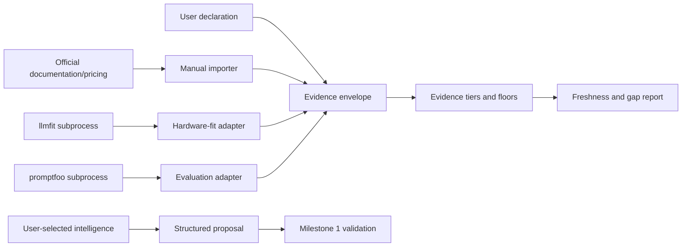
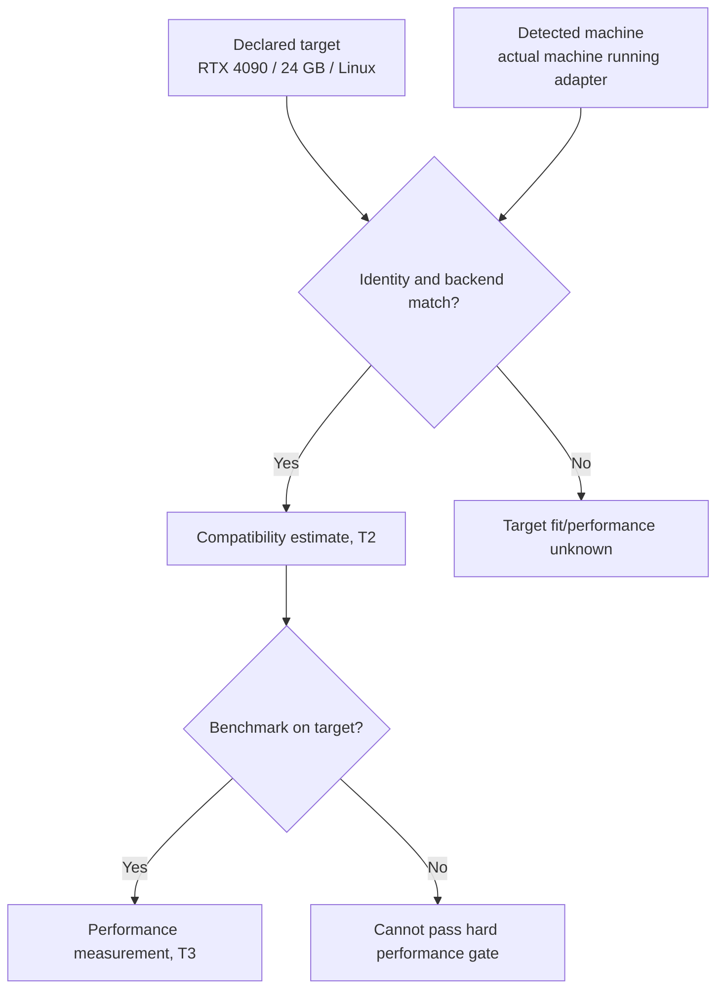

# Milestone 2 — Evidence and Adapter Boundaries

Target: **Weeks 2–3**

Status: **Complete — merged into local `main` on September 13, 2026 after Anurag authorized the merge. Implemented in `packages/adapters` at `ADAPTER_PROTOCOL_VERSION = 0.1.0-draft.1`; independent technical review passed at `8b027ac` after twelve correction passes. Required project-contract amendments 1–4 are ratified under Anurag's scoped acknowledgement exception in [`../07-schema-amendment-proposal.md`](../07-schema-amendment-proposal.md). Amendment 5 remains proposed and deferred.**

Depends on: **Milestone 1 public contract exports (merged as `a30a8f4`)**

Primary owner: **Developer A — evidence and comparison**

## Outcome

ANVILMARK can collect user declarations, authoritative facts, tool observations, and measurements through replaceable adapters without persisting secrets or confusing estimates with proof.

ANVILMARK must still function when every optional adapter is absent. Absence produces an explicit evidence gap, not a crash and not a pass.

## Adapter boundary

Optional tools never write the authoritative contract directly. They return validated envelopes that ANVILMARK may reference.

## Intelligence-adapter interface

Define a provider-neutral interface for Claude Code, Codex, a user API endpoint, an OpenAI-compatible endpoint, or a local model.

The interface must expose:

- adapter identity and capabilities;
- whether execution is local or remote;
- the exact outbound projection;
- structured request and response versions;
- timeout, cancellation, and failure results;
- usage/evidence metadata when the adapter provides it;
- no hosted ANVILMARK default.

An intelligence response is a proposal. It may suggest constraints, candidates, questions, or rationale. It cannot approve, weaken hard constraints, or classify its own inference as measured evidence.

## Evidence-adapter interface

Every adapter result must identify:

- subject and claim;
- evidence tier and kind;
- producer and exact version;
- observation/retrieval time;
- source locator or redacted command manifest;
- target environment and detected environment where relevant;
- value and units;
- assumptions and exclusions;
- raw-result/content hash;
- confidence and caveats;
- freshness/refresh policy;
- available, unavailable, unsupported, failed, or unknown standing.

Subprocess output is untrusted input and must pass schema validation.

## llmfit adapter

Run llmfit only as an optional subprocess. Record its version, sanitized command manifest, raw-result hash, model/configuration identity, and caveats.

Keep these subjects separate:

llmfit's generic quality signal cannot satisfy a workload quality gate. An estimated tokens-per-second value cannot satisfy hard Atlas latency or throughput requirements.

## promptfoo adapter

Run promptfoo only as an optional subprocess.

Requirements:

- isolated ANVILMARK-controlled data directory;
- optional sharing/telemetry disabled by default where supported;
- exact CLI version recorded;
- credentials supplied through approved runtime references only;
- dataset, workload, candidate, model/configuration, prompt, and evaluator hashes attached;
- token, cost, latency, schema, and quality metrics mapped without changing their evidence meaning;
- result cannot be reused after any identity-defining input changes.

Promptfoo absence creates an evaluation evidence gap. It does not prevent contract inspection or manual evidence import.

## Manual evidence importer

Support structured import for official pricing, license, residency, provider capability, model documentation, and other attributable facts.

Require:

- publisher and source locator;
- retrieval time;
- exact subject/version;
- region/tier/currency/unit where relevant;
- calculation assumptions and excluded costs;
- evidence tier;
- expiry or refresh condition.

A copied claim without an attributable source remains T1 or T0, not T2.

## Freshness and evidence gaps

Represent current, stale, expired, superseded, and unknown-freshness states. Preserve old evidence for history while preventing stale records from silently satisfying a current constraint.

Produce a project-level gap report grouped by workload and candidate. For Atlas it should be able to report missing quality measurement, target-hardware benchmark, provider region, current pricing, or license evidence independently.

## Security requirements

- Never persist API keys, tokens, passwords, or private-key material.
- Sanitize command manifests, stdout/stderr, errors, and debug output.
- Show the exact remote projection before sending.
- Deny repository contents and machine identity to remote adapters by default.
- Treat evaluation rows as denied by default unless the user authorizes the selected provider path.
- Time out and terminate subprocesses without corrupting the current contract.

## Required tests

- adapter present, absent, unsupported, timed out, and non-zero exit;
- malformed and oversized subprocess output;
- secret-shaped output;
- target/detected hardware match and mismatch;
- llmfit estimate attempting to satisfy a hard performance gate;
- promptfoo result with wrong dataset, prompt, candidate, or configuration hash;
- stale/expired evidence;
- missing publisher or source;
- optional tool absence appearing in the gap report;
- two intelligence adapters producing schema-compatible proposals.

## Suggested team split

### Developer A

- evidence envelope, tiers, freshness, manual importer, and gap report.

### Developer B

- subprocess runner and llmfit adapter with hardware-identity tests.

### Developer C

- intelligence-adapter interface and promptfoo adapter with safe projection tests.

All developers agree the adapter result/error envelope before building individual integrations.

## Out of scope

- final recommendation or ranking workflow;
- idea elicitation CLI;
- human approval interaction;
- architecture generation;
- repository scanning or conformance;
- runtime observability or routing;
- automatically downloading models.

## Exit checklist

Unticked pending independent re-verification. Every item below is believed
true against the current tree, but the milestone has failed review twice and
the boxes are the reviewer's to tick.

- [ ] ANVILMARK works with no optional adapter installed.
- [ ] Adapter implementations are replaceable behind stable interfaces.
- [ ] No secret is persisted or exposed in an artifact/error.
- [ ] Every imported fact has subject, source, producer, and time.
- [ ] Target and detected hardware cannot be confused.
- [ ] llmfit estimates cannot satisfy measured quality/performance gates.
- [ ] promptfoo results bind to exact workload, candidate, configuration, and dataset.
- [ ] Stale and missing evidence are explicit.
- [ ] The Atlas evidence-gap report is deterministic.
- [ ] Formatting, lint, tests, and build pass.

## Implementation record

The package is documented in [`packages/adapters/README.md`](../../../packages/adapters/README.md).
It depends only on the reviewed public exports of `@anvilmark/project-contract`.

### Real tool contracts

Both optional adapters are implemented against the tools' documented output,
with fixtures derived from upstream and provenance recorded in
[`packages/adapters/test/fixtures/PROVENANCE.md`](../../../packages/adapters/test/fixtures/PROVENANCE.md).

- **promptfoo**: the adapter constructs `eval -c <config> -o <artifact>` with
  progress bar, table, and sharing disabled, writes the artifact beneath the
  ANVILMARK data directory, and parses that FILE. Nothing is assumed about
  stdout. The CLI version comes from `--version`, not from a result field.
- **llmfit**: `--json system` for the machine and `--json info <model>` for the
  model, both matched against the documented `node`/`system` envelope and model
  entry fields. The returned model and quantization are checked against what
  was requested; a difference yields `unknown`.

### Project-contract amendments

Four amendments were required, all four recorded here and set out in full in
[`../07-schema-amendment-proposal.md`](../07-schema-amendment-proposal.md)
rather than silently applied. The draft schema line has moved from `0.1.0-draft.1` to
`0.1.0-draft.3` across the package, the Atlas fixture, and the package README;
`draft.2` was an intermediate step within this milestone and was never merged.

1. **`Hardware.backend`.** Decision 06 section 8 requires a backend or device
   mismatch to produce `unknown`, but `draft.1` had nowhere to record which
   backend a machine offers, so the rule could not be evaluated at all.

2. **`measured_evaluation.value.identity`.** An evaluation is only evidence
   about the exact dataset, prompt, evaluator, workload, and model
   configuration that produced it. A single opaque `configuration_hash` could
   say that something changed but never which thing, and keeping the individual
   hashes in an adapter annotation would have lost them the moment the evidence
   was attached to a contract.

3. **Algorithm-qualified digests and `config_digest`.** Digests are `sha256:`
   plus lower-case hex, which standardises how they are written; the format
   alone does not make a value authentic. Integrity comes from recomputing and
   comparing, so the adapter derives every digest itself, and the config digest
   from the bytes actually handed to the tool.

4. **Required non-null `provider_id`, and `measurements.expected_evaluation` on
   a candidate.** A nullable provider let "we never established one" look like
   a recorded value, and without a declared expectation the contract could
   check that an evaluation was internally complete but not that it described
   the candidate as configured now.

Amendments 1–4 are **ratified** as of September 13, 2026. Anurag accepted
them and explicitly removed the requirement to wait for the other two
acknowledgements for this decision, as recorded in document 07. They amend the
project-contract schema to `0.1.0-draft.3`; the remaining decisions in document 06
continue to apply. Amendment 5 remains proposed and deferred.

### The declared/detected hardware contradiction

The first implementation set `target_hardware_ref === detected_hardware_ref`,
and the Milestone 1 admission logic treated unequal ids as proof of a mismatch.
Both were wrong in the same way: decision 06 keeps the declared target and the
deterministically detected machine as SEPARATE subjects with separate ids and
separate evidence kinds, so ids can never decide identity.

The correction: `hardwareCapabilitiesMatch` compares backend, accelerator
count, model, and VRAM. Model names are compared by containment, because a user
writes `RTX 4090` and a tool reports `NVIDIA GeForce RTX 4090`, and requiring
equality would make every genuine pairing a mismatch. Integrity validation now
confirms both references resolve AND carry the correct evidence kinds, and
rejects an observation that names one entry for both roles. A matched pair with
different ids supports a T2 compatibility estimate; it still cannot clear a T3
performance or quality gate.

### Other corrections

- **Structured secrets.** `sanitizeStructured` now passes the key path to the
  canonical classifier, so an opaque value under `api_token` is caught even
  with no vendor prefix. `adapterError` sanitizes its message and recursively
  sanitizes its detail. Numeric token counts are untouched.
- **Executable discovery.** Denying the whole ambient environment also denied
  `PATH`, so an ordinarily-installed tool was permanently "unavailable". A
  resolution allowlist is now forwarded; its values are never recorded.
- **Freshness.** A future-dated observation is `unknown`, never `current`, and
  cannot supersede a genuine record. Supersession selects the newest by
  `observed_at`, using id only as the equal-time tie-break. The expiry boundary
  is inclusive.
- **Gap categories.** Licence, pricing, and hardware-fit now require the right
  kind, attribution, tier, and freshness. A stale relevant fact reports
  `stale_evidence`; nothing relevant reports the missing category.
- **Remote projection.** Contract hardware ids are device identifiers and no
  longer leave the machine. Hardware is projected under a projection-local
  alias, and every reference to it is rewritten to the same alias.
- **Provenance.** `raw_result_hash` covers stdout, stderr, exit code, and
  signal together; where an artifact file is relied upon, it is the hash of
  that file's bytes.

A defect found earlier and kept fixed: the output sanitizer redacted any field
whose name contained `token`, corrupting `estimated_tokens_per_second` and
`input_tokens_per_call`. The pattern reads `token(?!s)` and skips numeric,
boolean, and very short values.

Carried into Milestone 3:

- a hardware gate on a `managed_api` or `self_hosted` candidate is always
  `unknown`, because there is no deployment hardware to benchmark;
- freshness windows are caller-supplied; a `periodic` record with no configured
  window reports `unknown` rather than guessing;
- the tool output schemas follow current upstream documentation and will need
  re-confirming against real installations and future releases.

## Handoff to Milestone 3

Milestone 3 consumes these adapters only through their reviewed interfaces. It
may request evidence, but it must not special-case promptfoo, llmfit, Claude
Code, or Codex in the authoritative workflow.

## Second correction pass

A second adversarial review found further merge blockers, each reproduced with
a failing test before being fixed.

- **Promptfoo execution and artifact boundary.** The artifact name is now a
  plain file name, validated; the run happens in a unique per-run directory the
  adapter creates inside the data directory and removes in `finally` on every
  path; the data directory itself may not be a symlink; caller argument
  pass-through is gone entirely; credential names may not collide with
  adapter-owned `PROMPTFOO_*` variables and safety variables are applied last;
  `--no-write` is passed; and the artifact is stat-checked against a size cap
  before it is read, because the stdout cap does not bound a file the tool
  writes.
- **Attribution.** Identity digests must be `sha256:` plus lower-case hex, the
  config digest is computed from the bytes handed to `-c`, and a run covering
  more than one provider is refused as `ambiguous_attribution` rather than
  aggregated onto one candidate.
- **llmfit parsing.** `gpus[].count` is read and reconciled against
  `gpu_count`, with a contradiction failing closed; the reported operating
  system is mapped rather than defaulted; and model identity is exact after
  canonicalisation, so `…-Instruct-AWQ` no longer passes as `…-Instruct`.
- **Hardware comparison.** Now covers backend, accelerator model, count and
  VRAM, plus RAM and CPU as floors and the operating system. Accelerator names
  are compared on word boundaries after dropping brand words, so
  "NVIDIA GeForce RTX 4090" matches a declared "RTX 4090" while "RTX 4090 Ti"
  and "RTX 4070 SUPER" do not.
- **Probing.** Both adapters probe the executable `collect` will actually run,
  so a reported version always belongs to the binary that produced the result.
- **Gap report.** The duplicated licence block is gone, `resolveHardware` is
  supplied so a valid matched observation closes its gap, and subjects no
  longer render as `candidate.candidate.<id>.licence`.

### Decisions worth recording

- **An operating-system difference invalidates a fit estimate** rather than
  downgrading it. A CUDA-on-Linux estimate does not describe a macOS host even
  with an identical card.
- **RAM and CPU are floors, not equalities.** More detected capacity than the
  target declares cannot invalidate a fit estimate; less can.
- **Symlinked ancestors are the platform's business.** Only the final segment
  of the data directory is checked, because on macOS `/var` is itself a link
  and rejecting that would reject every temporary directory.

## Third correction pass

Independent verification reproduced three semantic failures against the built
packages despite a green suite. Each was reproduced as a failing test first.

- **A multi-provider artifact was accepted with `provider_id: null`.** Provider
  identity was read only from `results.prompts[].provider`; an artifact listing
  its providers under `results.providers[]` established none at all. Providers
  are now collected from `results.prompts[]`, `results.results[]`, and
  `results.providers[]` and reconciled. No provider, more than one, or a
  provider that disagrees with the candidate's expected one is refused. An
  `available` measured evaluation can no longer carry a null provider.
- **The llmfit fixture was not the CLI's output.** It carried the HTTP API's
  `node` object, which the CLI never emits. The fixture is now the real
  `llmfit --json info <model>` envelope, read from upstream source at commit
  `53951c3f89aa0dc7afbc0a6d52ccbe27417421e2` rather than from prose. The CLI
  reports **no operating system at all**, so ANVILMARK observes it through an
  injectable platform observer and records it as an ANVILMARK deterministic
  observation, not an llmfit field.
- **A stronger machine validated a weaker target.** Treating RAM and CPU as
  floors meant a 64 GB / 16-core measurement was accepted as evidence about a
  32 GB / 8-core target. The rule is now conservative: RAM, core count, OS,
  backend, and every accelerator's model, count and VRAM must match, the CPU
  model is compared when the target names one, and anything missing or
  incomparable yields no match.

Two further corrections followed from the same review:

- **Identity is derived, not asserted.** Formatting a value as
  `sha256:<64 hex>` does not verify it. The adapter now derives each digest
  from the inputs it can read, compares them with the caller's expectation, and
  returns `unknown` when an input is dynamic or unreadable. The config is
  hashed before and after the run so a mid-run edit fails closed. `readArtifact`
  is gone from the public request: the filesystem is a construction-time seam,
  so a caller cannot substitute the bytes that get measured.
- **Cleanup failure withdraws the evidence.** A run directory that cannot be
  confirmed removed produces `cleanup_failed` rather than `available`, and the
  error names no path and quotes no artifact.

## Fourth correction pass

Four blockers were reproduced independently. Each was reproduced as a failing
test before being fixed.

- **`EvaluationInputs` was caller-authored.** A caller could pass empty path
  lists while the config referenced a dataset, a prompt and an evaluator, and
  the adapter returned T3 evidence backed by the digest of an empty array. The
  adapter now parses the config and discovers its own inputs; the supported
  subset is stated in the package README and anything outside it returns
  `unsupported_configuration` and `unknown`.
- **Referenced files were read once.** A dataset changed during the run was
  still accepted. Discovered inputs are now staged into an immutable snapshot
  and the snapshot is what executes, which removes the window rather than
  narrowing it.
- **The core contract accepted a providerless measurement.** `provider_id` is
  now required and non-null, candidates declare
  `measurements.expected_evaluation`, and `admitEvidence` refuses a measured
  evaluation whose provider or configuration does not match — or when no
  expectation was supplied at all.
- **The llmfit fixture had `fit_level` and `fit_label` inverted.** At the
  pinned commit `fit_to_json` emits the code in `fit_level` and the human
  string in `fit_label`. Corrected, with the source lines recorded.

Promptfoo is now pinned too: commit
`0170037970dd4732f7542c60ceafa5f4951289de`, read from `src/types/index.ts` and
`src/util/output.ts` rather than from prose. `version` and `timestamp` live
inside `results` in both V2 and V3, so the earlier "flat" fixture described a
shape no current version emits and was removed rather than parsed.

### Decisions worth recording

- **Discovery refuses rather than guesses.** A glob that would need expanding,
  a generated function, or a remote reference makes the whole configuration
  unsupported. A partial identity is worse than none, because it looks
  complete.
- **Digests use config-relative logical paths.** The same project in two
  directories has one identity; an absolute path would have made identity
  machine-specific, which is both wrong and a quiet privacy leak.
- **An empty group is never a valid identity.** If no dataset, prompt,
  evaluator or provider was discovered, the config did not describe one.

## Fifth correction pass

Three defects, each reproduced as a failing test first.

- **Inline test rows carried the wrong identity.** They were inserted with
  `group: "prompt"`, directly contradicting the comment above them, so
  `manifest.datasets` was empty for a wholly inline config, changing test data
  moved `prompt_hash`, and `dataset_hash` never moved at all. Rows are now
  split canonically: the row's data goes to the dataset, its `assert` block to
  the evaluator. Regressions assert that each of vars, prompt, assertions and
  provider moves exactly one digest.
- **Containment was lexical.** An in-directory symlink to an outside file was
  accepted and read. Both sides are now resolved through the filesystem, and a
  symlinked config file is refused outright because it makes the containment
  root ambiguous.
- **Assertion file references were accepted syntactically and never read.**
  The pinned promptfoo source applies `file://` to an assertion's `value` and
  does not establish that an `assert` element may be a file reference, so
  rather than invent the syntax it is removed from the supported subset and
  refused at discovery.

An arithmetic error in the previous report is also corrected here: the total at
that point was **501**, not 507. The commit message on `ac5cd22` carries the
wrong figure and is left as written, since history is not rewritten to hide a
mistake.

## Sixth correction pass

Review found the promptfoo config parser unsound, and it was: four
configurations it should have refused were accepted and hashed. An assertion
`value` of `file://cases.txt`, a var of `file://data.csv`, a `scenarios` block,
and a `python:grader.py` provider each produced a complete identity while the
bytes that decide pass or fail sat outside everything hashed.

The instruction was not to add more checks, and adding more would not have
helped: the promptfoo config format is open, so any parser is a guess about
what a file means. **Control is inverted instead.** ANVILMARK owns a strict,
typed `PromptfooEvaluationSpec` and generates the promptfoo JSON config from
it. There is no longer a caller config to parse — `promptfoo-config.ts` is
deleted — and the four cases are refused because the shapes that expressed them
cannot be written. `test/spec-boundary.test.ts` asserts the specific reason for
each, not merely that some unsupported reason exists.

Identity follows from the spec rather than from files: `dataset_hash` over the
cases, `evaluator_hash` over the assertions, `prompt_hash` over the content,
`model_configuration_hash` over the provider declaration, and `config_digest`
over the generated bytes. There are no paths left to normalise.

The milestone is **acceptance-tested against the real binary** for the first
time. `test/promptfoo-real-binary.test.ts` runs promptfoo **0.122.0**, the
version at the pinned source commit, using its built-in `echo` provider — no
API key, no model request, no paid call. The generated config executes, both
cases pass, the artifact parses, attribution reads `echo` from the artifact,
every recorded digest equals the one ANVILMARK derived, changing a case, a
prompt or an assertion moves exactly one digest, the tool reads nothing outside
the snapshot, and the run directory is removed. The test is skipped unless
`ANVILMARK_PROMPTFOO_BIN` names a binary, so the default suite still needs no
install and makes no external call.

`js-yaml` was removed with the parser that needed it. The package now depends
on `@anvilmark/project-contract` and `zod` only.

Test totals: **232** in `packages/adapters` across 13 files, and **502** across
the workspace — 266 `project-contract`, 232 `adapters`, 1 each in `contract`,
`engine`, `web`, and `mcp`. The 3 real-binary tests are additional and run only
when `ANVILMARK_PROMPTFOO_BIN` is supplied; they are skipped in the figures
above.

## Seventh correction pass

The inversion was accepted; six bounded defects in it were not.

- **The spec and the request both declared the evaluation.** Only the hashes and
  the provider were compared, so the other four fields were copied onto the
  record unchecked. A spec for `workload.real` / `candidate.real` /
  `dataset.real@v1` was recorded as available T3 evidence about
  `workload.other` / `candidate.other` / `dataset.other@v9`. `request.identity`
  is **removed**: every attribution field now comes from the validated spec, and
  a regression asserts that a stray declaration appears nowhere in the record.
  `deriveExpectedEvaluation` produces a candidate's
  `measurements.expected_evaluation` from the same normalised spec, through the
  same function the adapter records with, so the two cannot drift.

- **Credentials had two declarations.** The hash covered
  `spec.provider.credential_env_names` while the process received
  `request.credentialEnvNames`. `request.credentialEnvNames` is **removed**.
  The spec's list is validated (portable name syntax, no duplicates, no
  adapter-owned `PROMPTFOO_*`), hashed, and forwarded — one list, so the hashed
  set and the executed set are the same set by construction.

- **Provider config was not closed data.** `z.record(z.string(), z.unknown())`
  accepted `{ request: "file://…" }`, `{ transformResponse: "file://…" }`, an
  executable transform expression, a literal `apiKey`, `NaN`, a function, and a
  cyclic object — each of which changes what runs while contributing nothing the
  identity describes. It is replaced by a **closed allowlist of eight sampling
  parameters** (`temperature`, `top_p`, `top_k`, `seed`, `max_tokens`,
  `frequency_penalty`, `presence_penalty`, `stop`), each finite and bounded.
  Twenty-two hostile inputs are table-driven regressions.

- **The config was rendered three times from a mutable object.** There is now
  one `EvaluationPlan`, computed once: a canonical, deep-frozen copy of the
  spec, the exact config bytes, and every derived identity. Those bytes are what
  the snapshot receives and what `config_digest` covers. Rendering uses the
  project's canonical serializer rather than `JSON.stringify`, so reversing
  every object's key order produces identical bytes. Mutating the caller's
  nested objects after validation changes nothing.

- **Validation ran after the version probe.** A refused request still spawned a
  subprocess. `configPath` and spec validation now run first; regressions use a
  nonexistent executable and assert that no version was established and no
  command manifest exists.

- **The acceptance test deleted its own evidence.** Its helper removed
  `dataDirectory` before the cleanup assertions ran. It now captures the run
  directory from the generated `-c` path, asserts the parent survives and the
  run directory does not, and removes the parent afterwards. The claim that no
  other file was read is **withdrawn**: nothing in the test monitors filesystem
  reads, so it now states only that the generated config path was passed.

### What the real binary found

Running promptfoo 0.122.0 for real caught a defect every mock had passed: the
version probe ran without the adapter's own environment, so promptfoo's
multi-line update notice was captured as the producer version and written onto
the evidence. The probe now runs with telemetry, sharing and the update check
disabled, and `parseVersion` takes the version line rather than the stream.

All **24** supported assertion types — twelve base types and their `not-` forms
— are exercised against the real binary in both directions: once arranged to
hold, and once arranged to fail. The failing arrangement is the half that
proves anything, since a type promptfoo silently ignored would have passed it.
All 24 failed as required, so none is being ignored. The `not-` forms were
previously claimed in the README but not in the schema; they are now both
implemented and exercised.

Test totals: **551** passing across the workspace by default — 281
`adapters` (14 files), 266 `project-contract` (7 files), and 1 each in
`contract`, `engine`, `web` and `mcp`. A fifteenth adapters file holds 5
real-binary tests, skipped unless `ANVILMARK_PROMPTFOO_BIN` names a promptfoo
executable.

## Eighth correction pass

Four merge blockers, all of them boundaries that were narrower in the document
than in the code.

- **The provider id boundary was a denylist, and denylists have gaps.**
  `https://example.com/collect?api_key=...`, `webhook:http://example.com/collect`,
  `browser` and `promptfoo:manual-input` were all accepted, along with
  WebSocket, MCP, sequence and agent-SDK providers. Because `provider_id` is
  persisted on the evidence record, a URL carrying a token in its query string
  would have written that credential into the contract.

  The replacement has two parts, and neither is a longer denylist. A **positive
  grammar** — one to three `:`-separated alphanumeric segments — structurally
  excludes everything that is really an endpoint, since a URL, socket address,
  path, query string, fragment or embedded credential each needs a character
  the grammar does not have. What the grammar cannot do is tell `browser` from
  a model name, because both are ordinary words. So execution additionally
  requires **registration**: an adapter is constructed with the providers it
  may run, each declaring `local` or `remote`, and the default is none. What to
  register is a policy question left to the caller.

- **Remote execution needed no authorization.** Decision 06 denies evaluation
  rows by default unless the user authorizes the provider path, and requires the
  exact outbound projection to be shown first; `collect()` simply ran. There are
  now two steps. `prepareEvaluation` returns an `EvaluationProjection` — the
  provider, the destination, the data categories, the case counts, the
  credential names, and a digest binding content to destination — without
  executing anything. A `remote` provider then requires a `RemoteAuthorization`
  matching that exact digest; missing, mismatched, stale, future-dated or
  unreadable all return `authorization_required` **before** the probe, so no
  prompt, dataset row or credential is written anywhere. A `local` provider is
  not asked for permission to send data it does not send.

  Milestone 2 does not create authorizations and has no standing to. Milestone
  3's interactive flow shows the projection and records the decision; this
  milestone only enforces that a matching record exists.

- **The artifact did not have to describe the evaluation.** The normal fixture
  reported 38 successes and 2 failures for a spec with one row and one prompt,
  and that was recorded as available T3 evidence. With exactly one provider,
  promptfoo runs every prompt against every row, so `rows x prompts` fixes the
  count before the tool starts. That total, the per-case row count, and the
  per-case provider identities must now all reconcile, or the outcome is
  `unknown`. The rule is checked against the tool itself: three rows and two
  prompts produce six cases in promptfoo 0.122.0.

  The fixtures were regenerated by **running** promptfoo 0.122.0 against the
  config ANVILMARK generates, rather than adjusting the assertion to tolerate
  the mismatch.

- **Reserved environment names were matched case-sensitively in one place and
  case-insensitively in another.** `promptfoo_disable_sharing`,
  `PromptFoo_Config_Dir` and `pRoMpTfOo_cache_path` were accepted as
  credentials by the schema while `isReservedEnvironmentName` already called
  them reserved. On Windows those are the same variables, so the lower-case
  spelling could turn sharing back on. There is now one function, used by both.

Test totals: **612** passing across the workspace by default — 342 `adapters`
(15 files), 266 `project-contract` (7 files), and 1 each in `contract`,
`engine`, `web` and `mcp`. A sixteenth adapters file holds 6 real-binary tests,
skipped unless `ANVILMARK_PROMPTFOO_BIN` names a promptfoo executable.

## Ninth correction pass

The status line previously said seven correction passes; eight correction
commits had followed the implementation (`b465ec0` through `37f26ff`), the first
recorded inside the implementation record above. It undercounted by one. This
is the ninth.

The four corrections in `37f26ff` were accepted. Four trust-boundary blockers
remained, and every one was reproduced as a failing regression against the
unmodified `37f26ff` source before any fix: of the 48 regressions written first,
45 failed there. The three that passed were two deliberate guards against
over-correcting and one trivial check, since deleted. The genuine-output
reconciliation tests described below were added after the fix and were not run
against `37f26ff`.

- **The request could choose the program and its environment.**
  `PromptfooRequest` carried `executable`, `readEnv` and `baseEnv`, so the
  caller supplying an evaluation could also decide how it was measured. Against
  the unfixed build, a request pointing at a stand-in program produced
  `available` evidence, and `probe()` handed another program recorded that
  program's version. The sharper case was reproduced end to end: the probe
  resolved a bare executable name through the ambient `PATH` while the
  evaluation resolved it through the request's `baseEnv`, and the evidence came
  back `available` recording `0.118.4` from the probed program while a
  different program produced the result.

  All three are now construction-time options. The environment is snapshotted
  when the adapter is built and used by both the probe and the run; `probe()`
  ignores any executable it is handed. The request is a closed shape, and a
  request naming `executable`, `readEnv`, `baseEnv` or any other unknown field
  is refused with `unsupported_argument` before anything runs.

- **Any valid environment name could be a credential.** `PATH`, `HOME`,
  `NODE_OPTIONS`, `OPENAI_BASE_URL`, `HTTP_PROXY` and `HTTPS_PROXY` were all
  accepted, read and forwarded. A registration now also declares a stable
  `destination` (`"local"`, or a lower-case host with an optional port — never a
  URL) and the exact `credentialEnvNames` the provider may read. A spec may use
  only those names, matched exactly, and a refusal
  (`credential_not_permitted`) happens before the probe and before any value is
  looked up. Duplicate names are refused ignoring case, in both the spec and the
  policy. Policy can never grant the fixed set of names that decide which
  program runs or where traffic goes — the runner's resolution variables,
  `NODE_OPTIONS`, and the proxy variables — and the destination identity and
  sorted credential-name set are bound into the projection digest, so an
  authorization for one host or one credential set does not cover another.
  Vendor endpoint variables are refused only because policy must list every
  name; a policy that lists one is declaring it a credential, which the adapter
  cannot detect. Policy is construction-time configuration and cannot arrive
  through a request, a spec or an agent proposal, since all three are closed
  shapes with no field for it.

- **Per-case outcomes were not reconciled with the summary.** The row schema
  kept only `provider`, so an artifact whose stats reported one success while
  its only row said `success: false` became T3 evidence. The semantics were
  taken from the pinned source, promptfoo 0.122.0 at commit
  `0170037970dd4732f7542c60ceafa5f4951289de`, and every cited line was checked
  against that checkout: `trackRowStats` (`src/evaluator.ts:3387`) counts a row
  as a success when `success` is true, as an error when `failureReason` is
  `ERROR` (2), and otherwise as a failure; `ResultFailureReason` is defined at
  `src/types/index.ts:375`. Per-case rows are now required, each must carry a
  boolean `success` and a `failureReason` of 0, 1 or 2, a passing row naming a
  failure reason is refused as a contradiction no pinned code path produces,
  and the rows must tally exactly to the stats. The `error` string is never
  read, because the source sets it on ordinary assertion failures and on an
  empty response that is counted as a failure.

  Real output was checked as well as source. Genuine 0.122.0 artifacts with a
  passing row, a failing row and an error row are committed as fixtures and
  reconcile; a one-field tamper of each is refused; and the real-binary suite
  classifies all 24 genuine failing rows of the negative control and catches a
  single flipped row. Two things the real output taught, both recorded rather
  than fixed here: an invalid regular expression is an assertion failure, not
  an error; and promptfoo attributes its `http` provider to the URL rather than
  to the id, so such a run can never be attributed under the provider grammar.

- **Future-dated authorizations were accepted.** The future window reused
  `authorizationMaxAgeMs`, so with the one-hour default an authorization dated
  thirty minutes ahead of the clock passed. There is now a separate
  `authorizationClockSkewMs`, defaulting to zero because nothing in the
  documents justifies another value. Both limits must be finite and
  non-negative; otherwise the adapter refuses with `invalid_adapter_policy` in
  both `probe()` and `collect()` before any subprocess starts. A `NaN` max age
  had made every age comparison false and so accepted every authorization.

Authorization records are still plain objects with no signature or human
identity. That is deliberate for this milestone: Milestone 3 must be the only
component that creates them, and Milestone 2 only enforces that one matches.

### Found while doing this

- The two fixtures regenerated in `37f26ff` embedded `config.outputPath`, a path
  under the macOS per-user temporary directory. It is machine identity rather
  than a credential, and the adapter never reads it. All fixtures are now
  normalised (outcome fields asserted unchanged), and a regression fails if any
  fixture contains an absolute local path. **The path remains in the blobs of
  `37f26ff`.** That commit is local and unpushed; rewriting a reviewed commit is
  a decision for the reviewers, not for this pass.
- promptfoo exits with `PROMPTFOO_FAILED_TEST_EXIT_CODE` (default 100) whenever
  the pass rate is below `PROMPTFOO_PASS_RATE_THRESHOLD` (default 100%), at
  `src/node/doEval.ts:1204-1205`, and the adapter treats a non-zero exit as a
  failed run. So a real evaluation with any failing case currently yields no
  evidence at all. This predates this pass and is not changed by it.

Test totals: **664** passing across the workspace by default — 394 `adapters`
(16 files), 266 `project-contract` (7 files), and 1 each in `contract`,
`engine`, `web` and `mcp`. A seventeenth adapters file holds 6 real-binary tests,
skipped unless `ANVILMARK_PROMPTFOO_BIN` names a promptfoo executable.

## Tenth correction pass — final acceptance pass

This was defined as the final acceptance pass. Seven items were set; each was
reproduced against `591171a` before it was fixed. The regressions are in
`test/acceptance.test.ts`. That file was run against genuine `591171a` source
after it was final — `591171a`'s adapter sources swapped in from `git archive`,
then restored and verified byte-identical — and **81 of its 93 tests failed
there**. The 12 that passed are all labelled `guard:`, meaning behaviour that
was already correct and must stay so. An earlier draft had a test helper that
shared assertion objects between the spec and the artifact, which made one
mutation a no-op; the re-run was done because of it.

1. **Negative evaluation evidence was discarded.** promptfoo 0.122.0 exits 100
   when the pass rate is below `PROMPTFOO_PASS_RATE_THRESHOLD` (default 100),
   after writing its output (`src/node/doEval.ts:1007`, `1204-1218`). Against
   `591171a`, a real evaluation with one failing assertion returned
   `non_zero_exit`. The adapter now sets `PROMPTFOO_PASS_RATE_THRESHOLD=0`, an
   adapter-owned variable, so a completed run exits normally. Fatal errors keep
   their own non-zero exit (`DoEvalError`, lines 143-161) and still fail; a run
   that exits 100 anyway still fails; the shared runner still treats every
   non-zero exit as a failure; a zero exit with a missing or malformed artifact
   still fails. The real-binary test that ran promptfoo directly, because the
   adapter threw failing runs away, is replaced by one that puts 24 failing
   assertions through `createPromptfooAdapter` and gets available T3 evidence
   with 24 failures. Available evidence means the evaluation completed, not that
   the candidate passed.

2. **Result rows were not bound to the plan.** Wrong prompts, variables,
   assertions, indexes, duplicate or missing pairs, a missing per-row provider,
   and an artifact from another evaluation of the same size were all accepted.
   Every row must now carry integer `promptIdx` and `testIdx` in range and the
   planned provider; the rows must cover every prompt-by-row pair exactly once;
   and each must restate its planned prompt (`prompt.label`), variables
   (`vars`, `testCase.vars`), assertions (`testCase.assert`, the default
   assertions followed by the row's own, `src/evaluator.ts:2526-2529`) and
   description. The artifact's prompt list must match too
   (`src/prompts/processors/string.ts:19`). Rendered prompts are not compared.
   A real 0.122.0 run with two prompts, three rows, a default assertion and one
   undescribed row binds through the adapter.

   Checking this against real output found that promptfoo's exporter rewrites
   JSON-valued strings compactly (`src/util/sanitizer.ts:750-775`) while the run
   sends the original — `{"ok": true}` was sent with its space and exported as
   `{"ok":true}`. An artifact cannot show which ran, so non-compact JSON in a
   prompt, variable, assertion value or description is refused rather than
   normalised. The same exporter replaces strings it judges to be secrets; such a
   value would fail binding and its evidence would be refused.

3. **No version boundary.** A stand-in reporting 0.118.4 was run and its output
   accepted. `VERIFIED_PROMPTFOO_VERSIONS` is now exactly `0.122.0`; any other
   probed version is `unsupported` before an evaluation runs, and an artifact
   whose `metadata.promptfooVersion` differs from the probed version is
   `identity_mismatch`. Stand-in programs replaying 0.122.0 fixtures now identify
   as 0.122.0.

4. **Execution was neither pinned nor isolated.** The executable was passed by
   name to every spawn, so a program placed earlier on `PATH` after the adapter
   was built ran instead, and promptfoo ran in the host process's working
   directory. The executable is now resolved once at construction to a canonical
   absolute path and hashed; the file must still match before the probe, before
   the run and after it, or the result is `executable_changed`. The digest is
   recorded in the record's caveats; the manifest names the executable as
   `promptfoo` and the working directory as `<run-directory>`, with relative
   arguments, so no machine path is persisted. This verifies the launcher file,
   **not** promptfoo's transitive package dependencies. promptfoo runs in the
   run directory, with home, XDG, temporary and promptfoo directories inside it,
   and the probe gets its own disposable directory. Redirection is by
   environment variable and confines well-behaved lookups; it is not a sandbox.

5. **Projection and evidence identity were incomplete.** Changing
   `temperature`, `max_tokens`, `stop` or a row description did not change the
   projection digest, so an earlier authorization still matched. The digest now
   also binds `model_configuration_hash`, the exact config bytes, and row
   descriptions, alongside reach, destination and credential names, which were
   already bound. The verified identity hashed into `configuration_hash` now
   includes provider reach and destination identity, so `deriveExpectedEvaluation`
   (which now requires provider policy) and `isEvaluationCurrentFor` do not treat
   endpoint A's evidence as current for endpoint B. The contract's identity
   object has no field for these, so they are also stated in the record's
   caveats, and structured fields are proposed as **amendment 5** in
   `07-schema-amendment-proposal.md` — proposed only, not implemented, not
   acknowledged.

6. **Resource limits were request-controlled.** `timeoutMs`, `maxOutputBytes`
   and `maxArtifactBytes` are now construction-time ceilings with documented
   bounds; a request may only lower them. `NaN`, infinities, negatives, zero,
   fractions, strings and values above the ceiling are
   `invalid_resource_limit` before any subprocess starts — against `591171a` a
   `NaN` timeout spawned promptfoo and returned `timed_out`. Invalid ceilings are
   `invalid_adapter_policy` in both `probe()` and `collect()`.

7. **Milestone 3 conditions** are recorded below.

### Found while verifying the items above

Each was reproduced against `591171a` before it was closed.

- **Prompts read as files.** promptfoo 0.122.0 treats a single-line prompt as a
  file path under its pinned `maybeFilePath` (`src/prompts/utils.ts:11-36`).
  Through the adapter, the prompt text `../../../secret.txt` was read from outside
  the data directory and returned as available T3 evidence; for a remote
  provider the contents would have been sent under an authorization covering the
  text. Such prompts are refused by a faithful copy of the pinned rule.
- **Prompts fetched from services.** `portkey://`, `langfuse://` and
  `helicone://` prompts, fetched at render time
  (`src/evaluatorHelpers.ts:424-485`), were accepted by the spec. They are
  refused.
- **Environment in templates.** `{{ env.PROMPTFOO_CONFIG_DIR }}` was replaced
  with a local path while the config loaded (`src/util/render.ts:31`). The
  adapter sets `PROMPTFOO_DISABLE_TEMPLATE_ENV_VARS=1`; a real run confirms the
  expression renders to nothing.
- **Nunjucks statements.** `` put the repository's
  `package.json` into a prompt and was returned as available evidence.
  Statements are refused in every string promptfoo renders.

### Conditions Milestone 3 must meet

Hard integration requirements. The Milestone 2 adapter must not be exposed
without them.

1. Remote execution remains disabled by default: nothing is registered unless
   trusted construction-time configuration registers it.
2. A request-provided `RemoteAuthorization` is a plain object, not proof of human
   approval.
3. Milestone 3 must introduce a construction-time trusted authorization verifier
   or store, or an opaque capability issued by its approval flow.
4. Agents must not construct adapters, provider registries or authorization
   records.
5. Provider reach, destination and allowed credential names must come from a
   vetted, host-owned catalogue, never an agent proposal.
6. Destination is declared policy until actual network observation exists.

### Deferred

- **HTTP and custom-endpoint providers.** promptfoo attributes them to their URL,
  which the provider-id grammar does not admit. The grammar was not weakened;
  the capability is deferred.
- **Pinning promptfoo's dependencies** beyond the launcher file.
- **Structured execution identity** in the contract (amendment 5).

Test totals: **758** passing across the workspace by default — 488 `adapters`
(17 files), 266 `project-contract` (7 files), and 1 each in `contract`,
`engine`, `web` and `mcp`. An eighteenth adapters file holds 10 real-binary
tests, skipped unless `ANVILMARK_PROMPTFOO_BIN` names a promptfoo executable.

## Eleventh correction pass

Review of the final acceptance pass found two Milestone 2 blockers. Both were
reproduced against `483d1cb` before they were fixed. The regressions are in
`test/template-and-assertion.test.ts`; once final, that file was run against
genuine `483d1cb` source (adapter sources swapped in from `git archive`, then
restored and verified byte-identical), and **78 of its 140 tests failed there**.
The 62 that passed are all labelled `guard:`.

### A correction to the tenth pass

The tenth pass refused Nunjucks statements and stated that expressions
(`{{ name }}`) could stay allowed. **That was wrong.** Nunjucks 3.2.4, which
promptfoo 0.122.0 installs, evaluates expressions as JavaScript:
`{{ range.constructor("return 6*7")() }}` renders `42`.

### 1. Template execution

Reproduced through the adapter with the real binary against `483d1cb`:

- the prompt `{{ range.constructor("return 42")() }}` rendered `42`, and an
  `equals "42"` assertion held, returning available T3 evidence;
- `pid={{ range.constructor("return process.pid")() }}` matched `^pid=[0-9]+$`,
  so the code had process access;
- the same expression in an assertion value executed
  (`src/assertions/index.ts:548`);
- run directly, `{{ env.constructor.constructor("return 42")() }}` executed at
  config load in the evaluation description, a test description and a variable,
  with `PROMPTFOO_DISABLE_TEMPLATE_ENV_VARS=1` set. `renderEnvOnlyInObject`
  (`src/util/render.ts:31`) renders when `varName in envGlobals`, and
  `"constructor" in {}` is true.

The reported expression `{{ range.constructor("return 6*7")() }}` was refused at
`483d1cb` only because `*` tripped the prompt-as-path rule, not because
expressions were blocked.

The fix is a positive grammar with no list of dangerous names. A prompt may use
template syntax only as `{{ identifier }}`, and every referenced variable must
exist in every row. Every other string in the generated config promptfoo reads
— assertion values and array elements, variable values and names, descriptions,
the evaluation description and the references folded into it, stop sequences,
metric names — is literal. "Template syntax" is the four tokens the Nunjucks
3.2.4 lexer acts on in plain text, checked directly against the installed
version: `{{`, `` render literally. A row variable shadows a Nunjucks global of the same
name, also checked directly, so `{{ range }}` is the row's `range`. Refusal
happens while planning; the real-binary suite checks that the constructor
expression, and environment access, produce no version probe, no command and no
run directory.

### 2. Malformed assertions

`{ type: "contains" }` with no value was accepted, and promptfoo recorded its
invariant failure as an error row, which the tenth pass's real-binary test
counted as an evaluation error. That is invalid configuration, not evidence about
a candidate. The spec also accepted `levenshtein` without a threshold (which
silently defaults to 5), a comma string for list types (which promptfoo splits
into needles), a `threshold` on types that ignore it, a JSON-schema value on
`is-json`, and an uncompilable `regex` (which promptfoo records as an ordinary
failed case).

Assertions are now a discriminated union with one closed shape per type, taken
from the pinned handlers in `src/assertions/`: a non-empty string for `contains`,
`icontains`, `starts-with` and `regex` (which must compile); a string for
`equals`; a non-empty list of non-empty strings for the four list types; no
value for `is-json` and `contains-json`; and a string with an explicit integer
threshold for `levenshtein`. `metric` is allowed on all; `threshold` only on
`levenshtein`. Every `not-` form has its base shape. A malformed assertion is
refused while planning — with a nonexistent executable configured, the refusal
is `unsupported_configuration`, not `executable_not_found`.

The real-binary test that manufactured an error row with `{ type: "contains" }`
is removed. **No valid local `echo` evaluation was found that produces a genuine
runtime error row**: `echo` never fails, and timeouts need a slower provider. So
error-row reconciliation is tested only with faithful artifacts — the genuine
error row captured from a closed localhost endpoint, and synthetic rows in the
genuine shape run through the adapter. That is a stated limitation.

All 48 real-binary assertions — 24 types held, 24 types failed — still evaluate
with zero errors under the per-type shapes.

Test totals: **898** passing across the workspace by default — 628 `adapters`
(18 files), 266 `project-contract` (7 files), and 1 each in `contract`,
`engine`, `web` and `mcp`. A nineteenth adapters file holds 13 real-binary tests,
skipped unless `ANVILMARK_PROMPTFOO_BIN` names a promptfoo executable.

## Twelfth correction pass

One bounded correction to the interpolation grammar. The grammar admitted any
identifier inside `{{ ... }}`, but Nunjucks 3.2.4 does not treat every
identifier as a variable. Checked against the installed version by rendering
`{{ name }}` with a same-named row variable for every parser keyword: the lexer
turns `true` and `false` into boolean tokens and `none` and `null` into null
tokens (`src/lexer.js:211-223`), and the parser consumes `not` as an operator
(`parseNot`). No other keyword failed to substitute; `True`, `None`, `and`, `or`,
`in`, `is` and `if` all substitute.

Reproduced through the adapter with the real binary against `dd5ecfc`, each with a
same-named variable defined: all five were accepted, promptfoo 0.122.0 was probed
and run, `{{ true }}`, `{{ false }}`, `{{ none }}` and `{{ null }}` rendered a
literal instead of the row value (one failed case each), and `{{ not }}` produced
an error row — available evidence, in each case, about a prompt other than the
one planned.

The five words are now refused while planning, case-sensitively, with a reason
naming the word. The new regressions in `test/template-and-assertion.test.ts`
were run against unmodified `dd5ecfc`: the 15 negative tests (spaced, compact,
and before-spawn for each word) failed there and the 13 guards passed. The real
binary suite adds a refusal for each word before spawn and a positive control in
which `{{ ticket }}|{{ range }}|{{ env }}|{{ True }}|{{ None }}` substitutes
exactly under promptfoo 0.122.0.

While fixing it, the field-level prompt check was changed to report the parser's
specific reason; previously it refused with a generic message that did not name
what was wrong.

**Dependency limitation, stated accurately.** The template rules describe
Nunjucks 3.2.4. The version boundary checks promptfoo's own version and does not
independently verify the Nunjucks version promptfoo loads. promptfoo 0.122.0
declares `nunjucks` as `^3.2.4`, so another installation could resolve a later
3.x release, and the launcher digest does not cover the Nunjucks package.

Test totals: **926** passing across the workspace by default — 656 `adapters`
(18 files), 266 `project-contract` (7 files), and 1 each in `contract`,
`engine`, `web` and `mcp`. A nineteenth adapters file holds 19 real-binary tests,
skipped unless `ANVILMARK_PROMPTFOO_BIN` names a promptfoo executable.

## Independent acceptance and sign-off — September 13, 2026

The agreed Milestone 2 implementation passed independent technical review at
`8b027ac6a66e7c3f486acd067b696f0573f687cb`. The final reserved-name finding is
closed, with refusal before any subprocess starts and real local echo controls
confirming legitimate variable substitution. No actionable code blockers remained
within the agreed scope. The documented limitations and Milestone 3 integration
conditions above still apply.

Checks independently run at that commit:

| Check                                    | Result                                   |
| ---------------------------------------- | ---------------------------------------- |
| Workspace tests                          | 926 passed, including 656 adapter tests  |
| Real Promptfoo 0.122.0 integration tests | 19 passed, with Nunjucks 3.2.4 installed |
| Build, lint, formatting and diff checks  | Passed                                   |
| Reviewed working tree                    | Clean                                    |

Subsequent changes through the sign-off record are documentation only. Amendments
1–4 are ratified under Anurag's recorded acceptance and scoped acknowledgement
exception in document 07. No decision is attributed to Navaneeth or Aaradhya, and
Amendment 5 remains proposed and deferred.

After this sign-off, Anurag explicitly authorized the merge. On September 13,
2026, local `main` was fast-forwarded from
`a30a8f4591f60ffd48d997b8530e88f6fd57d0cc` to the reviewed source branch tip
`a43a77fc756b6e8cd9c72e53f26b241b99caee78` from
`milestone-2/evidence-adapters-final`. There were no conflicts, and the
implementation, dependencies and tests are unchanged from the independently
validated `8b027ac`; intervening commits contain documentation only.

Milestone 2 is **complete and merged into local `main`**. The merge was performed
in a temporary checkout, preserving the original landing-page checkout and the
reviewed source checkout. No history was rewritten. No push was performed, and
Milestone 3 has not been started.
