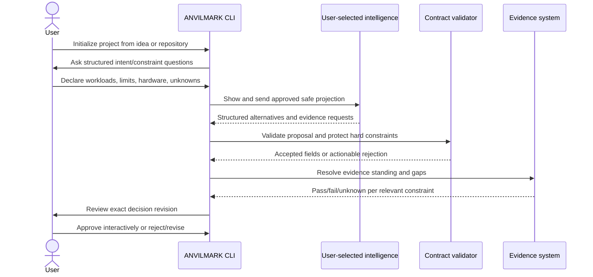
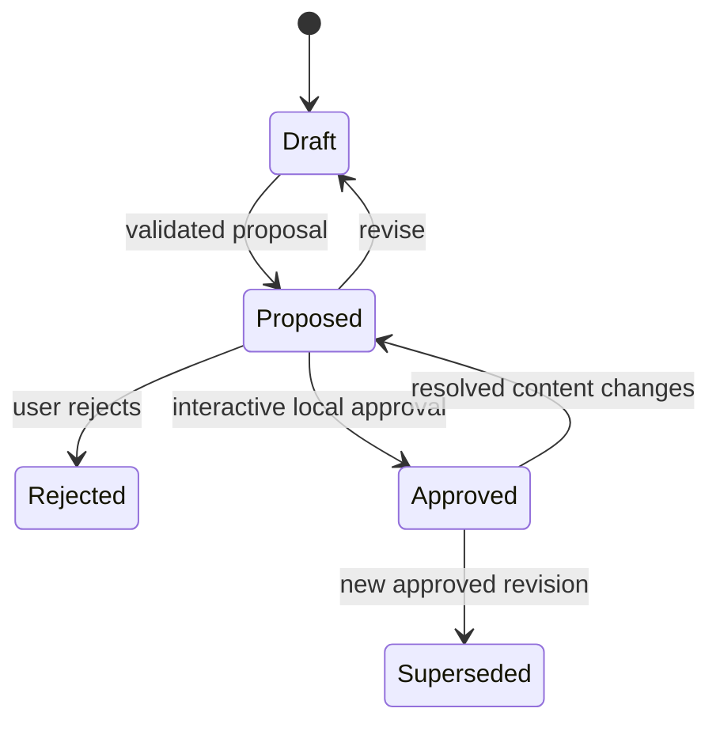

# Milestone 3 — Idea-to-Contract Flow

Target: **Weeks 3–4**  
Depends on: **Milestone 1 contract and Milestone 2 adapter interfaces**  
Primary owner: **Developer C — CLI and agent experience**

## Outcome

A user can start with an informal application idea, preserve assumptions and unknowns as structured data, receive alternatives from user-selected intelligence, review the evidence, and explicitly approve an exact decision revision.

This is the first user-operable workflow. It remains local-first and supplies no ANVILMARK model.

## User journey

## Project initialization

Provide a local command that creates a valid draft under `.anvilmark/` for either:

- a new idea;
- an existing repository reference;
- a contract imported from an approved local file.

Initialization records project identity, selected intelligence mechanism, network policy, and repository references without storing credentials. A partial but valid contract is preferable to invented completeness.

## Structured elicitation

Collect and preserve:

- purpose, users, outcomes, and non-goals;
- separate workloads and their input/output classifications;
- expected usage and burst assumptions;
- latency, quality, privacy, residency, provider, license, budget, hardware, and availability constraints;
- hard/soft/informational severity;
- soft direction and priority order;
- declared hardware and budgets;
- already-made decisions;
- unresolved questions.

Questions should be progressive. Do not require users to understand every architecture term before they can save a draft.

## Intelligence proposal flow

The same structured request must work through Claude Code, Codex, a user API endpoint, or local intelligence.

Before remote execution, show:

- selected adapter and destination category;
- exact data categories in the projection;
- whether repository content or evaluation rows are included;
- whether provider usage may cost money.

The response may propose structured constraints, candidates, architecture elements, rationale, and evidence requests. It cannot write directly to an approved revision.

## Proposal validation and protection

Reject or require correction when a proposal:

- is malformed or uses unknown fields;
- references nonexistent subjects;
- deletes or weakens a hard constraint;
- creates an exception;
- labels an inference as measured evidence;
- turns missing evidence into pass;
- embeds a secret value;
- overwrites approved content;
- claims an unevaluated option is viable.

Accepted proposals create a new draft/proposed revision with generation provenance.

## Alternatives and honest standing

Atlas must receive at least two meaningfully different architecture/candidate alternatives, such as local-first and hybrid managed. Alternatives begin discovered or unevaluated.

Display, per alternative:

- satisfied, failed, and unknown constraints;
- evidence and freshness;
- operating assumptions;
- rejected/incompatible reasons;
- evidence still required before viability or approval.

Do not reduce all dimensions to an unexplained score.

## Review and approval

The local review experience shows the exact resolved decision, selected candidate, alternatives, evidence, constraint results, rationale provenance, unknowns, and approval hash.

Approval requirements:

- interactive local CLI only;
- defaults to no;
- absent from MCP and web;
- no `--yes` flag or environment bypass in the first slice;
- hash covers decision, selected candidate, cited evidence, and constraint results;
- history is append-only;
- changing resolved content makes the old approval non-current.

The CLI must state that interactivity reduces accidental approval but does not prove human presence against an agent with unrestricted shell access.

## Required tests

- initialize from idea and repository reference;
- save incomplete drafts with explicit unknowns;
- equivalent structured requests through two intelligence adapters;
- malformed proposal and broken references;
- attempted hard-constraint weakening;
- secret-containing proposal;
- estimate presented as measurement;
- two alternatives with incomplete evidence;
- user reject, revise, abort approval, and approve;
- content change after approval;
- remote failure leaving the previous valid revision intact.

## Suggested team split

### Developer A

- elicitation subject model, candidate states, evidence-gap presentation.

### Developer B

- proposal protection, revision transitions, approval hash/currentness tests.

### Developer C

- initialization, adapter selection, safe-projection review, review/approval CLI.

## Out of scope

- hosted intelligence;
- full architecture diagrams or CALM;
- repository mapping and conformance;
- visual editor;
- automatic deployment, routing, or observability;
- accounts, teams, or noninteractive approval;
- landing page.

## Exit checklist

- [ ] An informal idea becomes a valid structured draft.
- [ ] Workloads, assumptions, constraints, and unknowns remain separate.
- [ ] Different intelligence adapters use the same request/response contract.
- [ ] At least two Atlas alternatives exist without false viability claims.
- [ ] Evidence gaps remain visible during comparison.
- [ ] Agent output cannot weaken hard constraints or self-approve.
- [ ] Remote projection is displayed before sending.
- [ ] Human approval is mandatory, interactive, and absent from MCP.
- [ ] Resolved-content changes invalidate current approval.
- [ ] No secret is persisted or transmitted unintentionally.
- [ ] Formatting, lint, tests, and build pass.

## Handoff to Milestone 4

Milestone 4 operates only on a valid contract revision and labels all draft, stale, or unapproved decisions honestly. It may generate views; it may not change the authoritative decision while generating them.
