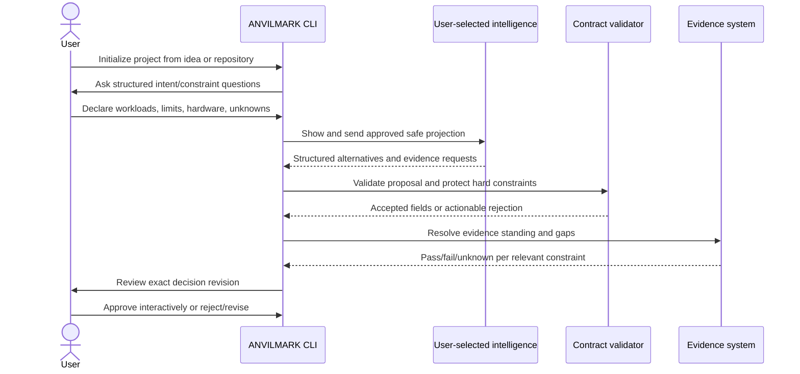
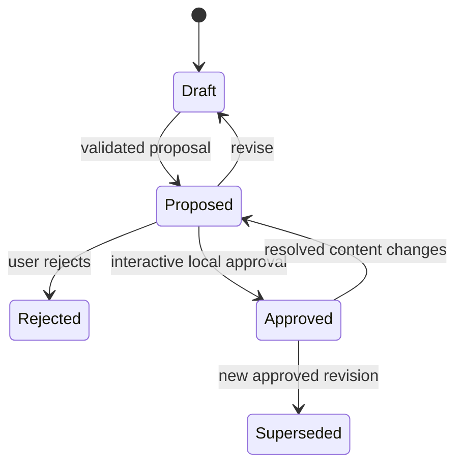

# Milestone 3 — Idea-to-Contract Flow

Target: **Weeks 3–4**  
Depends on: **Milestone 1 contract and Milestone 2 adapter interfaces**  
Primary owner: **Developer C — CLI and agent experience**\
Status: **Complete — passed independent review at `b7f61e8` and merged locally into `main` by fast-forward on September 14, 2026.**

## Outcome

A user can start with an informal application idea, preserve assumptions and unknowns as structured data, receive alternatives from user-selected intelligence, review the evidence, and explicitly approve an exact decision revision.

This is the first user-operable workflow. It remains local-first and supplies no ANVILMARK model.

## User journey

## Project initialization

Provide a local command that creates a valid draft under `.anvilmark/` for either:

- a new idea;
- an existing repository reference;
- a contract imported from an approved local file.

Initialization records project identity, selected intelligence mechanism, the remote-intelligence posture, and repository references without storing credentials. A partial but valid contract is preferable to invented completeness.

> **Amended September 14, 2026** ([document 08](../08-milestone-3-scope-proposal.md), item 4). "Network policy" is narrowed to the remote-intelligence posture: which contract categories may be projected to remote intelligence (`remote_intelligence_policy`), which providers exist (host configuration outside the project), and per-request interactive consent for remote sends. Project-wide and evaluation network enforcement are out of Milestone 3 scope; nothing observes or restricts the network.

## Structured elicitation

Collect and preserve:

- purpose, users, outcomes, and non-goals;
- separate workloads and their input/output classifications;
- expected usage, including explicitly unknown monthly usage, and burst assumptions;
- latency, quality, privacy, residency, provider, license, budget, hardware, and availability constraints;
- hard/soft/informational severity;
- soft direction and priority order;
- declared hardware and budgets;
- already-made decisions;
- unresolved questions.

Questions should be progressive. Do not require users to understand every architecture term before they can save a draft.

> **Amended September 14, 2026** ([document 08](../08-milestone-3-scope-proposal.md), amendments 6 and 7; schema `0.1.0-draft.4`). A workload whose monthly usage is unknown is kept as a workload with `calls_per_month: null` and `basis: unknown`; it is reported as `missing_usage`, and projected-cost conclusions stay blocked. A workload's output data classification is recorded in `output_classification`, `null` meaning not declared (unknown). A workload whose input classification or output format is unknown is still recorded as an unresolved question.

## Intelligence proposal flow

The same structured request must work through Claude Code, Codex, a user API endpoint, or local intelligence.

Before remote execution, show:

- selected adapter and destination category;
- exact data categories in the projection;
- whether repository content or evaluation rows are included;
- whether provider usage may cost money.

The response may propose structured constraints, candidates, questions, inferences, and rationale. It cannot write directly to an approved revision.

> **Amended September 14, 2026** ([document 08](../08-milestone-3-scope-proposal.md), item 3). Architecture-element proposals are deferred to Milestone 4, and structured evidence requests to a later adapter-protocol revision. Evidence still required is derived deterministically from the gap report, and a response carrying unsupported fields is rejected.

## Proposal validation and protection

Reject or require correction when a proposal:

- is malformed or uses unknown fields;
- references nonexistent subjects;
- deletes or weakens a hard constraint;
- creates an exception;
- labels an inference as measured evidence;
- turns missing evidence into pass;
- embeds a secret value;
- overwrites approved content;
- claims an unevaluated option is viable.

Accepted proposals create a new draft/proposed revision with generation provenance.

## Alternatives and honest standing

Atlas must receive at least two meaningfully different architecture/candidate alternatives, such as local-first and hybrid managed. Alternatives begin discovered or unevaluated.

Display, per alternative:

- satisfied, failed, and unknown constraints;
- evidence and freshness;
- operating assumptions;
- rejected/incompatible reasons;
- evidence still required before viability or approval.

Do not reduce all dimensions to an unexplained score.

## Review and approval

The local review experience shows the exact resolved decision, selected candidate, alternatives, evidence, constraint results, rationale provenance, unknowns, and approval hash.

Approval requirements:

- interactive local CLI only;
- defaults to no;
- absent from MCP and web;
- no `--yes` flag or environment bypass in the first slice;
- hash covers decision, selected candidate, cited evidence, and constraint results;
- history is append-only;
- changing resolved content makes the old approval non-current.

The CLI must state that interactivity reduces accidental approval but does not prove human presence against an agent with unrestricted shell access.

## Required tests

- initialize from idea and repository reference;
- save incomplete drafts with explicit unknowns, including a workload with unknown usage and an undeclared output classification;
- equivalent structured requests through two intelligence adapters;
- malformed proposal and broken references;
- attempted hard-constraint weakening;
- secret-containing proposal;
- estimate presented as measurement;
- two alternatives with incomplete evidence;
- user reject, revise, abort approval, and approve;
- content change after approval;
- remote failure leaving the previous valid revision intact.

## Suggested team split

### Developer A

- elicitation subject model, candidate states, evidence-gap presentation.

### Developer B

- proposal protection, revision transitions, approval hash/currentness tests.

### Developer C

- initialization, adapter selection, safe-projection review, review/approval CLI.

## Out of scope

- hosted intelligence;
- full architecture diagrams or CALM;
- repository mapping and conformance;
- visual editor;
- automatic deployment, routing, or observability;
- accounts, teams, or noninteractive approval;
- landing page.

## Exit checklist

Checked items are implemented and verified on branch `milestone-3/idea-to-contract-flow`, under the wording as amended on September 14, 2026. Codex's independent review of `b7f61e8` passed on September 14, 2026, and that commit was merged locally into `main`; see "Independent review and local merge" at the end of this document.

- [x] An informal idea becomes a valid structured draft.
- [x] Workloads, assumptions, constraints, and unknowns remain separate, including unknown usage and undeclared output classification.
- [x] Different intelligence adapters use the same request/response contract (for the supported proposal fields; architecture-element and evidence-request proposals deferred by decision).
- [x] At least two Atlas alternatives exist without false viability claims.
- [x] Evidence gaps remain visible during comparison, including `missing_usage`.
- [x] Agent output cannot weaken hard constraints or self-approve.
- [x] Remote projection is displayed before sending.
- [x] Human approval is mandatory, interactive, and absent from MCP.
- [x] Resolved-content changes invalidate current approval.
- [x] No secret is persisted or transmitted unintentionally.
- [x] Initialization records the remote-intelligence posture (narrowed from "network policy" by decision).
- [x] Formatting, lint, tests, and build pass.

## Handoff to Milestone 4

Milestone 4 operates only on a valid contract revision and labels all draft, stale, or unapproved decisions honestly. It may generate views; it may not change the authoritative decision while generating them.

---

## Implementation record — September 13, 2026

Status: **Implemented on branch `milestone-3/idea-to-contract-flow`, based on
local `main` at `eb021c5`. The independent review of `4484049` required changes;
the correction pass below addresses its four findings and is ready for
re-review. Four scope items remain unmet pending the team decisions proposed in
[document 08](../08-milestone-3-scope-proposal.md), so Milestone 3 is not
complete. Not approved, not merged, not pushed.** _(Historical status of that
pass; superseded by "Independent review and local merge" below.)_

Amendments 1–4 are ratified and in force; Amendment 5 remains proposed and
deferred and was not used. The scoped acknowledgement exception for the
Milestone 2 decision was not applied to anything here. No project decision was
approved on anyone's behalf: approvals exist only in temporary test projects,
through simulated interactive input.

### What a user can do

The new `@anvilmark/cli` package provides the `anvilmark` command
([`packages/cli/README.md`](../../../packages/cli/README.md)); the
[Atlas walkthrough](03-atlas-walkthrough.md) runs it end to end.

- Initialize `.anvilmark/` from an idea, from an idea plus repository
  references, or from a reviewed contract file.
- Describe the project progressively (`elicit`, or `intent`, `workload`,
  `constraint`, `priority`, `hardware`, `budget`, `candidate`, `evidence`),
  with unknowns kept as unresolved questions.
- Select `none`, `handoff` (Claude Code, Codex or any agent) or a
  host-registered OpenAI-compatible provider (local runtime or remote API);
  preview, send, export and import structured proposals.
- Compare alternatives per workload without a score; draft, propose, revise and
  reject decisions; review the exact content and approval hash; approve
  interactively; check approval currentness and history.

Authoritative rules are reused, not re-implemented: `validateProjectContract`
and `parseProjectContract` for every commit; `reviewProposal` (its schema half
extracted as `parseProposalDocument`) for proposals; `resolveDecision`,
`hashApprovalContent`, `computeApprovalHash`, `approvalState` and
`appendApproval` for review and approval; `buildGapReport`,
`evaluateConstraintFresh`, `admitEvidence` (through them) and `freshnessOf` for
comparison; `importManualEvidence` and `attachEvidence` for evidence import;
`buildProjection` for every outbound payload.

### Exit checklist mapping

| Exit criterion                                                                                                     | Implementation                                                                                                                                                                                                                                                            | Verification                                                                                                                                                                                                                                                                                                                                                       |
| ------------------------------------------------------------------------------------------------------------------ | ------------------------------------------------------------------------------------------------------------------------------------------------------------------------------------------------------------------------------------------------------------------------- | ------------------------------------------------------------------------------------------------------------------------------------------------------------------------------------------------------------------------------------------------------------------------------------------------------------------------------------------------------------------ |
| An informal idea becomes a valid structured draft.                                                                 | `init --idea` → `newProjectContract`, validated and committed as `r1`.                                                                                                                                                                                                    | `init.test.ts`: "turns an informal idea into a valid draft that invents nothing" (built binary); `walkthrough.test.ts`.                                                                                                                                                                                                                                            |
| Workloads, assumptions, constraints, and unknowns remain separate. **Partially met — see the scope status below.** | Separate commands and elicitation sections write separate contract fields; burst assumptions become informational constraints. A workload with unknown usage cannot be kept as a workload, and output data classification has no field (document 08, Amendments 6 and 7). | `drafts.test.ts`: "keeps workloads, assumptions, constraints, resources and priorities separate", "saves each section, records unknowns, and refuses to invent usage", "refuses to guess unknown usage and leaves the draft unchanged".                                                                                                                            |
| Different intelligence adapters use the same request/response contract.                                            | `buildIntelligenceRequest` + `IntelligenceRequestSchema` for every mechanism; both adapters return through `parseProposalDocument`; the CLI applies every proposal through one `applyProposal`.                                                                           | `intelligence.test.ts`: "send a byte-identical request through the handoff file and a remote provider", "send the identical request and produce the same contract from the same proposal"; `intelligence-mechanisms.test.ts`: "returns the same validated proposal the HTTP mechanism returns".                                                                    |
| At least two Atlas alternatives exist without false viability claims.                                              | Pre-authored proposal adds `local_first` and `hybrid_managed` drafting candidates as `discovered`; Atlas's two classification candidates stay `unevaluated`; `candidate status viable` is refused without passing hard constraints; proposals have no status field.       | `decisions.test.ts`: "shows two discovered alternatives per workload, their gaps, and no score", "refuses to mark an unevaluated alternative viable"; `intelligence.test.ts`: "rejects measurements, results or statuses that would turn missing evidence into a pass".                                                                                            |
| Evidence gaps remain visible during comparison.                                                                    | `compare`: per-candidate unknown constraints, evidence on record with tier and freshness, evidence still required, workload and project gaps, optional-tool gaps.                                                                                                         | `decisions.test.ts`: "shows two discovered alternatives…", "shows imported evidence with its tier and freshness, and reopens the gap when it expires", "reports a missing optional tool as a gap without failing".                                                                                                                                                 |
| Agent output cannot weaken hard constraints or self-approve.                                                       | `reviewProposal` refuses hard-constraint redefinition and approval/decision fields; `applyProposal` refuses any existing id and any change that makes a current approval non-current; decisions require `propose` and interactive `approve`.                              | `intelligence.test.ts`: "rejects redefining, and so weakening, a hard constraint", "rejects replacing an existing soft constraint or candidate", "rejects approvals and decisions"; `decisions.test.ts`: "lets a later proposal add alternatives without touching approved content".                                                                               |
| Remote projection is displayed before sending.                                                                     | `describeProviderDisclosure` / `describeHandoffDisclosure` rendered before every send and export; exact request printed before remote consent; `propose preview` sends and writes nothing.                                                                                | `intelligence.test.ts`: "shows the disclosure and the exact payload, and sends nothing without a terminal", "previews without sending or writing anything".                                                                                                                                                                                                        |
| Human approval is mandatory, interactive, and absent from MCP.                                                     | `approve` requires stdin and stdout TTYs, typed hash prefix, defaults to no, refuses bypass flags, re-verifies content; no MCP tool or web code touches approval.                                                                                                         | `decisions.test.ts`: "is refused without a terminal, with --yes, or with any approval subcommand" (includes the built binary), "defaults to no…", "approves the exact displayed content…", "refuses when the content changes between display and confirmation", "stays out of MCP and the web package".                                                            |
| Resolved-content changes invalidate current approval.                                                              | `approvalState` after every change; `reconcileApprovals` moves a stale approved decision to `proposed` under a new revision and advances `contract_revision`; approvals are only appended.                                                                                | `decisions.test.ts`: "makes the approval non-current when resolved content changes, and keeps history append-only", "supersedes the earlier approved decision for the same scope".                                                                                                                                                                                 |
| No secret is persisted or transmitted unintentionally.                                                             | Full validation (including `findSecrets`) before every commit; outbound requests, handoff responses and HTTP replies are scanned; credentials read from a named variable at send time only; error output sanitized.                                                       | `drafts.test.ts`: "never persists a secret typed into a field…"; `intelligence.test.ts`: "rejects a secret without storing it anywhere", "sends once after consent, and never stores or prints the credential"; `init.test.ts`: "records the selected mechanism by id and never a credential"; `intelligence-mechanisms.test.ts`: credential and error-body tests. |
| Formatting, lint, tests, and build pass.                                                                           | —                                                                                                                                                                                                                                                                         | See "Validation" below.                                                                                                                                                                                                                                                                                                                                            |

### Required tests mapping

| Required test                                                    | Tests                                                                                                                                                                                                                                                                                                                                                                                                                                                                                          |
| ---------------------------------------------------------------- | ---------------------------------------------------------------------------------------------------------------------------------------------------------------------------------------------------------------------------------------------------------------------------------------------------------------------------------------------------------------------------------------------------------------------------------------------------------------------------------------------- |
| Initialize from idea and repository reference                    | `init.test.ts`: "turns an informal idea…", "records a repository reference without reading or sending its contents", "refuses a repository path that does not exist…", "imports a reviewed contract file exactly as written"                                                                                                                                                                                                                                                                   |
| Save incomplete drafts with explicit unknowns                    | `drafts.test.ts`: "records an unknown as an unresolved question…", "refuses to guess unknown usage…", "saves each section, records unknowns…", "keeps completed sections when stopped…"; `init.test.ts`: "turns an informal idea…" (status lists what is not yet provided)                                                                                                                                                                                                                     |
| Equivalent structured requests through two intelligence adapters | `intelligence.test.ts`: "send a byte-identical request through the handoff file and a remote provider", "send the identical request and produce the same contract from the same proposal"                                                                                                                                                                                                                                                                                                      |
| Malformed proposal and broken references                         | `intelligence.test.ts`: "rejects a malformed response", "rejects unknown fields", "rejects references to subjects that do not exist"; `init.test.ts`: "refuses an invalid contract file…"                                                                                                                                                                                                                                                                                                      |
| Attempted hard-constraint weakening                              | `intelligence.test.ts`: "rejects redefining, and so weakening, a hard constraint", "rejects creating an exception"; `drafts.test.ts`: "removes a hard constraint only after interactive confirmation"                                                                                                                                                                                                                                                                                          |
| Secret-containing proposal                                       | `intelligence.test.ts`: "rejects a secret without storing it anywhere"; `intelligence-mechanisms.test.ts`: "rejects a proposal that tries to approve, and one carrying a secret"                                                                                                                                                                                                                                                                                                               |
| Estimate presented as measurement                                | `init.test.ts`: "refuses a contract whose estimate is presented as a measurement"; `intelligence.test.ts`: "rejects an inference labelled as a measurement", "rejects measurements, results or statuses…", "records generated inferences as T0 evidence that cannot satisfy anything"                                                                                                                                                                                                          |
| Two alternatives with incomplete evidence                        | `decisions.test.ts`: "shows two discovered alternatives per workload, their gaps, and no score", "shows imported evidence with its tier and freshness…"                                                                                                                                                                                                                                                                                                                                        |
| User reject, revise, abort approval, and approve                 | `decisions.test.ts`: "rejects a proposed decision, and refuses to revive it", "revises a proposed decision back to a new draft revision", "defaults to no…", "approves the exact displayed content and appends one approval record"                                                                                                                                                                                                                                                            |
| Content change after approval                                    | `decisions.test.ts`: "makes the approval non-current when resolved content changes, and keeps history append-only"                                                                                                                                                                                                                                                                                                                                                                             |
| Remote failure leaving the previous valid revision intact        | `intelligence.test.ts`: "leaves the previous valid state intact when the provider fails", "leaves state intact when the provider is unreachable or the credential is missing", "leaves state intact when the user cancels while waiting for the provider"; `persistence.test.ts`: "leaves the previous valid state intact when the final replace fails", "writes nothing when the snapshot itself cannot be created", "refuses to overwrite a project.yaml that changed while the command ran" |

The approval, consent and TTY checks were confirmed to be load-bearing by
temporarily disabling each and observing the tests above fail (2, 1 and 4
failures), then restoring the sources byte for byte.

### Milestone 2 integration conditions

The remote intelligence path meets all six conditions; the mapping is in
[`packages/adapters/README.md`](../../../packages/adapters/README.md) under
"Intelligence mechanisms". The CLI does not run promptfoo evaluations — it
only probes whether promptfoo is installed, with no providers registered — so
the remote evaluation path remains unexposed. HTTP and custom-endpoint promptfoo
providers, pinning of promptfoo's dependencies, and Amendment 5 remain deferred.

### Gaps against this milestone's wording

Superseded by the criterion-by-criterion scope status in the correction pass
below and by [document 08](../08-milestone-3-scope-proposal.md). The earlier
statement that items 2–6 did not block the milestone was an implementation
assertion, not a scope decision, and is withdrawn.

### Known limitations

- **No live provider was verified.** The OpenAI-compatible adapter was
  exercised only against a controlled local HTTP server; the handoff mechanism
  only with pre-authored responses. No Claude Code, Codex, Ollama or hosted API
  was called.
- **Interactivity is not a security boundary.** An agent with unrestricted
  shell access can allocate a terminal and type a hash prefix, and can edit
  host configuration in the user's home directory. This was confirmed, not
  assumed: `script -q /dev/null anvilmark constraint remove …` with piped keys
  answered a real terminal prompt (a hard-constraint removal confirmation, not
  an approval). The CLI states the limit wherever approval appears.
- **A handoff agent may already read the repository**, including
  `.anvilmark/`; the projection limits what ANVILMARK hands over, not what that
  agent can open.
- **Consent is in-process.** It is not persisted or reusable across commands;
  each remote send needs its own interactive consent.
- **Approving with open questions.** A decision can be approved while hard
  constraints are unknown, provided each is listed in `unresolved_constraints`;
  the approval then records those unknowns rather than resolving them. A
  failing hard constraint blocks approval unless an exception naming the
  decision exists; this CLI does not create exceptions.
- `project.yaml` is rewritten in canonical form, so hand-written comments are
  not preserved.
- `compare` reports hardware-fit gaps only for local candidates that name a
  declared target, as `buildGapReport` defines them.
- **Floating model references are approvable, with a warning.** The schema
  allows them (an explicit mutability flag is the required warning), so
  `review` and `approve` show the flag and warn that the approval covers the
  reference, not a fixed artifact; they do not refuse.
- **Hand edits after an interrupted commit.** _(Superseded: this was the
  defect fixed on September 14, 2026 — see "Scope decisions, draft.4 and final
  corrections".)_ The committed chain was anchored at the history entry
  `project.yaml` matches. After a hand edit there was no such entry, a snapshot
  left by an interrupted commit could not be told apart from a committed one,
  and the next commit took the most recent complete snapshot as its parent.

### Validation

Run in the milestone worktree on September 13, 2026:

| Command                                                                                            | Result                                                                                                                                                           |
| -------------------------------------------------------------------------------------------------- | ---------------------------------------------------------------------------------------------------------------------------------------------------------------- |
| `pnpm format:check`                                                                                | All matched files use Prettier code style                                                                                                                        |
| `pnpm lint`                                                                                        | No problems                                                                                                                                                      |
| `pnpm build`                                                                                       | Succeeded for every package                                                                                                                                      |
| `pnpm test`                                                                                        | 1,033 passed, 19 skipped: `project-contract` 266; `adapters` 695 passed and 19 skipped (20 files); `cli` 68 (6 files); `contract`, `engine`, `mcp`, `web` 1 each |
| `ANVILMARK_PROMPTFOO_BIN=… vitest run test/promptfoo-real-binary.test.ts` (in `packages/adapters`) | 19 passed against the real promptfoo 0.122.0, rerun because shared adapter code changed                                                                          |

Milestone 2's baseline was 926 workspace tests with 19 real-binary tests
skipped by default. This milestone adds 39 adapter tests and 68 CLI tests;
the 19 skipped by default are the same real-promptfoo tests, which were run
separately as recorded above.

## Correction pass — September 14, 2026

The independent review of `4484049` required changes. Its four directed probes
were run against that commit and reproduced every finding before any fix; after
the fixes, each probe's defect assertion no longer holds. The regressions below
assert the corrected behaviour, and all 13 new CLI and adapter regressions were
confirmed to fail against genuine `4484049` source in a temporary worktree.
Three of the R1 CLI tests fail there at setup, because `4484049` has no
`--model-mutability` option; the in-process R1 test fails there for the
reviewer's exact reason, identical review text apart from the hash.

### R1 — the approval flow shows the content the hash covers

`review` and `approve` now print a covered-content section before any
confirmation: every field of the selected candidate (deployment, model family,
version, `version_mutability`, quantization, licence evidence, measurement
references and expected evaluation, estimates, basis, assumptions), with a
warning for a floating model reference and the proposal and generated rationale
that added the candidate; every approved constraint result; every cited
evidence record in full, including caveats and value; and the exact
`ResolvedApprovalContent` JSON that `hashApprovalContent` hashes. The re-read,
digest and hash re-checks before recording an approval are unchanged, as is the
statement that interactivity does not prove human presence.

Regressions (`packages/cli/test/review-fixes.test.ts`): "makes a quantization
difference visible, not only a different hash"; "renders different reviews for
decisions that differ only in quantization (workflow API)"; "prints the exact
hashed payload before asking for confirmation" (parses the printed JSON and
recomputes the displayed hash from it); "still refuses when a covered field
changes between display and confirmation"; "shows cited evidence in full,
including caveats and value".

### R2 — proposal records agree with committed history

An accepted proposal's record is now written inside the state revision that
applies it (history metadata, `provenance.record`, `outcome: applied`), which
the store writes before replacing `project.yaml`. It is accepted exactly when
that revision is on the committed chain, so no record write can fail after the
commit point and no accepted record exists for an uncommitted change. Refused,
failed and uncommitted attempts are recorded under `intelligence/proposals/`
(`not_accepted`, `rejected`, `not_committed`); if that write fails the command
says so and the project is unchanged. An adapter that throws is recorded as
`adapter_internal_error`. `--rationale-from-proposal` reads committed history
and refuses when the chain cannot be anchored (after a hand edit).

Regressions: "commits an accepted proposal with its record even when the
records directory is unusable" (the reviewer's reproduction); "keeps the project
byte for byte when a refusal cannot be recorded, and says so"; "creates no
accepted record when project.yaml cannot be replaced"; "creates no history and
no accepted record when the snapshot cannot be written".

### R3 — model mutability is stated, never inferred

Generated model references are always recorded `floating`: the adapter protocol
has no mutability field, and no protocol change was made. Direct input requires
an explicit `--model-mutability pinned|floating` whenever `--model-version` is
given; `pinned` without a version is refused. The new `candidate model` command
confirms or changes a model's identity, and a changed version never inherits
`pinned`. `compare` and `review` display the actual flag, including for a
non-null floating alias such as `latest`.

Regressions: "records generated references as floating, however specific their
version looks"; "requires an explicit choice when a version is typed".

### R4 — a malformed provider envelope is a structured outcome

`readChatCompletion` checks every level of the chat-completions envelope before
reading it. JSON `null`, arrays, strings, numbers, objects without non-empty
`choices`, a null or non-object choice or message, and non-string content all
return `malformed_output`. The CLI records the attempt and leaves the project
unchanged.

Regressions: `packages/adapters/test/intelligence-mechanisms.test.ts` —
"returns malformed_output, never a thrown error, for …" (11 envelope shapes) and
"returns malformed_output for JSON null through an injected fetch";
`review-fixes.test.ts` — "records JSON null as malformed_output and leaves the
project unchanged".

### Criterion-by-criterion scope status

| Milestone 3 exit criterion                                              | Status after this pass                                                                                                                                                                                                                      |
| ----------------------------------------------------------------------- | ------------------------------------------------------------------------------------------------------------------------------------------------------------------------------------------------------------------------------------------- |
| An informal idea becomes a valid structured draft.                      | Implemented                                                                                                                                                                                                                                 |
| Workloads, assumptions, constraints, and unknowns remain separate.      | **Partially met.** Unknown-usage workloads cannot be kept as workloads, and output data classification has no field: **unmet pending decision** on document 08 Amendments 6 and 7. Burst assumptions are implemented without schema change. |
| Different intelligence adapters use the same request/response contract. | Implemented for the supported protocol. Architecture-element and evidence-request proposals: **unmet pending decision** (document 08 item 3; deferral proposed).                                                                            |
| At least two Atlas alternatives exist without false viability claims.   | Implemented; generated model references can no longer be recorded as pinned (R3)                                                                                                                                                            |
| Evidence gaps remain visible during comparison.                         | Implemented                                                                                                                                                                                                                                 |
| Agent output cannot weaken hard constraints or self-approve.            | Implemented                                                                                                                                                                                                                                 |
| Remote projection is displayed before sending.                          | Implemented                                                                                                                                                                                                                                 |
| Human approval is mandatory, interactive, and absent from MCP.          | Implemented; approval now displays all covered content before confirmation (R1). Interactivity still does not prove human presence.                                                                                                         |
| Resolved-content changes invalidate current approval.                   | Implemented                                                                                                                                                                                                                                 |
| No secret is persisted or transmitted unintentionally.                  | Implemented                                                                                                                                                                                                                                 |
| Formatting, lint, tests, and build pass.                                | Pass in a clean checkout of the correction commit; see validation                                                                                                                                                                           |

Initialization requirement "records … network policy": **unmet as worded**;
recorded as the remote-intelligence posture only, pending the narrowing
decision in document 08 item 4. Candidate rationale provenance: implemented
without schema change, and now shown in review.

**Milestone 3 is therefore not complete.** The code corrections are ready for
re-review; the four open scope items need the decisions in document 08.
_(Superseded on September 14, 2026: the decisions were supplied and implemented;
see the final section.)_

### Validation

Run on September 14, 2026 in the milestone worktree. That worktree also holds
another agent's untracked `experiments/eval-bounded/`, which is not part of this
change and which repository-wide lint reports on (two errors in
`experiments/eval-bounded/project-b/cases.ts`), so repository-wide checks were
also rerun in a clean detached checkout of the correction commit.

| Command                                                                                              | Result                                                                                                                                                           |
| ---------------------------------------------------------------------------------------------------- | ---------------------------------------------------------------------------------------------------------------------------------------------------------------- |
| `pnpm build`                                                                                         | Succeeded                                                                                                                                                        |
| `pnpm test`                                                                                          | 1,057 passed, 19 skipped: `project-contract` 266; `adapters` 707 passed and 19 skipped (20 files); `cli` 80 (7 files); `contract`, `engine`, `mcp`, `web` 1 each |
| `ANVILMARK_PROMPTFOO_BIN=… vitest run test/promptfoo-real-binary.test.ts` (in `packages/adapters`)   | 19 passed against the real promptfoo 0.122.0                                                                                                                     |
| `prettier --check` on every changed file; `eslint --ignore-pattern "experiments/eval-bounded/**" .`  | Pass                                                                                                                                                             |
| Clean checkout of the correction commit: `pnpm format:check`, `pnpm lint`, `pnpm build`, `pnpm test` | Run after committing; recorded in "Clean-checkout verification" below                                                                                            |
| `git diff --check`                                                                                   | Pass                                                                                                                                                             |

### Clean-checkout verification

Run on September 14, 2026 in a detached checkout of `fbef55f` (no untracked
files), after `pnpm install --frozen-lockfile --offline`:

| Command                                                                                                      | Result                                                                                                                                      |
| ------------------------------------------------------------------------------------------------------------ | ------------------------------------------------------------------------------------------------------------------------------------------- |
| `pnpm format:check`                                                                                          | All matched files use Prettier code style                                                                                                   |
| `pnpm lint`                                                                                                  | No problems                                                                                                                                 |
| `pnpm build`                                                                                                 | Succeeded                                                                                                                                   |
| `pnpm test`                                                                                                  | 1,057 passed, 19 skipped: `project-contract` 266; `adapters` 707 passed and 19 skipped; `cli` 80; `contract`, `engine`, `mcp`, `web` 1 each |
| `ANVILMARK_PROMPTFOO_BIN=… pnpm exec vitest run test/promptfoo-real-binary.test.ts` (in `packages/adapters`) | 19 passed against the real promptfoo 0.122.0 (9.66 s)                                                                                       |
| `git diff --check eb021c5..fbef55f`                                                                          | Pass                                                                                                                                        |
| The review's four directed probes, run case by case against this build                                       | All four defect assertions no longer hold                                                                                                   |

### Limitations still open

- No live provider was contacted; the handoff mechanism was exercised with
  authored responses and the OpenAI-compatible adapter with a local stub.
- Floating model references remain approvable, with the warning described
  above.
- After a hand edit following an interrupted commit, the committed chain cannot
  be anchored; proposal lookup refuses in that state. _(Superseded: see the final
  section.)_
- The four scope items in document 08 are open. _(Superseded: decided and
  implemented; see the final section.)_

## Scope decisions, draft.4 and final corrections — September 14, 2026

Status: **Implemented and verified on `milestone-3/idea-to-contract-flow`.
Ready for independent review. Not signed off, approved, merged or pushed.**
_(Status when this section was written; superseded by "Independent review and
local merge" below.)_

### Scope decisions

Anurag supplied four decisions on September 14, 2026, recorded in full in
[document 08](../08-milestone-3-scope-proposal.md): accept Amendment 6 (unknown
usage) and Amendment 7 (output classification); defer architecture-element
proposals to Milestone 4 and structured evidence requests to a later
adapter-protocol revision; narrow the initialization "network policy"
requirement to the remote-intelligence posture. He authorized proceeding on
his acceptance alone for these four decisions only; that new exception is
recorded in document 08. The September 13 exception is not extended, nothing is
attributed to Navaneeth or Aaradhya, and Amendment 5 remains proposed and
deferred. The milestone wording and exit checklist above are amended to match.

### What the implementation now does

- **Unknown usage (Amendment 6).** Schema `0.1.0-draft.4`:
  `calls_per_month: null` exactly when `basis: unknown`, checked in both
  directions; the key stays required. `workload add` without a volume records
  it as unknown; `workload usage` sets or clears it later; elicitation keeps the
  workload. `compare` shows "monthly usage unknown" and a `missing_usage` gap;
  `status` lists such workloads. `basis: unknown` is not a usage input, so a
  projected cost comparison cannot pass. Unknown is never written as zero.
  Limitation retained: an unknown input classification or output format is
  still recorded as an unresolved question.
- **Output classification (Amendment 7).** `output_classification` is a label or
  `null` (default, not declared = unknown). Declared output labels are valid
  references for constraint subjects, relationships and `forbid_dataflow` rules,
  and appear in remote `data_classification_labels`. `workload add
--output-classification`, `workload output-classification`, elicitation,
  `status` and `compare` support it. No Atlas label was inferred.
- **Compatibility.** The Atlas fixture changed only its two version lines.
  Normalized serialization additionally writes `output_classification: null`
  per workload. An approved contract generated and hashed by the unmodified
  `f66bae6` (draft.3) build migrates by version fields alone and its approval
  stays current, also after re-serialization.
- **Deferred proposal fields** are rejected as unknown fields, unchanged.
- **Network scope.** No `remote_sending` field was added and no network
  enforcement is claimed.

### Defect A — a failed proposal became accepted after a manual edit

At `f66bae6`, committed history was inferred as "the snapshot `project.yaml`
matches, else the newest snapshot". After a failed commit and a hand edit, the
orphan became part of the chain: its proposal counted as accepted, its candidate
origin was attributed, a later ordinary save used it as parent, and its
rationale could be reused.

Fix: commits write `rNNNNNN.committed.json` after replacing `project.yaml` and
`rNNNNNN.abandoned.json` when replacement fails (history format 0.2).
`classifyHistory` decides standings from markers, byte-identical recovery for a
commit that replaced `project.yaml` but could not mark itself, and ancestry;
never from recency. Proposal lookups, candidate origins and the parent of every
new commit use only committed revisions. A revision that cannot be decided — an
unmarked commit followed by a hand edit — is ambiguous: excluded from
provenance, refused for rationale reuse, and blocking further commits until the
user runs `anvilmark history resolve rN --adopt|--abandon`. An ordinary save
never resolves it. Pre-marker (0.1) history is anchored at the matching
snapshot; after a hand edit its newest entry is treated as ambiguous and its
ancestors as committed.

Regressions (`packages/cli/test/ancestry-and-identity.test.ts`): failed rename,
manual edit, later save reusing the failed proposal's candidate id, candidate
origins, review display and rationale reuse; committed provenance still usable
after a hand edit; unmarked failure classified and marked at the next save;
ambiguity refusal and `history resolve`; recovery of a commit whose marker
could not be written, with and without a later hand edit; classification rules
for legacy and marked history.

### Defect B — a family change kept the old pin

`setCandidateModel` compared only the version. It now treats `family@version` as
the identity: when either changes and a version remains, `--model-mutability`
must be stated again. A re-stated identity or a quantization-only change keeps
the choice; a family change clears licence evidence recorded for the old
family. Help text and output show the rule and the resulting flag.

Regressions: family change refused without a choice; family change with
explicit `pinned` and `floating`; version change refused; no-op and
quantization-only edits keep the pin; licence evidence cleared; help text.

### Demonstration against `f66bae6`

In a temporary checkout of `f66bae6`, the subset of these regressions that uses
only APIs existing at that commit was run. The defect-A reproduction fails on
behaviour (the failed proposal is reported as accepted during the manual edit);
the committed-provenance test fails on behaviour (`f66bae6` refused rationale
reuse after any hand edit); the family-change refusal fails on behaviour (the
change was accepted). Two further B tests fail there only on output wording, and
the no-op test passes there, as expected. Codex's two additional probes, run
case by case against this implementation, no longer reproduce either defect,
and its corrected original four probes still pass.

### Criterion-by-criterion status

| Exit criterion (as amended)                                                                                                      | Status                                                                                                           |
| -------------------------------------------------------------------------------------------------------------------------------- | ---------------------------------------------------------------------------------------------------------------- |
| An informal idea becomes a valid structured draft.                                                                               | Implemented                                                                                                      |
| Workloads, assumptions, constraints, and unknowns remain separate, including unknown usage and undeclared output classification. | Implemented (Amendments 6 and 7); unknown input classification or output format is still a question, by decision |
| Different intelligence adapters use the same request/response contract.                                                          | Implemented; architecture-element and evidence-request proposals deferred by decision                            |
| At least two Atlas alternatives exist without false viability claims.                                                            | Implemented                                                                                                      |
| Evidence gaps remain visible during comparison.                                                                                  | Implemented, including `missing_usage`                                                                           |
| Agent output cannot weaken hard constraints or self-approve.                                                                     | Implemented; failed proposals cannot become accepted through history inference (defect A)                        |
| Remote projection is displayed before sending.                                                                                   | Implemented                                                                                                      |
| Human approval is mandatory, interactive, and absent from MCP.                                                                   | Implemented; interactivity still does not prove human presence                                                   |
| Resolved-content changes invalidate current approval.                                                                            | Implemented; a changed model identity needs a fresh mutability choice (defect B)                                 |
| No secret is persisted or transmitted unintentionally.                                                                           | Implemented                                                                                                      |
| Initialization records the remote-intelligence posture.                                                                          | Implemented (narrowed by decision)                                                                               |
| Formatting, lint, tests, and build pass.                                                                                         | Pass; see validation                                                                                             |

No Milestone 3 acceptance criterion, as amended, remains unmet.

### Limitations

- No live provider was contacted; mechanisms were exercised with a local HTTP
  stub and authored handoff responses.
- Interactivity is not proof of human presence; host configuration and history
  markers are ordinary files an agent with shell access can edit.
- Floating model references remain approvable, with a warning.
- An ambiguous revision needs a human `history resolve` statement; the CLI
  cannot know whether a hand edit started from the interrupted commit.
- History written before commit markers existed presumes the ancestors of its
  newest entry were committed.
- Unknown input classification and output format are still questions.
- Architecture-element and evidence-request proposals, and project-wide network
  enforcement, are out of Milestone 3 by decision.

### Validation

Working checkout, before committing (repository-wide checks follow in a clean
checkout, below): `pnpm build` succeeded; `pnpm test` gave 1,095 passed and 19
skipped (`project-contract` 282, `adapters` 712 passed and 19 skipped, `cli` 97,
`contract`, `engine`, `mcp`, `web` 1 each); Prettier and ESLint passed on every
changed file. The Atlas walkthrough, sections 0–8, ran as written except the
interactive approval.

### Clean-checkout verification

Run on September 14, 2026 in a detached checkout of `a6654ae` (no untracked
files) after `pnpm install --frozen-lockfile --offline`:

| Command                                                                                                      | Result                                                                                                                                      |
| ------------------------------------------------------------------------------------------------------------ | ------------------------------------------------------------------------------------------------------------------------------------------- |
| `pnpm format:check`                                                                                          | All matched files use Prettier code style                                                                                                   |
| `pnpm lint`                                                                                                  | No problems                                                                                                                                 |
| `pnpm build`                                                                                                 | Succeeded                                                                                                                                   |
| `pnpm test`                                                                                                  | 1,095 passed, 19 skipped: `project-contract` 282; `adapters` 712 passed and 19 skipped; `cli` 97; `contract`, `engine`, `mcp`, `web` 1 each |
| `ANVILMARK_PROMPTFOO_BIN=… pnpm exec vitest run test/promptfoo-real-binary.test.ts` (in `packages/adapters`) | 19 passed against the real promptfoo 0.122.0 (9.66 s), using its local `echo` provider                                                      |
| `git diff --check eb021c5..a6654ae` and `f66bae6..a6654ae`                                                   | Pass                                                                                                                                        |

## Independent review and local merge — September 14, 2026

**Independent review.** Codex reviewed `b7f61e8e42977a75982acd58b285039024dccc11`
on branch `milestone-3/idea-to-contract-flow` and found that it **passes
independent review with no remaining blocking finding**. The review covered the
changes from `f66bae6`: history markers, recovery and ambiguity handling; model
identity and pinning; Amendments 6 and 7 and draft.3 compatibility; CLI
behaviour; and the scope and decision records. It re-ran the four corrected
R1–R4 probes and the two follow-up reproductions against the built commit, and
independently checked unknown usage and output classification, a zero volume
being distinct from unknown, refused invalid usage combinations, output labels
in the projection and as constraint subjects, and the draft.3 approval hash
`81b8559b4cd6fdddd5addfb4bd065caa574529f8802e4f1bfe85292efe481f1d` remaining
current under draft.4 after version-only migration and normalized
serialization. The verdict is about implementation and scope; it is not a
product-demand verdict, a runtime privacy guarantee, or evidence of a live
provider evaluation.

The review report itself is kept outside the repository, with Codex's other
review artifacts.

**Verification evidence** (the review's clean checkout of `b7f61e8`, and this
branch's own clean-checkout verification recorded above): frozen offline
install, `pnpm build`, `pnpm lint` and `pnpm format:check` passed;
`pnpm test` gave **1,095 passed, 19 skipped** (`project-contract` 282,
`adapters` 712, `cli` 97, and 1 each in `contract`, `engine`, `mcp` and `web`);
the separate real promptfoo 0.122.0 suite passed **19/19**; the directed
regression checks passed; `git diff --check` from `eb021c5` and `f66bae6`
passed. No live or paid provider was contacted, and no real project decision
was approved.

**Limits the review confirmed as documented, not blocking:** an unknown output
format is still recorded as a question; floating model references remain
approvable with a warning; an interactive terminal does not prove human
presence; history markers are local files, not an authenticated audit service;
pre-marker history keeps its documented assumption about older ancestors, and an
ambiguous revision needs an explicit `history resolve` decision — including
legacy history that a version migration can leave ambiguous even though the
migrated contract is valid; there is no runtime network enforcement and remote
evaluations are not exposed; architecture-element and structured
evidence-request proposals remain deferred.

**Local merge.** After fetching `origin` and confirming that local `main` and
the remote `main` were both `eb021c5cd4c5363494f62b954706259f6115b91e` and that
the reviewed branch still pointed at `b7f61e8`, `main` was fast-forwarded to
`b7f61e8` in a clean temporary worktree (`git merge --ff-only`). No merge commit
was created, and the tree of `main` at that point was byte-identical to the
reviewed commit. This section was then added to `main` in a
documentation-only commit whose parent is `b7f61e8`; it changes no code, test,
fixture or package file. The branch `milestone-3/idea-to-contract-flow` remains
at the reviewed `b7f61e8`.
