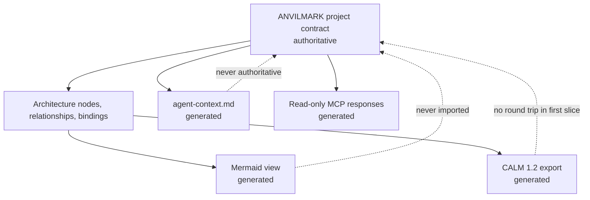

# Milestone 4 — Architecture and Generated Context

Target: **Weeks 4–5**  
Depends on: **Milestone 3 valid reviewed/approved contract revisions**  
Primary owner: **Developer C — MCP and agent context**

## Outcome

One authoritative ANVILMARK contract deterministically generates architecture views and the same approved implementation context for humans, Claude Code, and Codex.

Milestone 4 describes what should exist. Repository mapping in Milestone 5 discovers what actually exists.

## Source-of-truth boundary

Generated files may be overwritten. Manual edits to them do not change the project contract.

## Authoritative architecture model

Implement contract-backed:

- stable nodes and relationships;
- component/external-system kinds;
- workload placement;
- data classifications;
- trust boundaries and crossings;
- interfaces where required;
- decision and constraint bindings;
- generated-view locations.

Every relevant element should navigate to the approved decision and evidence that justify it.

## Mermaid generation

Generate `.anvilmark/architecture/view.mmd` with stable ordering, escaped labels, trust boundaries, data-flow labels, workload placement, and a contract revision marker.

The same contract must produce byte-stable Mermaid output. Do not include secrets, machine identity, or absolute local paths.

## CALM 1.2 export

Generate `.anvilmark/architecture/calm.json` by mapping ANVILMARK nodes, relationships, and interfaces into CALM 1.2.

Use ANVILMARK-namespaced metadata for workload references, data classification, trust-boundary meaning, and decision references that CALM does not represent natively.

Requirements:

- export only; no import or round-trip editing;
- stable ANVILMARK IDs preserved;
- deterministic ordering/content;
- official CALM validation passes;
- ANVILMARK remains authoritative.

## Generated agent context

Generate `.anvilmark/generated/agent-context.md` containing:

- project intent, outcomes, and non-goals;
- hard constraints and approved exceptions;
- workload decisions and deployment standing;
- architecture components, relationships, trust boundaries, and data classifications;
- implementation requirements;
- evidence gaps and unresolved questions;
- contract revision/hash and generation time/version;
- explicit distinction among approved, declared, measured, estimated, inferred, and unknown.

Do not present a draft, stale approval, or unknown field as an approved instruction.

## Read-only MCP surface

Implement provider-neutral tools for:

- `get_project_summary`;
- `get_constraints`;
- `get_workload_decision`;
- `get_architecture_context`;
- `list_evidence_gaps`.

Responses include contract revision and approval standing and may support workload/component filters. Claude Code and Codex must receive semantically identical facts.

MCP cannot approve, create exceptions, weaken constraints, or make generated views authoritative.

## Revision and stale-output handling

Every generated artifact records:

- contract revision and hash;
- generator/schema version;
- generation time;
- approval standing relevant to its content.

If current contract revision differs, report the artifact as stale rather than continuing silently. If a decision has no current approval, label it proposed/unapproved.

## Safe projection

Default-allow decision-layer content and non-identifying hardware capabilities. Default-deny repository roots, bindings, source, local identities, credential references, command lines, evaluation rows, and source-quoting explanations for remote consumers.

Local consumers may receive a broader, separately disclosed projection. Local execution must not silently authorize remote transmission.

## Required tests

- Atlas architecture validation and broken bindings;
- deterministic Mermaid and safe label escaping;
- deterministic CALM export and official validation;
- deterministic agent context;
- revision marker on every artifact/response;
- stale output and non-current approval warnings;
- no generated artifact accepted as authoritative input;
- Claude Code/Codex semantic response equality;
- MCP filtering and provider neutrality;
- denied local/secret fields absent from remote projection.

## Suggested team split

### Developer A

- architecture subjects, decision/constraint bindings, validation.

### Developer B

- Mermaid and CALM exporters, determinism, CALM validation.

### Developer C

- agent-context generator, read-only MCP tools, safe projections, cross-agent tests.

## Out of scope

- repository parsing and call-site detection;
- conformance execution;
- CALM import or editable canvas;
- code generation/modification;
- hosted service;
- production deployment;
- landing page.

## Exit checklist

- [ ] ANVILMARK architecture remains authoritative.
- [ ] Architecture elements bind to decisions and constraints.
- [ ] Mermaid regenerates deterministically.
- [ ] CALM 1.2 export validates and uses namespaced extensions honestly.
- [ ] Agent context regenerates deterministically.
- [ ] Every output carries its source contract revision.
- [ ] Stale/unapproved content is labelled correctly.
- [ ] Claude Code and Codex retrieve the same facts.
- [ ] MCP is read-only and provider-neutral.
- [ ] Remote projections exclude local/code/secret fields by default.
- [ ] Formatting, lint, tests, and build pass.

## Handoff to Milestone 5

Milestone 5 uses architecture node IDs, trust boundaries, workload decisions, and conformance declarations as scanner inputs. It writes proposed repository bindings and observations; it does not rewrite approved architecture decisions.
