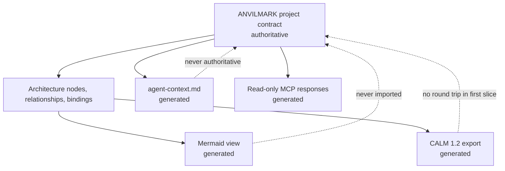

# Milestone 4 — Architecture and Generated Context

Current status: **reviewed and merged into `main` on September 14, 2026**, at
reviewed branch head `4058d6f`. The dated implementation and correction records
below preserve their status at the time; this status and the merge record at
the end supersede earlier pending-review and unmerged statements.

Target: **Weeks 4–5**  
Depends on: **Milestone 3 valid reviewed/approved contract revisions**  
Primary owner: **Developer C — MCP and agent context**

## Outcome

One authoritative ANVILMARK contract deterministically generates architecture views and the same approved implementation context for humans, Claude Code, and Codex.

Milestone 4 describes what should exist. Repository mapping in Milestone 5 discovers what actually exists.

## Source-of-truth boundary

Generated files may be overwritten. Manual edits to them do not change the project contract.

## Authoritative architecture model

Implement contract-backed:

- stable nodes and relationships;
- component/external-system kinds;
- workload placement;
- data classifications;
- trust boundaries and crossings;
- interfaces where required;
- decision and constraint bindings;
- generated-view locations.

Every relevant element should navigate to the approved decision and evidence that justify it.

## Mermaid generation

Generate `.anvilmark/architecture/view.mmd` with stable ordering, escaped labels, trust boundaries, data-flow labels, workload placement, and a contract revision marker.

The same contract must produce byte-stable Mermaid output. Do not include secrets, machine identity, or absolute local paths.

## CALM 1.2 export

Generate `.anvilmark/architecture/calm.json` by mapping ANVILMARK nodes, relationships, and interfaces into CALM 1.2.

Use ANVILMARK-namespaced metadata for workload references, data classification, trust-boundary meaning, and decision references that CALM does not represent natively.

Requirements:

- export only; no import or round-trip editing;
- stable ANVILMARK IDs preserved;
- deterministic ordering/content;
- official CALM validation passes;
- ANVILMARK remains authoritative.

## Generated agent context

Generate `.anvilmark/generated/agent-context.md` containing:

- project intent, outcomes, and non-goals;
- hard constraints and approved exceptions;
- workload decisions and deployment standing;
- architecture components, relationships, trust boundaries, and data classifications;
- implementation requirements;
- evidence gaps and unresolved questions;
- contract revision/hash and generation time/version;
- explicit distinction among approved, declared, measured, estimated, inferred, and unknown.

Do not present a draft, stale approval, or unknown field as an approved instruction.

## Read-only MCP surface

Implement provider-neutral tools for:

- `get_project_summary`;
- `get_constraints`;
- `get_workload_decision`;
- `get_architecture_context`;
- `list_evidence_gaps`.

Responses include contract revision and approval standing and may support workload/component filters. Claude Code and Codex must receive semantically identical facts.

MCP cannot approve, create exceptions, weaken constraints, or make generated views authoritative.

## Revision and stale-output handling

Every generated artifact records:

- contract revision and hash;
- generator/schema version;
- generation time;
- approval standing relevant to its content.

If current contract revision differs, report the artifact as stale rather than continuing silently. If a decision has no current approval, label it proposed/unapproved.

## Safe projection

Default-allow decision-layer content and non-identifying hardware capabilities. Default-deny repository roots, bindings, source, local identities, credential references, command lines, evaluation rows, and source-quoting explanations for remote consumers.

Local consumers may receive a broader, separately disclosed projection. Local execution must not silently authorize remote transmission.

## Required tests

- Atlas architecture validation and broken bindings;
- deterministic Mermaid and safe label escaping;
- deterministic CALM export and official validation;
- deterministic agent context;
- revision marker on every artifact/response;
- stale output and non-current approval warnings;
- no generated artifact accepted as authoritative input;
- Claude Code/Codex semantic response equality;
- MCP filtering and provider neutrality;
- denied local/secret fields absent from remote projection.

## Suggested team split

### Developer A

- architecture subjects, decision/constraint bindings, validation.

### Developer B

- Mermaid and CALM exporters, determinism, CALM validation.

### Developer C

- agent-context generator, read-only MCP tools, safe projections, cross-agent tests.

## Out of scope

- repository parsing and call-site detection;
- conformance execution;
- CALM import or editable canvas;
- code generation/modification;
- hosted service;
- production deployment;
- landing page.

## Exit checklist

- [ ] ANVILMARK architecture remains authoritative.
- [ ] Architecture elements bind to decisions and constraints.
- [ ] Mermaid regenerates deterministically.
- [ ] CALM 1.2 export validates and uses namespaced extensions honestly.
- [ ] Agent context regenerates deterministically.
- [ ] Every output carries its source contract revision.
- [ ] Stale/unapproved content is labelled correctly.
- [ ] Claude Code and Codex retrieve the same facts.
- [ ] MCP is read-only and provider-neutral.
- [ ] Remote projections exclude local/code/secret fields by default.
- [ ] Formatting, lint, tests, and build pass.

## Handoff to Milestone 5

Milestone 5 uses architecture node IDs, trust boundaries, workload decisions, and conformance declarations as scanner inputs. It writes proposed repository bindings and observations; it does not rewrite approved architecture decisions.

## Implementation record — September 14, 2026

> Superseded in part by the correction and amendment pass below: amendments 8
> and 9 are now accepted and implemented, and the four defects found by the
> independent review of `efb5539` are fixed. This section is kept as written
> for that commit.

Status: **implemented on branch `milestone-4/architecture-and-generated-context`
from `main` at `d22a4d3`; awaiting independent review.** Not merged, not
pushed. Two requirements remain **unmet pending a team decision** (below).

Authority used: document 06 as amended by documents 07 and 08, this milestone
file, the Atlas fixture, the CALM 1.2 spike export and the Milestone 3
implementation. No new schema field, protocol field or scope change was
implemented. `project-contract` stays at `0.1.0-draft.4`; the historical
`packages/contract` `0.1.0` and its MCP scaffold are unchanged. Amendment 5
remains deferred. No real project decision was approved; approved states in
tests and the walkthrough use the synthetic fixture.

### What a user can do

- Declare and edit the architecture with `anvilmark architecture node|relationship add|update|remove`,
  `bind|unbind` and `views`, as ordinary validated commits over the existing
  draft.4 fields. Broken references, undeclared data classifications,
  duplicate ids and removing a still-referenced node are refused and write
  nothing.
- Inspect it with `architecture show` and `architecture validate [--strict]`:
  derived decision, constraint and evidence links, trust-boundary crossings,
  derived workload placement, and every unresolved gap in support.
- `anvilmark generate` writes `.anvilmark/architecture/view.mmd`,
  `.anvilmark/architecture/calm.json`, `.anvilmark/generated/agent-context.md`
  and a manifest; `anvilmark generate --check` reports `current`, `missing`,
  `incomplete`, `tampered`, `stale_source`, `stale_generator` or `stale_time`.
- Run the read-only project MCP server
  (`packages/mcp/dist/project-server.js --project-dir DIR`) with the five tools,
  from Claude Code or Codex using the same command.

The worked example is [`04-atlas-walkthrough.md`](04-atlas-walkthrough.md).
Package documentation: [`@anvilmark/context`](../../../packages/context/README.md),
[`@anvilmark/cli`](../../../packages/cli/README.md),
[`@anvilmark/mcp`](../../../packages/mcp/README.md).

### Design in brief

- **One fact layer.** `@anvilmark/context` builds facts from a parsed contract
  for an explicit projection and `as_of`. The Mermaid, CALM and agent-context
  renderers and the MCP tools all read those facts; nothing reads a generated
  file back.
- **Knowledge and standing.** Facts are labelled `approved`, `declared`,
  `measured`, `estimated`, `inferred` or `unknown`. Decision standing is
  `approved_current`, `approved_stale`, `approved_unresolvable`,
  `proposed_unapproved`, `draft`, `rejected` or `superseded`; only
  `approved_current` is instruction-eligible. Evidence freshness is evaluated
  separately, so an approval hash is never presented as fresh evidence.
- **Source identity.** Every artifact and every MCP response (including
  argument errors) carries project id, contract revision, CLI state revision,
  canonical contract hash, schema version, generator
  `anvilmark-context/0.1.0-draft.1`, projection and `as_of`.
- **Determinism and freshness.** Renderers read no clock. `generate` uses
  `--as-of`, else the manifest's `as_of` for an unchanged source, generator and
  projection, else the clock once, recorded. Regenerating an unchanged contract
  is byte-stable and writes nothing. `--check` re-renders at the manifest's
  `as_of` and compares bytes, so a hand edit is `tampered` even if its manifest
  digest was also edited.
- **Safe writes.** `generate` holds the project lock, writes temporaries,
  re-reads `project.yaml` and refuses if it changed, replaces the views and
  then the manifest, and restores the previous files if a replacement fails. It
  never writes `project.yaml`, history, approvals or evidence.
- **Projections.** `remote-default` is constructed field by field and excludes
  repository roots and bindings, source locations, owners, approver
  identities and notes, credential references, integration data directories,
  evidence locators and values (evaluation rows, command lines) and hardware
  ids (aliased, including inside adapter-written gap text). Two independent
  checks follow: the secret scanner, and a scan refusing any known local value.
  `local-disclosed` is opt-in, puts local fields under `local_*` keys and
  states that local production does not authorize remote transmission.
- **CALM.** Export only, starting from the spike mapping. ANVILMARK facts are
  under `metadata.anvilmark`. A missing ANVILMARK description becomes an
  explicit "Not declared…" text with `description-declared: false` because
  CALM requires one; no interfaces, protocols, controls or flows are generated.
- **MCP.** A new server entry beside the unchanged historical scaffold. Tools
  are annotated read-only, advertise strict input schemas, and route argument
  enforcement through the shared query layer so errors carry the source marker
  and list valid values. Protocol output is stdout-only; diagnostics use
  stderr.

### Exit checklist mapping

| Exit criterion                                                    | Status                                      | Evidence                                                                                                                                                                                                                                                                                  |
| ----------------------------------------------------------------- | ------------------------------------------- | ----------------------------------------------------------------------------------------------------------------------------------------------------------------------------------------------------------------------------------------------------------------------------------------- |
| ANVILMARK architecture remains authoritative                      | **Met**                                     | Generated files are never read as input (`generate.test.ts` edited-CALM case; MCP test with tampered CALM and agent context); `--check` reports edits as `tampered`                                                                                                                       |
| Architecture elements bind to decisions and constraints           | **Met on draft.4 fields; interfaces unmet** | Bindings, component-scoped decisions, derived placement and constraint links (`facts.test.ts`, `architecture.test.ts`). "Interfaces where required" has no schema field: **unmet pending decision** on amendment 9 in [document 09](../09-milestone-4-architecture-amendment-proposal.md) |
| Mermaid regenerates deterministically                             | **Met**                                     | Byte-stable renderer and CLI tests, including two projects built by the same CLI workflow; real Mermaid parser checks (opt-in)                                                                                                                                                            |
| CALM 1.2 export validates and uses namespaced extensions honestly | **Met**                                     | Official `@finos/calm-cli` 1.56.0 and 1.59.0 on Atlas, approved, all-kinds, empty, nodes-only and hostile-text exports (no errors; nodes-only gives the validator's unreferenced-node warning); two mutated exports rejected; walkthrough exports validated                               |
| Agent context regenerates deterministically                       | **Met**                                     | Renderer and CLI byte-stability tests                                                                                                                                                                                                                                                     |
| Every output carries its source contract revision                 | **Met**                                     | Header/metadata/table assertions for all three artifacts and the manifest; every MCP tool response and error. A `project_unavailable` error has `source: null` because no contract could be read                                                                                          |
| Stale/unapproved content is labelled correctly                    | **Met**                                     | Stale, unresolvable, proposed, draft, rejected and superseded standings; expired evidence under a current approval; `stale_source`/`stale_generator`/`stale_time`/`tampered`/`incomplete` checks; walkthrough section 9                                                                   |
| Claude Code and Codex retrieve the same facts                     | **Met at protocol level**                   | Real stdio server, two clients identifying as `claude-code` and `codex-mcp-client`, byte-identical responses (`project-server.test.ts`, `verify:project-tools`). **Not demonstrated with the Claude Code or Codex applications**                                                          |
| MCP is read-only and provider-neutral                             | **Met**                                     | Exactly five tools, all `readOnlyHint`; project tree digest unchanged after calls; no lock created; responses independent of client identity                                                                                                                                              |
| Remote projections exclude local/code/secret fields by default    | **Met**                                     | Marker tests across facts, all artifacts, manifest and all five queries, including nested evaluation rows, command lines, quoted source text and a credential reference; secret and known-local-value refusals; local-disclosed boundary                                                  |
| Formatting, lint, tests, and build pass                           | **See validation**                          | Clean-checkout results are recorded in the validation section                                                                                                                                                                                                                             |

Also carried from Milestone 3: **architecture-element proposals** from an
intelligence were deferred to this milestone by decision, with the alternative
protocol expansion not accepted. The draft.4 graph still has no provenance
field, so accepting them would put unattributed generated structure — including
trust boundaries — into the authoritative graph. They remain rejected as unknown
fields. **Unmet pending decision** on amendment 8 in document 09.

### Required tests mapping

| Required test                                            | Where                                                                                                     |
| -------------------------------------------------------- | --------------------------------------------------------------------------------------------------------- |
| Atlas architecture validation and broken bindings        | `context/test/facts.test.ts`; `cli/test/architecture.test.ts` (refusals, hand-edited broken reference)    |
| Deterministic Mermaid and safe label escaping            | `context/test/renderers.test.ts` (hostile text; real Mermaid parser opt-in); `cli/test/generate.test.ts`  |
| Deterministic CALM export and official validation        | `context/test/renderers.test.ts` (official CLI opt-in, including invalid exports)                         |
| Deterministic agent context                              | `context/test/renderers.test.ts`, `context/test/artifacts.test.ts`, `cli/test/generate.test.ts`           |
| Revision marker on every artifact/response               | `renderers.test.ts`, `artifacts.test.ts`, `queries.test.ts`, `mcp/test/project-server.test.ts`            |
| Stale output and non-current approval warnings           | `facts.test.ts`, `artifacts.test.ts`, `generate.test.ts`, `queries.test.ts`                               |
| No generated artifact accepted as authoritative input    | `generate.test.ts`, `artifacts.test.ts`, `project-server.test.ts`                                         |
| Claude Code/Codex semantic response equality             | `project-server.test.ts`; `mcp/scripts/verify-project-tools.mjs`                                          |
| MCP filtering and provider neutrality                    | `queries.test.ts`, `project-server.test.ts`                                                               |
| Denied local/secret fields absent from remote projection | `context/test/projection.test.ts`, `project-server.test.ts`                                               |
| Failed writes and changes during generation              | `generate.test.ts` (rename failure with restore, temporary-write failure, change after render, lock held) |
| Milestone 3 behaviour intact                             | Full existing suites; the Milestone 3 guard that keeps approval out of MCP sources still passes           |

### Interpretations recorded for review

Document 09 records two readings that need no schema change and can be
rejected: **generation time** is represented by the recorded `as_of` (the
wall-clock time of each regeneration is not written, so regeneration stays
byte-stable, and `project.updated_at` is never used); **workload placement** is
derived from relationships and labelled as derived.

### External verification tools (not dependencies)

No dependency was added to any package. The new workspace package uses only
existing workspace dependencies. Three third-party tools were used for
verification only, installed with npm outside the repository, and are never
imported by ANVILMARK code:

| Tool              | Version(s) used | Licence    | Maintenance (npm registry, checked September 14, 2026)                                   | Data flow                                                                                                            | Reason                                                           |
| ----------------- | --------------- | ---------- | ---------------------------------------------------------------------------------------- | -------------------------------------------------------------------------------------------------------------------- | ---------------------------------------------------------------- |
| `@finos/calm-cli` | 1.56.0, 1.59.0  | Apache-2.0 | FINOS `architecture-as-code`; 1.56.0 published 2026-08-17, 1.59.0 on 2026-09-09 (latest) | Local file validation against CALM 1.2 schemas bundled in the package (identical in both versions); nothing uploaded | Official CALM 1.2 validation required by the milestone           |
| `mermaid`         | 11.12.0, 12.0.0 | MIT        | `mermaid-js/mermaid`; 12.0.0 is the latest release                                       | Parses generated `.mmd` files locally in jsdom                                                                       | Check that generated views parse and labels decode to inert text |
| `jsdom`           | 26.1.0          | MIT        | `jsdom/jsdom`; 26.1.0 published 2025-04-13 (latest is 30.0.1)                            | Local DOM for Mermaid's parser                                                                                       | Mermaid's parser needs a DOM                                     |

Installing them downloads packages from the npm registry. The opt-in tests
read `ANVILMARK_CALM_BIN` and `ANVILMARK_MERMAID_NODE_MODULES`; without them
those tests are skipped, and the default suite needs no network.

### Known limitations

- Generated trust boundaries, interfaces and architecture proposals are not
  supported (document 09). Conformance rules are shown as declarations and are
  not evaluated (Milestone 6).
- Workload placement is derived from relationships, not declared.
- Client parity is shown at the MCP protocol level only. No Claude Code or
  Codex application was connected, and nothing verifies what a client or its
  model does with tool results.
- The remote-default projection governs what ANVILMARK emits; ANVILMARK cannot
  control whether a client forwards tool results or a generated file to a
  remote model.
- The known-local-value check matches exact strings of at least eight
  characters. A local value rewritten by other text (for example a path
  fragment) would not be caught by that check; construction remains the primary
  control.
- The MCP server evaluates `as_of` at call time unless started with `--as-of`,
  so two calls at different times can differ in time-dependent standings; both
  report their `as_of`.
- `project.yaml` edited by another tool between the final recheck and the
  manifest rename is not prevented (no cross-process lock beyond the CLI's);
  `generate` warns and `--check` then reports `stale_source`.
- CALM exports from contracts whose nodes have no relationships produce the
  validator's `architecture-nodes-must-be-referenced` warning; this is reported,
  not suppressed.
- The historical MCP scaffold still returns fixture data, as documented.

- On a fresh checkout, `pnpm install` warns that it cannot link the `anvilmark`
  bin into `packages/mcp/node_modules` before the CLI is built (the project
  server imports the CLI's store). The warning is harmless; `pnpm build`
  resolves it.
- The Milestone 3 test that keeps any mention of approval out of MCP sources is
  unchanged; MCP tool descriptions therefore speak of instruction eligibility,
  while approval standing itself comes from the shared facts.

### Validation

Run on September 14, 2026 in a clean detached checkout of `cf8c7f6` (the
implementation commit `fcea2cc` plus documentation), created with
`git worktree add --detach`. Node.js v24.15.0, pnpm 11.16.0 via Corepack.
This record was added afterwards in a documentation-only commit.

| Check                                                                                                                                    | Result                                                                                                                                                                                                                                                 |
| ---------------------------------------------------------------------------------------------------------------------------------------- | ------------------------------------------------------------------------------------------------------------------------------------------------------------------------------------------------------------------------------------------------------ |
| `pnpm install --frozen-lockfile --offline`                                                                                               | Passed (bin-link warning noted above)                                                                                                                                                                                                                  |
| `pnpm build`                                                                                                                             | Passed                                                                                                                                                                                                                                                 |
| `pnpm lint`                                                                                                                              | Passed                                                                                                                                                                                                                                                 |
| `pnpm format:check`                                                                                                                      | Passed                                                                                                                                                                                                                                                 |
| `pnpm test`                                                                                                                              | **1,201 passed, 21 skipped**: contract 1, project-contract 282, engine 1, web 1, adapters 712 (+19 skipped real-Promptfoo), context 79 (+2 skipped opt-in validators), CLI 114, MCP 11                                                                 |
| Context suite with `ANVILMARK_CALM_BIN` = `@finos/calm-cli` 1.56.0 and `ANVILMARK_MERMAID_NODE_MODULES` = Mermaid 11.12.0 + jsdom 26.1.0 | 81/81 passed                                                                                                                                                                                                                                           |
| Context suite with `@finos/calm-cli` 1.59.0 and Mermaid 12.0.0 + jsdom 26.1.0                                                            | 81/81 passed                                                                                                                                                                                                                                           |
| Real Promptfoo 0.122.0 suite (`ANVILMARK_PROMPTFOO_BIN`, built-in `echo` provider; adapter code unchanged in this milestone)             | 19/19 passed                                                                                                                                                                                                                                           |
| `pnpm verify:mcp` (historical scaffold)                                                                                                  | `tools/list OK: audit_system, estimate_cost, explain_finding`                                                                                                                                                                                          |
| `pnpm verify:mcp-project` (real stdio)                                                                                                   | Passed: protocol `2025-11-25`, exactly five read-only tools, every tool called, three invalid-argument errors with source markers, 8/8 responses byte-identical for `claude-code` and `codex-mcp-client`, JSON-RPC-only stdout, project tree unchanged |
| `git diff --check d22a4d3 cf8c7f6`                                                                                                       | Passed                                                                                                                                                                                                                                                 |
| Checkout status after verification                                                                                                       | Clean                                                                                                                                                                                                                                                  |

The walkthrough was run as written in the implementation worktree against the
built `fcea2cc` code (sections 0–6, 8, 9), and its generated CALM exports and
Mermaid views were validated with the tools above (section 7). No model was
downloaded, no live or paid provider was contacted, no repository content was
uploaded, and no Claude Code or Codex application was connected: client parity
is established at the MCP protocol level only.

## Correction and amendment pass — September 14, 2026

Status: **implemented on branch `milestone-4/architecture-and-generated-context`
on top of `efb5539`; awaiting independent review.** Not merged, not pushed, not
deployed. No real project decision was approved; M5 was not started.

Inputs: the independent review of `efb5539` (four reproduced defects R1–R4,
with probe script and results) and Anurag's decision of September 14, 2026
accepting amendments 8 and 9 with modifications and both interpretations as
clarified, under a new acknowledgement exception limited to those Milestone 4
decisions. The decision, its scope and the exact accepted specification were
recorded in
[document 09](../09-milestone-4-architecture-amendment-proposal.md) (commit
`e9fc362`) before implementation. No decision is attributed to Navaneeth or
Aaradhya; Amendment 5 and structured evidence requests remain deferred.

### Defects fixed

| Review case                                                                         | Fix                                                                                                                                                                                                                                                                                                                                                                                                                                                                                                                                                                                                                                                                                                      | Regression tests                                                                                                                                                                                                                                                                         |
| ----------------------------------------------------------------------------------- | -------------------------------------------------------------------------------------------------------------------------------------------------------------------------------------------------------------------------------------------------------------------------------------------------------------------------------------------------------------------------------------------------------------------------------------------------------------------------------------------------------------------------------------------------------------------------------------------------------------------------------------------------------------------------------------------------------- | ---------------------------------------------------------------------------------------------------------------------------------------------------------------------------------------------------------------------------------------------------------------------------------------- |
| **R1** (P1) output paths could overwrite `project.yaml` through a directory symlink | `packages/cli/src/output-boundary.ts` walks every output (views, agent context, manifest) component by component below the physical `.anvilmark/` before any output is read or written: symbolic links below `.anvilmark/`, non-directory parents, non-regular destinations, aliases of `project.yaml`/`.lock` (by file identity) or of `history/`, `intelligence/`, `evaluations/` (case-folded path), and colliding destinations are refused. Missing directories are created one checked component at a time; the boundary is rechecked just before replacement, and temporaries are opened exclusively in verified directories. `generate --check` applies the same check without creating anything. | `cli/test/m4-review-corrections.test.ts`: the reproduced `exports -> .` link, a link outside the project, a symlinked and a hard-linked output, case-folded aliases, colliding outputs, a file where a directory is needed; the contract and prior output are unchanged on every refusal |
| **R2** (P1) remote-default MCP errors echoed the local project directory            | Project-level failures now return fixed text with codes `project_not_found`, `project_unreadable`, `project_invalid` (issue codes and contract field paths only), `projection_refused` and `internal_error`, and `source: null`. Local diagnostics go only to the server's standard error. Credential sanitization is no longer relied on for paths.                                                                                                                                                                                                                                                                                                                                                     | `mcp/test/project-server-m4-corrections.test.ts` over real stdio: missing, malformed, invalid, unreadable (chmod 000) and projection-refused projects, every tool, both `content` and `structuredContent`                                                                                |
| **R3** (P2) ordinary regeneration called time-stale output "already current"        | `presentFreshness` (context) compares time-dependent facts at `as_of` and now. Every `generate` reports it separately from byte equality. A reused or recorded `as_of` that is no longer current prints `STALE … (stale_time)` with the differences, keeps the bytes, returns exit 1 and JSON `status: stale_time`, `remediation: "anvilmark generate --refresh"`; `--check` gives the same remedy. An explicit `--as-of` succeeds and is labelled `historical_snapshot`.                                                                                                                                                                                                                                | `cli/test/m4-review-corrections.test.ts`: current day, genuine no-op, expiry across the clock boundary, historical rendering, refresh resolving it; `context/test/amendments.test.ts`                                                                                                    |
| **R4** (P2) candidate constraint standings labelled every pass/fail `measured`      | Standing knowledge is derived from the admissible, current evidence and calculation basis, independently of the outcome: projected cost and hardware-compatibility estimates are `estimated`; the strongest supporting evidence otherwise decides; unsettled outcomes are `unknown`; a `knowledge_basis` explains each label.                                                                                                                                                                                                                                                                                                                                                                            | `context/test/amendments.test.ts`: projected cost (facts, agent context and MCP agree on `estimated`), an admissible observation (`measured`), below-floor and expired support (`unknown`)                                                                                               |

The reviewer's probe script was also rerun against the corrected build (with
its fixture migrated to draft.5): all four defect assertions now fail — R1 on
the symlink refusal, R2 because the path is absent, R3 on the non-success exit,
R4 because the label is `estimated`.

### Amendments implemented

- **Schema `0.1.0-draft.5`** (`project-contract`): `origin` on nodes,
  relationships and bindings with O1–O3; `interfaces` and interface references
  with I1–I3; one binding per decision and no duplicate binding node (I4–I5);
  `architectureContentHash` over `anvilmark-architecture-content/1` with
  domain separation and canonical sets; derived `confirmationStanding`. Pure and
  portable: no history is consulted.
- **Protocol `0.1.0-draft.2`** (`adapters`): strict version-specific proposal
  validation (draft.1 rejects the architecture arrays even when empty); strict
  entries that cannot carry origin, confirmation or interfaces; draft.2 requests
  with a `propose_architecture` task; draft.1 requests still import. The
  evidence-adapter envelope stays `0.1.0-draft.1`. Existing architecture is not
  added to any projection field.
- **Import** (`cli`): all-or-nothing application with the proposal record in
  the same state revision; existing ids and bindings cannot be overwritten or
  extended; cross-references within the proposal are validated.
- **Confirmation** (`cli`): `architecture confirm node ID | relationship ID |
binding DECISION_REF`, interactive only, verifying committed provenance
  (missing, ambiguous, abandoned, uncommitted or mismatched provenance refuses),
  typed hash prefix, re-read before commit, history provenance
  `architecture_confirmation`. CLI edits that change confirmed content clear it;
  manual edits become `confirmation_stale`.
- **Effective conclusions** (`context`): untrusted elements are `inferred`,
  effective trust boundaries and crossings are `unknown` (declared values and
  possible crossings stay visible), links through them are not authoritative;
  confirmed elements are `declared`, never `measured`. Mermaid groups them under
  an unknown boundary; CALM, agent context and MCP carry the same standings.
- **Interfaces** (`cli`, `context`): `architecture interface add|update|remove`,
  `relationship --source-interface/--destination-interface`; CALM native
  interface ids and references, protocols only in `metadata.anvilmark`.
- **Interpretations**: `as_of` is the persisted evaluation instant with present
  freshness reported separately (R3); workloads are "associated through
  relationships" (`associated_workloads`), not placed.
- **Generator** `anvilmark-context/0.1.0-draft.2`; output from `0.1.0-draft.1`
  reports `stale_generator` (verified against a fixture written by the `efb5539`
  build, `cli/test/fixtures/draft4-generated/`).

### Compatibility evidence

- `project-contract/test/fixtures/approved-atlas.draft4.yaml` was written by the
  unmodified `efb5539` build from the synthetic draft.3 fixture (with a binding
  and an edited description). Migrated by its version lines only, it parses with
  every element user-declared and no interfaces; the stored approval hash
  `81b8559b4cd6fdddd5addfb4bd065caa574529f8802e4f1bfe85292efe481f1d` recomputes
  identically and stays current, also after normalized serialization
  (`draft5-amendments.test.ts`).
- The Atlas fixture changed only its two version lines; its draft.3 relation
  test still holds. Historical fixtures and the draft.3 fixture are unchanged.

### Exit checklist status

| Exit criterion                                                    | Status                    | Evidence                                                                                                                                                                        |
| ----------------------------------------------------------------- | ------------------------- | ------------------------------------------------------------------------------------------------------------------------------------------------------------------------------- |
| ANVILMARK architecture remains authoritative                      | **Met**                   | Generated edits are `tampered` and never read (CLI, MCP end-to-end); output can no longer reach project state (R1)                                                              |
| Architecture elements bind to decisions and constraints           | **Met**                   | Bindings, component scope, associations, constraint links with authority; interfaces declared (amendment 9); unconfirmed bindings shown but not support                         |
| Mermaid regenerates deterministically                             | **Met**                   | Byte-stable tests; real Mermaid 11.12.0 and 12.0.0 parsing                                                                                                                      |
| CALM 1.2 export validates and uses namespaced extensions honestly | **Met**                   | Official CLI 1.56.0 and 1.59.0 on graphs with interfaces, null protocols, multiple interfaces and unconfirmed proposals; undefined and wrong-node interface references rejected |
| Agent context regenerates deterministically                       | **Met**                   | Byte-stable tests                                                                                                                                                               |
| Every output carries its source contract revision                 | **Met**                   | All artifacts and MCP responses; project-level MCP errors carry `source: null` because no source could be established                                                           |
| Stale/unapproved content is labelled correctly                    | **Met**                   | Decision standings; `stale_time` in ordinary generation and `--check` (R3); inferred/stale architecture; `stale_generator` for old output                                       |
| Claude Code and Codex retrieve the same facts                     | **Met at protocol level** | Real stdio, two client identities, byte-identical responses and component views. **Not demonstrated with the Claude Code or Codex applications**                                |
| MCP is read-only and provider-neutral                             | **Met**                   | Five `readOnlyHint` tools; tree digests unchanged across the end-to-end walkthrough; no tool can confirm                                                                        |
| Remote projections exclude local/code/secret fields by default    | **Met**                   | Projection marker tests; path-free MCP errors (R2)                                                                                                                              |
| Formatting, lint, tests, and build pass                           | **See validation**        | Clean-checkout results below                                                                                                                                                    |

Architecture-element proposals and interfaces, previously unmet pending a
decision, are implemented under the recorded decision.

### Known limitations of this pass

- Confirmation is content integrity and local provenance checking, not identity:
  an interactive terminal does not prove a person is present, and someone who
  rewrites the whole contract, including the hash, is not detected by the
  portable standing.
- Portable consumers (context, MCP) report content-match standing only; they do
  not re-verify `proposal_ref` against history.
- Existing architecture is not projected to intelligences, so a proposing agent
  must be told existing node ids to reference them.
- Proposals cannot declare interfaces; users declare them.
- The output boundary guards against misconfiguration and pre-existing links. A
  concurrent process with write access to `.anvilmark/` that swaps a directory
  between the final recheck and a rename is not prevented.
- Case-folded comparison refuses some paths that are distinct on a
  case-sensitive filesystem (for example `Project.YAML`).
- Earlier limitations still apply: protocol-level client parity only, no
  conformance evaluation, and the harmless bin-link warning on a fresh install.

### Validation of this pass

Run on September 14, 2026 in a clean detached checkout of `d16fe7b`, created
with `git worktree add --detach`. Node.js v24.15.0, pnpm 11.16.0 via Corepack.
This record was added afterwards in a documentation-only commit. The
intermediate commits `e1e73b5`–`2df9ea7` are grouped by package and are not
each independently green; the verified state is `d16fe7b`.

| Check                                                                                            | Result                                                                                                                                                                                                  |
| ------------------------------------------------------------------------------------------------ | ------------------------------------------------------------------------------------------------------------------------------------------------------------------------------------------------------- |
| `pnpm install --frozen-lockfile --offline`                                                       | Passed (the known bin-link warning)                                                                                                                                                                     |
| `pnpm build`, `pnpm lint`, `pnpm format:check`                                                   | Passed                                                                                                                                                                                                  |
| `pnpm test`                                                                                      | **1,278 passed, 23 skipped**: contract 1, project-contract 306, engine 1, web 1, adapters 723 (+19 real-Promptfoo skipped), context 88 (+3 opt-in validators skipped), CLI 142, MCP 16                  |
| Context suite with `@finos/calm-cli` 1.56.0 and Mermaid 11.12.0 + jsdom 26.1.0                   | 91/91 passed (official CALM validation including interfaces, null protocols, multiple interfaces, unconfirmed proposals, and rejected undefined and wrong-node interface references)                    |
| Context suite with `@finos/calm-cli` 1.59.0 and Mermaid 12.0.0 + jsdom 26.1.0                    | 91/91 passed                                                                                                                                                                                            |
| Adapters suite with real Promptfoo 0.122.0 (`ANVILMARK_PROMPTFOO_BIN`, built-in `echo` provider) | 742/742 passed, including the 19 real-binary tests; run because the shared proposal path changed                                                                                                        |
| `pnpm verify:mcp` (historical scaffold)                                                          | `tools/list OK: audit_system, estimate_cost, explain_finding`                                                                                                                                           |
| `pnpm verify:mcp-project` (real stdio)                                                           | Passed: five read-only tools, every tool called, three argument errors with source markers, 8/8 byte-identical responses for `claude-code` and `codex-mcp-client`, JSON-RPC-only stdout, tree unchanged |
| `git diff --check efb5539 d16fe7b`                                                               | Passed                                                                                                                                                                                                  |
| Checkout status after verification                                                               | Clean                                                                                                                                                                                                   |

The walkthrough was run as written in the implementation worktree against the
built code (sections 0–8, 10–12, 14; section 9's confirmations typed through a
real pseudo-terminal). Its generated CALM exports passed `@finos/calm-cli`
1.56.0 and 1.59.0 with no errors or warnings, and its Mermaid views parsed with
Mermaid 11.12.0 and 12.0.0 (the Atlas view with subgraphs `tb_local`,
`tb_remote_provider` and `tb_unknown`). The reviewer's four probes were rerun
against the corrected build as described above. No model was downloaded, no
live or paid provider was contacted, no repository content was uploaded, and no
Claude Code or Codex application was connected: client parity is established at
the MCP protocol level only.

## Follow-up to review `1b944fd` — September 14, 2026

Codex implemented the two remaining corrections at the user's request. The
accepted amendments and acknowledgement exception are unchanged.

- **C1, MCP error disclosure:** project-level errors contain only fixed text
  and a fixed error code. Validation issue paths are excluded because unknown
  property names and dynamic record keys can contain private text. Full local
  validation diagnostics remain on stderr. Regressions exercise root and nested
  unknown properties, invalid metric keys, every tool, both response
  representations, and unchanged project files over actual stdio.
- **C2, draft.4 compatibility:** parsing normalizes repeated user-declared
  bindings to the union of their node refs before integrity validation. It
  preserves all associations, the first binding's position, already unique
  bindings, and the source file. Groups containing agent provenance are never
  combined; duplicate proposal additions remain refused. Document 09 now makes
  clear that the manual legacy-repair prerequisite was an implementation error,
  not an extra condition of the accepted amendment.

The legacy fixtures in `project-contract/test/fixtures/draft4-binding-cases.json`
cover repeated nodes, overlapping bindings and disjoint bindings. Reconstructing
each from the preserved approved draft.4 fixture gives the recorded canonical
document hash. Each was validated with the unmodified `efb5539` build before
migration, with approval `81b8559b4cd6fdddd5addfb4bd065caa574529f8802e4f1bfe85292efe481f1d`
current. The draft.5 regressions change only the schema version fields, preserve
that hash and standing, and verify deterministic round trips and set ordering.

The original R1–R4 cases and the synthetic import/confirmation/interface-edit
workflow are retained. Review artifacts and the final validation record identify
the exact tested commit. No main merge, push, deployment, real approval change
or Milestone 5 work is part of this correction.

### Final correction verification

Verified implementation: **`86ae934e25d3e95fec55a269da89052e7f7fa7af`**.
Checks ran in the clean detached checkout
`/private/tmp/anvilmark-m4-final-verification`. The subsequent verification-record
commit changes only this Markdown document.

| Check                                                                                                                 | Result                                                                                                                                                                                              |
| --------------------------------------------------------------------------------------------------------------------- | --------------------------------------------------------------------------------------------------------------------------------------------------------------------------------------------------- |
| `pnpm install --frozen-lockfile --offline --store-dir /private/tmp/anvilmark-m3-review-pnpm-store`                    | Passed                                                                                                                                                                                              |
| `pnpm build`, `pnpm lint`, `pnpm exec prettier --check .`, `git diff --check 1b944fd..HEAD`                           | Passed                                                                                                                                                                                              |
| `pnpm test`                                                                                                           | **1,285 passed, 22 skipped**: contract 1, project-contract 310, engine 1, web 1, adapters 723 (+19 optional Promptfoo), context 88 (+3 optional validators), CLI 142, MCP 19                        |
| `pnpm --filter @anvilmark/context test` with `ANVILMARK_CALM_BIN` and `ANVILMARK_MERMAID_NODE_MODULES`                | **91 passed**, official CALM CLI 1.56.0 and Mermaid 11.12.0, including negative validation cases                                                                                                    |
| `pnpm --filter @anvilmark/adapters exec vitest run test/promptfoo-real-binary.test.ts` with `ANVILMARK_PROMPTFOO_BIN` | **19 passed**, real Promptfoo 0.122.0 with its echo provider                                                                                                                                        |
| `pnpm verify:mcp`, `pnpm verify:mcp-project`                                                                          | Passed; five project tools, 8/8 identical responses between named clients, project tree unchanged                                                                                                   |
| Eight directed review cases                                                                                           | Passed: R1–R4, safe invalid-property errors, legacy migration, content-hash invalidation, and synthetic CLI import/confirmation/interface-edit/generation/MCP                                       |
| Three legacy CLI generation cases                                                                                     | Repeated refs, overlapping bindings and disjoint bindings all load; old output is `stale_generator`; refresh and subsequent check are `current`; source bytes and current approval remain unchanged |

The 22 optional tests skipped in the ordinary workspace run were exercised by
the separate validator and Promptfoo commands above. The second validator
version pair from the prior implementation record was not repeated. The CLI
workflow uses scripted interactive input and a synthetic fixture; no live
Claude Code/Codex application integration is claimed. Existing protocol-level
client-parity and concurrent-directory-swap limitations remain as documented.

Both remaining review findings are resolved, with no known blocking findings
from this correction review. M4 is ready for a separate merge decision.

## Review and merge record — September 14, 2026

The user authorized merging and pushing M4 after its corrections were verified.
After fetching origin, local and remote `main` were both
`d22a4d36f567b205d0f36cca2e6978a5332227be`. In a clean temporary main worktree,
`main` was fast-forwarded to the reviewed M4 branch head
`4058d6f7534b65faa8b2127315abd24ce7fdf4df` (13 commits, no divergence).

The tested implementation is `86ae934e25d3e95fec55a269da89052e7f7fa7af`.
`4058d6f` adds only the verification record. The merge tree is identical to the
reviewed branch, with a subsequent documentation-only commit recording the
merge and bringing the root README, plan and handbook status up to date.
No code, test, fixture, dependency or schema changes were added during merging.

The final verification above remains applicable: 1,285 workspace tests passed,
the 22 optional cases were exercised through real Promptfoo and official
CALM/Mermaid runs, both MCP transport checks passed, all eight review probes
passed, and the three legacy migration/generation cases retained their source
bytes and approvals. No blocking review finding remains. The existing
protocol-level client-parity and bounded safety limitations remain documented.

M5 may now use the merged architecture and context baseline. It produces local
repository observations and proposed bindings; M6 owns conformance decisions.
Amendment 5 and structured evidence requests remain deferred. The M4
acknowledgement exception does not authorize future schema amendments. No real
project approval, deployment or source scan was performed during this merge.
