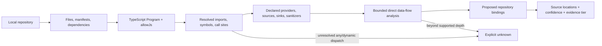

# Milestone 5 — Repository Mapping

Target: **Weeks 5–7**  
Depends on: **Milestone 4 architecture IDs and approved context**  
Primary owner: **Developer B — repository and conformance**\
Status: **Reviewed and merged into `main` on September 15, 2026**, at branch head `33d0656`. The dated records below preserve earlier states; this status and the merge record supersede pending-review statements.

## Outcome

ANVILMARK deterministically maps a TypeScript/JavaScript repository into source-linked observations and proposed bindings to the approved architecture, while reporting unsupported or dynamic behavior as unknown.

This milestone discovers implementation facts. It does not yet decide whether every fact conforms; Milestone 6 evaluates the rules.

## Analysis pipeline

No repository content leaves the machine during this pipeline.

## First detector

Build one detector using the TypeScript compiler API:

- TypeScript and JavaScript through `allowJs`;
- project/tsconfig discovery;
- module and import resolution;
- symbol-aware call-site analysis;
- source locations with normalized repository-relative paths;
- deterministic results for the same source and configuration.

Python, Java, Go, and general multi-language analysis are post-slice extensions.

## Detector plugin interface

Separate these responsibilities so later languages and provider adapters do not rewrite the scanner core:

1. **Inventory** — language, manifests, dependencies, infrastructure declarations, relevant files.
2. **Resolution** — modules, imports, symbols, aliases, and call sites.
3. **Semantics** — contract/provider-specific sources, sinks, sanitizers, model/runtime identifiers.
4. **Flow** — bounded propagation with supported/unsupported reasons.
5. **Binding** — architecture, workload, candidate, and decision references.
6. **Evidence** — exact locations, detector version, confidence, and evidence classification.

Provider knowledge belongs in replaceable recognizers or declarations, not scattered string checks.

## Repository inventory

Collect only facts relevant to the vertical slice:

- TypeScript/JavaScript source roots;
- package manager and manifests;
- AI SDK/runtime dependencies;
- provider/model references;
- environment-variable names without values;
- selected configuration files;
- candidate call sites;
- likely entry points and declared repository roots.

Inventory is not an architecture decision. It becomes evidence that may support a binding.

## Source, sink, and sanitizer model

For Atlas, contract/declaration-backed semantics include:

- raw-ticket source;
- redacted-ticket value;
- local redactor/sanitizer;
- remote provider sinks;
- selected/allowed provider candidate;
- classification workload boundary.

Recognizers should prefer type/symbol resolution over matching names such as `openai` or `redact`. User/contract declarations remain visible when semantic recognition depends on them.

## Bounded data-flow scope

The first slice supports:

- intraprocedural def-use;
- aliases that resolve statically;
- direct calls whose definitions resolve statically;
- one level of direct-call propagation;
- declared sanitizer clearing;
- type-resolved provider sinks.

Report `unknown`, with a reason, for:

- unresolved `any`;
- dynamic property access or dispatch;
- deeper indirection;
- runtime-selected modules/endpoints;
- reflection or code generation;
- queues, databases, event buses, or network hops not modelled;
- unsupported framework transformations.

Unknown is a supported result, not a scanner error.

## Repository binding output

Each proposed binding records:

- stable binding ID;
- contract revision;
- decision/workload/architecture references;
- repository root reference;
- repository-relative file, symbol, and line/column span;
- detector and version;
- deterministic, inferred, user-confirmed, or runtime-confirmed kind;
- confidence and evidence tier;
- source/sink/sanitizer annotations where relevant;
- caveats and unknown reasons;
- observed source content hash.

Never store an absolute user path in a remotely projected binding.

## Trust boundaries and redaction paths

Map recognized call sites to the contract's architecture nodes and trust boundaries. Preserve the difference between:

- a provider dependency existing;
- a provider client being instantiated;
- a provider call site existing;
- raw data provably reaching that call;
- redacted data reaching that call;
- data flow being unresolved.

These observations feed separate Milestone 6 rules.

## Required fixture coverage

Create small TypeScript/JavaScript cases for:

- direct SDK import and call;
- aliased import;
- wrapper function resolved one level deep;
- declared sanitizer on the direct path;
- missing sanitizer;
- JavaScript source through `allowJs`;
- dynamic import/runtime provider;
- unresolved `any`;
- queue/database handoff outside the supported boundary;
- comments or strings containing provider names without actual calls.

Tests must prevent text-only false positives.

## Security and data handling

- Scan local files only.
- Do not log full file contents by default.
- Persist minimal source excerpts only when explicitly permitted; prefer locations and hashes.
- Exclude ignored/generated/vendor directories by default.
- Detect probable secrets before any user-authorized remote projection.
- Show the exact selected files and payload before remote interpretation is requested.

## Suggested team split

### Developer A

- binding/evidence contract integration and evidence classification review.

### Developer B

- compiler-API program, module/symbol/call resolution, bounded flow, fixture cases.

### Developer C

- scanner CLI/MCP boundary, local-data policy, result presentation and filters.

## Out of scope

- Python/Java/Go parsing;
- general interprocedural or cross-service program analysis;
- runtime telemetry ingestion;
- automatic code changes;
- complete architecture reconstruction;
- pass/fail conformance decisions;
- repository upload;
- landing page.

## Exit checklist

- [ ] One detector covers TypeScript and JavaScript through `allowJs`.
- [ ] Detector responsibilities are separated behind a plugin interface.
- [ ] Every claimed call site links to repository-relative source evidence.
- [ ] Provider/model call sites are symbol-aware, not text-only.
- [ ] Atlas sources, sinks, sanitizer, and trust boundaries are representable.
- [ ] Supported direct flows are deterministic.
- [ ] Dynamic/unsupported flows return explicit unknown reasons.
- [ ] Deterministic and inferred bindings are visibly different.
- [ ] No repository content leaves the machine without exact disclosure and consent.
- [ ] Repeated scans of unchanged source are stable.
- [ ] Formatting, lint, tests, and build pass.

## Handoff to Milestone 6

Milestone 6 consumes versioned repository observations and bindings. It must not promote inferred or unresolved mappings into deterministic facts while evaluating a rule.

## Implementation record — September 15, 2026

Status: **implemented on branch `codex/m5-repository-mapping` from `main` at
`7b49d4d`, for independent review. Not merged or pushed.** Contract
`0.1.0-draft.5`, intelligence protocol `0.1.0-draft.2`, evidence-adapter
envelope `0.1.0-draft.1` and generator `anvilmark-context/0.1.0-draft.2` are
unchanged. No schema or protocol amendment was needed or made; amendment 5 and
structured evidence requests remain deferred. Historical `packages/contract`
`0.1.0` is untouched. No real decision, approval or binding was changed.

### What a user can do

- Declare, in a local file (`.anvilmark/scanner.yaml`), which exported
  functions are sources and sanitizers of which data classifications, which
  recognized provider operations correspond to which architecture node and
  candidate, and which files implement which component and workload.
- Run `anvilmark scan`: a compiler-backed scan of one TypeScript/JavaScript
  repository that writes only `.anvilmark/scans/repository-scan.json`.
- Inspect observations, data flows with traces, proposed bindings, unknowns,
  analysis errors and limits with `anvilmark scan show`, and check freshness
  with `anvilmark scan --check`.
- Hand the versioned artifact to Milestone 6 through `@anvilmark/scanner`'s
  `readArtifact`, `assessArtifactStanding` and `toContractRepositoryBinding`.

The reference is [`packages/scanner/README.md`](../../../packages/scanner/README.md);
the CLI surface is in [`packages/cli/README.md`](../../../packages/cli/README.md#repository-scan);
the reproducible example is [`05-atlas-walkthrough.md`](05-atlas-walkthrough.md).

### Design in brief

- **New package `@anvilmark/scanner`.** Stages `inventory → resolution →
semantics → flow → evidence → binding` behind typed, replaceable
  `StageImplementation`s; provider, boundary and unsupported-SDK knowledge in
  data-only recognizers (`openai`, `ollama`, queues, databases, Node events and
  processes, network). The artifact records every stage and recognizer version.
- **Compiler-backed.** A real `ts.Program` and type checker (TypeScript 5.9.3,
  pinned; dependency record in the package README), `allowJs` forced on,
  tsconfig/jsconfig discovery for options, module resolution through the same
  bounded host, resolved signatures and exact 1-based spans. A provider call is
  a call whose resolved declaration is a recognized operation in a recognized
  package; strings, comments and same-named local code never match.
- **Bounded reader.** Every compiler, inventory and manifest read goes through
  `RepositoryReader`: `realpath` inside the repository (or TypeScript's own
  `lib.*.d.ts`), denied `.anvilmark/`, no symlink following in the walk, no
  `.env*`, default exclusions and the root `.gitignore` subset, a 2 MiB limit,
  and a hash of every byte read.
- **Bounded flow** (`bounded-direct-call/1`): declaration-driven facts and
  opaque unknowns through intraprocedural def-use, resolved aliases, default
  library propagation, declared sources and sanitizers, branch joins marked
  `conditional`, and one level of direct-call propagation defined in the
  README. Anything else that carries data is one of 21 explicit unknown
  reasons with its location, context and partial trace.
- **Local artifact** `anvilmark-repository-scan/0.1.0-draft.1` (strict Zod
  schema). `content_hash` covers everything except `observation`; identical
  inputs give identical content at any absolute path; `observed_at` is
  explicit, reused for identical content, or the clock once.
- **CLI persistence** reuses the Milestone 4 physical output boundary, lock,
  exclusive temporary write, input recheck before publish and boundary
  recheck before rename. The boundary gained `protect` options so scan and
  generated outputs cannot overwrite each other's state.

### Interpretations recorded for review

These are implementation interpretations, not team decisions; reviewers may
change them.

1. **Schema gap.** Draft.5 `RepositoryBinding` has no spans, hashes, traces or
   unknowns. The richer data lives only in the local artifact. Nothing is
   written to `repository_bindings`; `toContractRepositoryBinding` returns a
   draft.5-shaped value only for a `declared_mapping` binding to a decision
   whose approval was current at scan time, with `discovery.kind:
deterministic`. No amendment is proposed by this pass.
2. **Discovery mapping.** Local kinds are `deterministic_observation`,
   `declared_mapping`, `heuristic_association` and `unresolved`. Heuristics are
   never projected and `agent_inferred` is never produced, because no agent
   made them. `user_confirmed` and `runtime_confirmed` are never produced.
3. **Tiers.** Compiler-resolved observations are T3 for the fact observed. A
   data-flow trace is T3 within the flow model, with each declared source and
   sanitizer listed as a T1 assumption (and `declared_sources_complete` for
   sanitized or no-data results); unresolved flows are T0; declared mappings
   T1; heuristics T0.
4. **One level.** Every function and module top level is a root; a resolved
   repository call is followed once from a root; calls inside a followed body
   are `call_depth_exceeded`. A root's own parameter-only context is
   `superseded` only when every in-repository reference to the function is a
   followed direct call.
5. **Sanitizer arguments.** Only the declared argument's declared
   classifications are cleared, in the return value only; facts in other
   arguments are carried conservatively.
6. **Sent data.** Every argument of a provider call is treated as sent, not
   only the payload property the recognizer names.
7. **Decision association.** A binding's decision is the workload's
   `current_decision_ref`, else the workload's single non-rejected,
   non-superseded decision; otherwise it is unbound with a reason.
8. **Heuristic.** The only heuristic associates a `managed_api` recognizer's
   call with the contract's single `remote_provider` node, when no sink
   declaration exists.
9. **Repository roots.** Scanning a repository not listed in
   `project.repository_roots` is allowed and recorded as a limit; the scanner
   never adds it.
10. **Lock scope.** The project lock is held for the whole scan, as for
    `generate`.

### Exit checklist status

- [x] **One detector covers TypeScript and JavaScript through `allowJs`.**
      `scenarios.test.ts` "JavaScript through allowJs" (CommonJS `.js` with
      `require`/`module.exports` and ESM `.mjs`, no tsconfig).
- [x] **Detector responsibilities are separated behind a plugin interface.**
      `ScanPipeline` stages and `RecognizerSet`; `boundaries.test.ts` replaces a
      stage and adds a recognizer for a new SDK without changing any stage.
- [x] **Every claimed call site links to repository-relative source
      evidence.** The schema requires `path`, `symbol`, full span and
      `source_sha256` on every observation, flow trace step and unknown;
      artifacts are asserted free of absolute paths.
- [x] **Provider/model call sites are symbol-aware, not text-only.**
      Resolved-declaration matching; strings, comments, a local `OpenAI` class,
      a local `create` function and a shadowing parameter produce no
      observation (`scenarios.test.ts`).
- [x] **Atlas sources, sinks, sanitizer and trust boundaries are
      representable.** Declarations bind `readTicket`, `redactTicket`, provider
      operations and components to Atlas nodes with hash-aware confirmation
      standing and trust boundaries (walkthrough, `handoff.test.ts`).
- [x] **Supported direct flows are deterministic.** Identical content for
      repeated scans and for copies at different paths; byte-identical CLI
      rescans (`boundaries.test.ts`, `scan.test.ts`, walkthrough).
- [x] **Dynamic/unsupported flows return explicit unknown reasons.** Runtime
      imports, runtime provider and endpoint, unresolved `any`, dynamic
      dispatch, depth limit, queue handoff, reflection, callbacks and more
      (`scenarios.test.ts`, `handoff.test.ts`).
- [x] **Deterministic and inferred bindings are visibly different.** Discovery
      kind, confidence, tier and projection eligibility differ for declared,
      heuristic and unresolved bindings (`boundaries.test.ts`,
      `scan.test.ts`).
- [x] **No repository content leaves the machine without exact disclosure and
      consent.** The scanner has no network, process or write calls (source
      guard test); nothing sends the artifact; the five read-only MCP tools do
      not read it and answer identically before and after a scan
      (`scan.test.ts`). No remote interpretation of repository content was
      added.
- [x] **Repeated scans of unchanged source are stable.** As above; changed
      source, manifests, resolution inputs, tsconfig, declarations or contract
      change the content hash and make `scan --check` stale.
- [x] **Formatting, lint, tests and build pass.** See Validation.

### Required fixtures and regressions

| Required case                                    | Where                                                                                                                                                           |
| ------------------------------------------------ | --------------------------------------------------------------------------------------------------------------------------------------------------------------- |
| Direct SDK import and call                       | `repositories/direct-call`; `scenarios.test.ts`                                                                                                                 |
| Aliased import                                   | `repositories/aliased-import` (re-export, namespace import, stored member)                                                                                      |
| One resolved wrapper                             | `repositories/wrapper-depth` (`oneLevel`, `returnPropagation`)                                                                                                  |
| Declared sanitizer on the direct path            | `repositories/sanitizer-cases` (`sanitizedDirect`), `handoff-approved-sanitized`                                                                                |
| Missing sanitizer                                | `repositories/missing-sanitizer`                                                                                                                                |
| JavaScript through `allowJs`                     | `repositories/javascript-allowjs`                                                                                                                               |
| Dynamic import / runtime provider                | `repositories/dynamic-runtime`, `handoff-ambiguous-runtime`                                                                                                     |
| Unresolved `any`                                 | `repositories/unresolved-any`                                                                                                                                   |
| Queue/database handoff                           | `repositories/queue-handoff` (synthetic `bullmq`)                                                                                                               |
| Provider names only in strings/comments          | `repositories/strings-and-shadowing`                                                                                                                            |
| Resolved vs shadowed symbols                     | `strings-and-shadowing`; "same-named function" in `boundaries.test.ts`                                                                                          |
| Sanitizer result ignored                         | `sanitizer-cases` `resultIgnored`                                                                                                                               |
| Reassignment / mixed branches                    | `sanitizer-cases` `reassigned`, `mixedBranch`                                                                                                                   |
| Request argument / property selection            | `sanitizer-cases` `propertySelected`, `propertyLeaks`, `declaredArgumentPosition`, `undeclaredArgumentPosition`                                                 |
| Wrapper beyond depth                             | `wrapper-depth` `twoLevels`                                                                                                                                     |
| Broken config / read / parse                     | `repositories/broken-inputs` (invalid tsconfig, syntax error, unreadable file); invalid declarations in `scan.test.ts`                                          |
| Safe ignored / symlink paths                     | `boundaries.test.ts` (escaping file and directory links, `.anvilmark`, `.env`, `dist`, `vendor`, `.gitignore`), tsconfig `extends` outside, plugins, references |
| Changed source / config / contract               | `boundaries.test.ts` identity test; `scan.test.ts` `--check` reasons                                                                                            |
| Unchanged repeated scans                         | `boundaries.test.ts`, `scan.test.ts`, walkthrough                                                                                                               |
| Source files byte-identical                      | `boundaries.test.ts`, `scan.test.ts`                                                                                                                            |
| Output symlink / alias refusal                   | `scan.test.ts` (symlinked `scans/`, link and hard link to `project.yaml`, `scanner.yaml`, `--config` file); `generate` refusing scan state                      |
| Changes during scanning                          | `scan.test.ts` (repository file and declaration file changed before publish)                                                                                    |
| M6: approved provider receiving sanitizer output | `handoff-approved-sanitized` with the synthetic approved contract                                                                                               |
| M6: disallowed provider receiving raw data       | `handoff-disallowed-raw` with a synthetic contract re-approved in memory for the local candidate                                                                |
| M6: ambiguous runtime path                       | `handoff-ambiguous-runtime`                                                                                                                                     |

Every fixture repository is copied to a temporary directory before scanning.
The SDK declarations are synthetic and labelled as such.

### Handoff to Milestone 6 (artifact and API)

- **Input file:** `.anvilmark/scans/repository-scan.json`, format
  `anvilmark-repository-scan/0.1.0-draft.1`. Read it only with
  `readArtifact` (schema-validated, content hash recomputed; `tampered` and
  `invalid` must not be used).
- **Freshness before use:** `assessArtifactStanding(artifact, contract)` for the
  contract hash, each decision's hash-aware approval state and each
  architecture node's content hash and confirmation standing; `anvilmark scan
--check` (or recomputing with `prepareScan`) for repository, declaration and
  scanner changes.
- **Rule 1 (provider allowlist) inputs:** `observations[kind=provider_call]`
  (`recognizer`, `provider`, `operation`, `default_deployment`, `caveats`, exact
  `location`), the matching `proposed_bindings` entry (`candidate`, `workload`,
  `decision.selected_candidate_ref`, `decision.approval_state`,
  `provider_node.trust_boundary`, `discovery`, `unbound_reasons`), and
  `unknowns` with `runtime_selected_provider`, `possible_provider_operation_unresolved`
  and `unsupported_provider_sdk` for unresolved provider paths.
- **Rule 2 (raw data to remote) inputs:** `data_flows` (`status`,
  `classifications`, per-context `facts` with `conditional` and `trace`,
  `unknown_reasons`, `assumptions`, `evidence_tier`), the binding's
  `provider_node.trust_boundary`, declarations of the sanitizer node, and flow
  `unknowns` carrying classifications (handoffs, depth, `any`).
- **Result-record fields available:** contract revision and hash, repository
  root and snapshot hash, scanner/TypeScript/flow/stage/recognizer versions,
  rule-relevant refs, evidence tier, discovery standing, file/symbol/span,
  traces, caveats and completeness.
- **Must not:** promote `heuristic_association`, `unresolved`, `conditional`
  facts, T1 assumptions or `no_declared_data` into deterministic facts; treat
  an incomplete scan as a pass; or treat `toContractRepositoryBinding` output
  as recorded bindings.

### Known limitations

The flow model is bounded as documented: no general interprocedural analysis,
closures, instance state, callbacks, async iteration, queue/database/event or
network semantics, or implicit flows; arrays are element-insensitive; each
case carrying data is an explicit unknown. Two provider recognizers exist,
verified only against synthetic declarations of the real packages' shapes.
Project references and tsconfig file selection are not used. Endpoint
overrides through environment variables are caveats. The `.gitignore` support
is a subset. The reader and output boundary guard against misconfiguration and
pre-existing links, not against a concurrent attacker.

### Validation

Run on September 15, 2026 in a clean detached worktree of `14ea03b` (the last
code commit; the commit adding this section changes only this document),
Node.js 24.15.0, pnpm 11.16.0 via Corepack, TypeScript 5.9.3:

| Command                                    | Result                                                                                                                                                              |
| ------------------------------------------ | ------------------------------------------------------------------------------------------------------------------------------------------------------------------- |
| `pnpm install --frozen-lockfile --offline` | exit 0                                                                                                                                                              |
| `pnpm build`                               | exit 0                                                                                                                                                              |
| `pnpm lint`                                | exit 0                                                                                                                                                              |
| `pnpm format:check`                        | exit 0                                                                                                                                                              |
| `pnpm test`                                | exit 0: scanner 36; cli 157 (14 files); mcp 19; context 88 + 3 opt-in skipped; adapters 723 + 19 opt-in skipped; project-contract 310; contract, engine, web 1 each |
| `pnpm verify:mcp`                          | exit 0 (`tools/list OK`)                                                                                                                                            |
| `pnpm verify:mcp-project`                  | exit 0 (`verification passed`: client parity, JSON-RPC-only stdout, unchanged project tree)                                                                         |

The worktree had no tracked or untracked changes after the run.

- **Clean-checkout finding.** The first clean run (of `488e379`) failed one
  scanner test: two `broken-inputs` fixture files live under directories Git
  ignores, so they had never been committed. `14ea03b` creates them in the
  test's temporary copy. The intermediate commits `8b999a8` and `c6fcfc2`
  install and build, and have that one failing scanner test (35 of 36);
  `c6fcfc2`'s CLI suite passes (156).
- **Milestone 4 regressions.** The existing CLI suites for safe errors, legacy
  draft.4 bindings, approval and confirmation hashes, symlink and alias
  refusal and generated-output freshness pass unchanged; the MCP suites and
  `verify:mcp-project` pass.
- **External validators** (installed outside the repository, never imported,
  as recorded for Milestone 4). The output-boundary and `generate` protection
  changed shared CLI code, so the opt-in context tests were repeated:
  `ANVILMARK_CALM_BIN` with `@finos/calm-cli` 1.56.0 and 1.59.0 together with
  `ANVILMARK_MERMAID_NODE_MODULES` (Mermaid 11.12.0, jsdom 26.1.0): 91 of 91
  passed each; Mermaid 12.0.0 alone: 89 passed, 2 CALM tests skipped. The
  renderers themselves are unchanged. **Promptfoo was not re-run**: no adapter,
  evaluation or intelligence code changed, and no paid evaluation or model
  download was needed.
- **Walkthrough.** [`05-atlas-walkthrough.md`](05-atlas-walkthrough.md) was run
  as written in temporary directories, and `scan-walkthrough.test.ts` repeats
  it through the built binary.
- **Other checkouts.** `main` and `origin/main` remain `7b49d4d`; the branch is
  not pushed. The original checkout (`54d37e5`, 15 untracked entries), M2
  (`a43a77f`), M3 (`b7f61e8`, untracked `experiments/eval-bounded/`), M4
  (`4058d6f`) and every reviewer worktree are unchanged.

## Correction pass — September 15, 2026

The independent review identified four findings (R1–R4) regarding bounded
data-flow tracking and snapshot invalidation, along with a requirement to formally
distinguish modeled request inputs from local SDK runner options.

### Findings and corrections

- **R1 — Alternative expression side effects:** Logical operators (`&&`, `||`,
  `??`), conditionals (`? :`), and logical assignments (`&&=`, `||=`, `??=`)
  previously evaluated side effects linearly. When sanitization was conditional,
  the skipped branch was lost. Bounded flow analysis now isolates branch states
  and retains the raw reaching path when any branch bypasses sanitization. Definite
  constant branches (`true && ...`, `false && ...`) evaluate deterministically.
- **R2 — Alias identities and writes:** Object mutations are now tracked through
  object identities across aliases and nested property writes (`alias.input = raw`,
  `request.message.input = raw`, `request.messages[0].input = raw`). Mutated
  module-scope objects are treated as `captured_variable_not_tracked` / `unresolved`
  rather than immutable initializers, and variable re-bindings are distinguished
  from object mutations.
- **R3 — Mutable request configuration:** Request objects mutated after
  instantiation (e.g. `request.model = "unapproved-model"`, `options.baseURL = ...`)
  no longer report stale literal model values or endpoints; they invalidate to
  `runtime_selected_model` or `runtime_selected_endpoint`.
- **R4 — Additions are snapshot changes:** `RepositoryReader` (`boundary.ts`)
  previously cached only positive file stats. Negative lookups (probed files that
  did not exist during scan, such as missing modules or optional configs) and
  directory listings are now tracked in input snapshots. Late-arriving files
  (`src/late.ts`, `package.json`, `tsconfig.json`) or packages
  (`node_modules/late-package`) now properly trigger `recheck()` cache invalidation.
- **SDK request options boundary:** `OPENAI_RECOGNIZER` now explicitly maps
  request options (`bodyOverride: "body"`, `sentProperties: ["headers", "query",
"idempotencyKey"]`, `localProperties: ["timeout", "maxRetries", "signal"]`).
  Local runner controls do not leak taint or corrupt call recognition; request
  headers and body overrides are analyzed; and unresolved options fail closed
  as `request_transport_unresolved`.
- **Version and schema alignment:** `SCANNER_VERSION` and `SCAN_ARTIFACT_FORMAT`
  advance to `0.1.0-draft.2` (and `FLOW_MODEL.version` to `2`). Scan artifacts
  include `transport_scope: "modeled_request_inputs"`,
  `recognizer_configuration_hash`, and `configuration.normalized_sha256`. Older
  draft.1 scan artifacts are refused until rescanned, preventing Milestone 6
  conformance from silently reusing stale semantics.

### Validation of correction pass

Verified implementation commit: **`b4b41579386aad588135c5b7d053260a44c306e2`**.

| Command                                                | Result                                                                                                                                                                                                |
| ------------------------------------------------------ | ----------------------------------------------------------------------------------------------------------------------------------------------------------------------------------------------------- |
| `pnpm install --frozen-lockfile --offline`             | exit 0                                                                                                                                                                                                |
| `pnpm build`                                           | exit 0 (all 9 packages)                                                                                                                                                                               |
| `pnpm lint`                                            | exit 0                                                                                                                                                                                                |
| `pnpm format:check`                                    | exit 0                                                                                                                                                                                                |
| `pnpm test`                                            | exit 0: **1,320 passed, 22 skipped** (scanner 66, cli 161 across 14 files, mcp 19, context 88 + 3 opt-in skipped, adapters 723 + 19 opt-in skipped, project-contract 310, contract/engine/web 1 each) |
| `pnpm verify:mcp`                                      | exit 0 (`tools/list OK`)                                                                                                                                                                              |
| `pnpm verify:mcp-project`                              | exit 0 (`verification passed`: client parity, JSON-RPC-only stdout, unchanged project tree)                                                                                                           |
| `git diff --check 4eff425..b4b4157`                    | exit 0 (no whitespace or git errors)                                                                                                                                                                  |
| Review regression suite (`review-regressions.test.ts`) | **26 new tests, 66/66 passed** in `@anvilmark/scanner`                                                                                                                                                |

## Review and merge record — September 15, 2026

The user authorized merging M5 after its review corrections and SDK boundary fixes were verified.
Local and remote `main` were both `7b49d4ddfc6845841e9e42d9e9d8e2836f5283db`. `main` was fast-forwarded to reviewed branch head `33d06562f18122a06d641395b6c293163715ace8` (4 commits from `7b49d4d`).

The tested implementation is `b4b41579386aad588135c5b7d053260a44c306e2`. `33d0656` adds only the verification record. The merge tree is identical to the reviewed branch, with this subsequent documentation-only commit recording the merge and bringing root README, plan and handbook status up to date.

The final verification above remains applicable: 1,320 workspace tests passed, 22 optional tests skipped, both MCP verification scripts passed, all review probes passed, and the scanner and CLI test suites passed cleanly. No blocking review finding remains.

Milestone 5 is complete. Milestone 6 (conformance loop) is next, where deterministic provider and direct-data-flow rules evaluate against these mapped bindings.

## What later work changed — September 18, 2026

The record above describes what Milestone 5 shipped. Hardening the scanner
against real repositories (`benchmarks/real-repos/`) changed the following, so
read the record as history where it differs from the code:

- **Flow model** is `bounded-direct-call/3`: calls are followed three deep, not
  one. Joining a value with itself no longer rebuilds it, one value carries at
  most 48 distinct unresolved points and 64 tracked properties, and a 205-file
  repository that took 229s now scans in about 5s.
- **Artifact** is `anvilmark-repository-scan/0.1.0-draft.3`: each call and
  client records a structured `endpoint` (how it was selected, host, provider,
  deployment) and an operation kind, each unknown records what it carries and
  whether it concerns AI, and facts that do not limit completeness are `notes`
  rather than `limits`.
- **Declarations** are `anvilmark-scan-config/0.1.0-draft.2` (draft.1 is still
  accepted): sinks take `paths`, `models` and `providers`.
- **Reader limits**: repository source keeps the 2 MiB limit; a dependency's
  `.d.ts` is read up to 8 MiB, because refusing one degrades the types of every
  file that imports it.
- **Recognizers** cover Anthropic, the Vercel AI SDK and its provider
  factories, Together, and `fetch` to known provider hosts, and map hosts to
  providers rather than trusting SDK or variable names.
- **New commands**: `anvilmark inventory` (a zero-configuration AI usage report
  needing no project), `anvilmark scan draft-config` (a draft declaration file
  from what a scan observes) and `anvilmark rule`.
