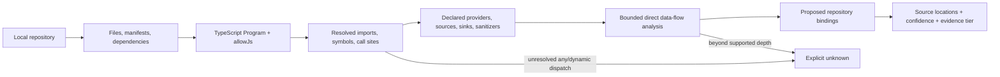

# Milestone 5 — Repository Mapping

Target: **Weeks 5–7**  
Depends on: **Milestone 4 architecture IDs and approved context**  
Primary owner: **Developer B — repository and conformance**

## Outcome

ANVILMARK deterministically maps a TypeScript/JavaScript repository into source-linked observations and proposed bindings to the approved architecture, while reporting unsupported or dynamic behavior as unknown.

This milestone discovers implementation facts. It does not yet decide whether every fact conforms; Milestone 6 evaluates the rules.

## Analysis pipeline

No repository content leaves the machine during this pipeline.

## First detector

Build one detector using the TypeScript compiler API:

- TypeScript and JavaScript through `allowJs`;
- project/tsconfig discovery;
- module and import resolution;
- symbol-aware call-site analysis;
- source locations with normalized repository-relative paths;
- deterministic results for the same source and configuration.

Python, Java, Go, and general multi-language analysis are post-slice extensions.

## Detector plugin interface

Separate these responsibilities so later languages and provider adapters do not rewrite the scanner core:

1. **Inventory** — language, manifests, dependencies, infrastructure declarations, relevant files.
2. **Resolution** — modules, imports, symbols, aliases, and call sites.
3. **Semantics** — contract/provider-specific sources, sinks, sanitizers, model/runtime identifiers.
4. **Flow** — bounded propagation with supported/unsupported reasons.
5. **Binding** — architecture, workload, candidate, and decision references.
6. **Evidence** — exact locations, detector version, confidence, and evidence classification.

Provider knowledge belongs in replaceable recognizers or declarations, not scattered string checks.

## Repository inventory

Collect only facts relevant to the vertical slice:

- TypeScript/JavaScript source roots;
- package manager and manifests;
- AI SDK/runtime dependencies;
- provider/model references;
- environment-variable names without values;
- selected configuration files;
- candidate call sites;
- likely entry points and declared repository roots.

Inventory is not an architecture decision. It becomes evidence that may support a binding.

## Source, sink, and sanitizer model

For Atlas, contract/declaration-backed semantics include:

- raw-ticket source;
- redacted-ticket value;
- local redactor/sanitizer;
- remote provider sinks;
- selected/allowed provider candidate;
- classification workload boundary.

Recognizers should prefer type/symbol resolution over matching names such as `openai` or `redact`. User/contract declarations remain visible when semantic recognition depends on them.

## Bounded data-flow scope

The first slice supports:

- intraprocedural def-use;
- aliases that resolve statically;
- direct calls whose definitions resolve statically;
- one level of direct-call propagation;
- declared sanitizer clearing;
- type-resolved provider sinks.

Report `unknown`, with a reason, for:

- unresolved `any`;
- dynamic property access or dispatch;
- deeper indirection;
- runtime-selected modules/endpoints;
- reflection or code generation;
- queues, databases, event buses, or network hops not modelled;
- unsupported framework transformations.

Unknown is a supported result, not a scanner error.

## Repository binding output

Each proposed binding records:

- stable binding ID;
- contract revision;
- decision/workload/architecture references;
- repository root reference;
- repository-relative file, symbol, and line/column span;
- detector and version;
- deterministic, inferred, user-confirmed, or runtime-confirmed kind;
- confidence and evidence tier;
- source/sink/sanitizer annotations where relevant;
- caveats and unknown reasons;
- observed source content hash.

Never store an absolute user path in a remotely projected binding.

## Trust boundaries and redaction paths

Map recognized call sites to the contract's architecture nodes and trust boundaries. Preserve the difference between:

- a provider dependency existing;
- a provider client being instantiated;
- a provider call site existing;
- raw data provably reaching that call;
- redacted data reaching that call;
- data flow being unresolved.

These observations feed separate Milestone 6 rules.

## Required fixture coverage

Create small TypeScript/JavaScript cases for:

- direct SDK import and call;
- aliased import;
- wrapper function resolved one level deep;
- declared sanitizer on the direct path;
- missing sanitizer;
- JavaScript source through `allowJs`;
- dynamic import/runtime provider;
- unresolved `any`;
- queue/database handoff outside the supported boundary;
- comments or strings containing provider names without actual calls.

Tests must prevent text-only false positives.

## Security and data handling

- Scan local files only.
- Do not log full file contents by default.
- Persist minimal source excerpts only when explicitly permitted; prefer locations and hashes.
- Exclude ignored/generated/vendor directories by default.
- Detect probable secrets before any user-authorized remote projection.
- Show the exact selected files and payload before remote interpretation is requested.

## Suggested team split

### Developer A

- binding/evidence contract integration and evidence classification review.

### Developer B

- compiler-API program, module/symbol/call resolution, bounded flow, fixture cases.

### Developer C

- scanner CLI/MCP boundary, local-data policy, result presentation and filters.

## Out of scope

- Python/Java/Go parsing;
- general interprocedural or cross-service program analysis;
- runtime telemetry ingestion;
- automatic code changes;
- complete architecture reconstruction;
- pass/fail conformance decisions;
- repository upload;
- landing page.

## Exit checklist

- [ ] One detector covers TypeScript and JavaScript through `allowJs`.
- [ ] Detector responsibilities are separated behind a plugin interface.
- [ ] Every claimed call site links to repository-relative source evidence.
- [ ] Provider/model call sites are symbol-aware, not text-only.
- [ ] Atlas sources, sinks, sanitizer, and trust boundaries are representable.
- [ ] Supported direct flows are deterministic.
- [ ] Dynamic/unsupported flows return explicit unknown reasons.
- [ ] Deterministic and inferred bindings are visibly different.
- [ ] No repository content leaves the machine without exact disclosure and consent.
- [ ] Repeated scans of unchanged source are stable.
- [ ] Formatting, lint, tests, and build pass.

## Handoff to Milestone 6

Milestone 6 consumes versioned repository observations and bindings. It must not promote inferred or unresolved mappings into deterministic facts while evaluating a rule.
