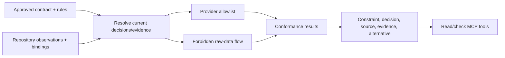
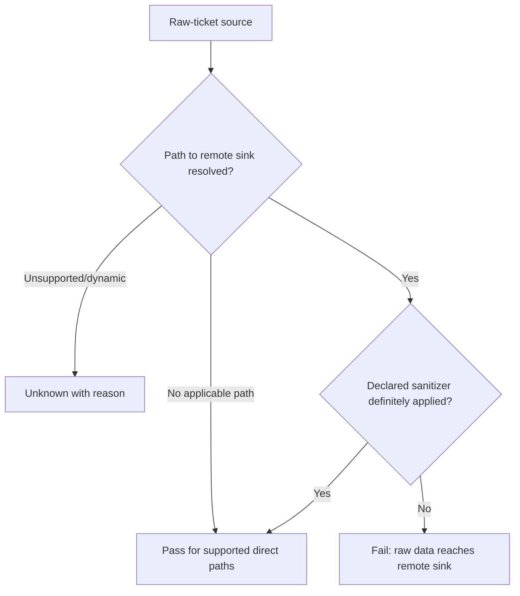

# Milestone 6 — Conformance Loop

Target: **Weeks 7–8**  
Depends on: **Milestone 5 source-linked repository bindings**  
Primary owner: **Developer B — repository and conformance**

## Outcome

ANVILMARK compares the observed repository with the approved contract and produces deterministic, evidence-linked pass/fail/unknown/not-applicable results for the two Atlas rules.

The slice succeeds only when it fails the direct violation, passes the compliant case, and refuses to guess in the ambiguous case.

## Result semantics

| Result           | Meaning                                                                  |
| ---------------- | ------------------------------------------------------------------------ |
| `pass`           | Sufficient in-scope evidence proves the rule is satisfied.               |
| `fail`           | Sufficient in-scope evidence proves a violation.                         |
| `unknown`        | The rule applies, but evidence or analysis scope cannot prove pass/fail. |
| `not_applicable` | The rule does not apply to this declared subject/revision.               |

An analysis error is reported separately and must not be converted to any conformance result.

## Conformance pipeline

Every result identifies the exact contract revision and repository/source revision it evaluated.

## Rule 1 — Provider allowlist

Evaluate whether a type/symbol-resolved provider/model call is allowed by the current approved workload decision.

This rule can prove:

- an approved provider/candidate is used;
- a disallowed provider/candidate is used;
- the provider is unresolved and therefore unknown;
- no applicable provider call exists.

It cannot prove which data reached the provider. That belongs to Rule 2.

## Rule 2 — Forbidden raw-data-to-remote flow

Evaluate the Atlas privacy constraint using:

- contract-declared raw-ticket source;
- type-resolved remote-provider sink;
- declared redactor as sanitizer;
- intraprocedural def-use;
- one level of statically resolved direct-call propagation.

Do not claim whole-program privacy from a bounded direct-flow pass. The result scope must say what was analyzed.

## Required Atlas fixture matrix

| Variant                | Provider rule              | Raw-data-flow rule                   | Expected explanation                                                   |
| ---------------------- | -------------------------- | ------------------------------------ | ---------------------------------------------------------------------- |
| Compliant              | `pass`                     | `pass` within supported direct scope | Approved provider receives sanitizer output.                           |
| Direct violation       | `fail`                     | `fail`                               | Disallowed remote provider receives the raw source at exact call site. |
| Ambiguous runtime path | `unknown` where unresolved | `unknown`                            | Runtime provider/data path exceeds supported analysis; never pass.     |

The direct violation must fail both rules. Provider failure alone does not prove raw-data transmission.

## Result record

Every conformance result includes:

- result ID and time;
- contract revision/hash and repository revision/hash;
- rule, constraint, workload, decision, candidate, and architecture references;
- pass/fail/unknown/not-applicable;
- evidence tier and deterministic/inferred standing;
- exact repository-relative file, symbol, and span;
- source/sink/sanitizer trace for the flow rule;
- supported analysis scope and caveats;
- approved alternative when one exists;
- detector/rule-engine versions;
- stable result hash.

An explanation may be generated for readability but cannot change the deterministic result.

## Suggested alternatives

When a rule fails, suggest only an already approved or explicitly proposed alternative, such as:

- call the approved provider candidate;
- pass the declared sanitizer output rather than the raw source;
- restore the approved local candidate.

Do not generate and present an unvalidated replacement as approved remediation.

## MCP check surface

Add read/check tools:

- `run_conformance` for the declared repository/revision;
- `check_proposed_change` for a local proposed diff or selected files;
- retrieval of detailed result/evidence by ID as needed.

These tools may run checks and return results. They cannot approve decisions, create exceptions, weaken constraints, or modify source.

## Determinism and caching

The same contract, source tree, detector versions, rule-engine version, and configuration must produce the same normalized result. Cache keys must include all of those identities. Stale results are visible and cannot be reused silently after relevant changes.

## Required tests

- all three Atlas variants;
- provider alias, wrapper, and direct call;
- provider name in comments/strings only;
- sanitizer definitely applied and definitely omitted;
- sanitizer result ignored while raw value is sent;
- runtime-selected provider;
- unresolved `any` and dynamic dispatch;
- stale binding or contract revision;
- result source locations and hashes;
- approved-alternative selection;
- repeated-check stability;
- MCP tools attempting forbidden mutation/approval.

## Suggested team split

### Developer A

- constraint/evidence-floor integration, result schema, approved-alternative logic.

### Developer B

- rule engine, provider allowlist, direct-flow rule, fixture matrix, determinism.

### Developer C

- conformance CLI/MCP surface, result presentation, safe proposed-change handling.

## Out of scope

- general program verification;
- whole-system privacy guarantees;
- deep interprocedural/cross-service taint;
- automatic remediation or code writing;
- runtime routing or enforcement;
- broad policy library;
- production telemetry;
- landing page.

## Exit checklist

- [ ] Results use pass/fail/unknown/not-applicable correctly.
- [ ] Provider allowlist and raw-data-flow are separate rules.
- [ ] Direct violation fails both rules with exact constraint, decision, file, and call site.
- [ ] Compliant variant passes within the declared analysis scope.
- [ ] Ambiguous variant returns unknown rather than pass.
- [ ] Every result carries source and contract/repository revision evidence.
- [ ] Explanations cannot override deterministic results.
- [ ] Suggested remediation refers only to approved/proposed alternatives honestly.
- [ ] MCP check tools cannot mutate or approve.
- [ ] Repeated unchanged checks are deterministic.
- [ ] Formatting, lint, tests, and build pass.

## Handoff to Milestone 7

Milestone 7 packages the complete loop and demonstrates failure followed by a correction and passing recheck. It must use the real contract, adapters, generators, scanner, and rule engine rather than a scripted fake result.
