# Milestone 7 — Local Demonstration and Usability

Target: **Weeks 8–10**  
Depends on: **Milestone 6 integrated conformance loop**  
Primary owner: **Developer C — CLI, packaging, and agent experience**

Status: **Acceptance reopened during M6 correction review, September 15, 2026.**
The previous completion checklist exceeded its evidence: fixture loading did
not establish human approval, and two stdio harness clients did not establish
actual agent application consumption. The corrected offline replay supports M6
regression testing. The broader requirements below still require acceptance.
No team acknowledgements are inferred from the replay.

Implementation follow-up, September 16: installation and guided workflow tools
are implemented, verified and merged from `codex/m7-onboarding` into `main`.
See the [onboarding record](07-onboarding-record.md)
and [guided workshop](07-guided-workshop.md). Real-project approval and actual
agent consumption are still separate acceptance steps.

## Outcome

A new developer can install ANVILMARK from a clean checkout and reproduce one coherent Atlas journey from idea through approved decision, agent context, repository violation, correction, and passing conformance—without an ANVILMARK-hosted model or manual transfer among unrelated tools/files.

This is the prototype acceptance milestone, not a production release.

## End-to-end demonstration

```mermaid
flowchart LR
    Idea[Atlas idea] --> Elicit[Structured intent and constraints]
    Elicit --> Candidates[Managed/open/local candidates]
    Candidates --> Evidence[Evidence and explicit gaps]
    Evidence --> Approval[Interactive human approval]
    Approval --> Context[Mermaid, CALM, agent context, MCP]
    Context --> Implement[Claude Code or Codex consumes context]
    Implement --> Scan[Local TS/JS repository mapping]
    Scan --> Fail[Deliberate violation fails]
    Fail --> Fix[Correct implementation]
    Fix --> Pass[Recheck passes]
```

The demo is incomplete if any stage is replaced with a hard-coded output or an unexplained manual copy/paste.

## Installation and packaging

Provide a documented local installation path that:

- starts from a clean checkout;
- verifies supported Node/pnpm versions;
- builds required packages;
- exposes the CLI and MCP server predictably;
- does not require accounts, cloud persistence, or an ANVILMARK key;
- reports optional adapter availability without failing installation;
- includes an uninstall/cleanup explanation for generated local project data.

Do not add automatic model downloads or silently install external runtimes.

## Coherent CLI walkthrough

The walkthrough must cover:

1. initialize Atlas;
2. review/edit structured intent, workloads, constraints, hardware, and unknowns;
3. select user-supplied intelligence or use a pre-authored proposal for an offline reproducible path;
4. collect/import optional evidence;
5. compare candidates and gaps;
6. review and approve one exact decision interactively;
7. generate Mermaid, CALM, and agent context;
8. configure Claude Code and Codex against the same local MCP/files;
9. scan the compliant/violating/ambiguous fixtures;
10. inspect the exact conformance evidence;
11. correct the direct violation and rerun to pass.

Commands and output should share consistent terminology with the contract.

## Read view

A minimal local web read view is optional only when it improves understanding. If included, it may display:

- project and contract revision;
- constraints and their standing;
- workload decisions and alternatives;
- evidence provenance/freshness/gaps;
- architecture view;
- conformance results and source links.

It remains read-only. Approval, exceptions, and authoritative edits stay in the local CLI/contract workflow.

This read view is not the project landing page. Public presentation work remains a separate scope and must not claim capabilities beyond the demonstrated prototype.

## Documentation set

Provide:

- quick start;
- full Atlas walkthrough;
- architecture and package overview;
- contract/evidence semantics;
- security and privacy model;
- remote-data projection explanation;
- approval limitation disclosure;
- optional promptfoo/llmfit setup;
- Claude Code and Codex setup using the same contract;
- scanner/conformance scope and unknown limitations;
- troubleshooting and cleanup;
- contribution/testing guide.

## Security demonstration

Demonstrate, rather than merely state, that:

- no secret is persisted;
- outbound projection is visible before remote use;
- local source stays local by default;
- approval is absent from MCP;
- dynamic analysis gaps become unknown;
- generated files show contract revision;
- stale evidence/results are visible;
- adapters can be absent without breaking core use.

## Agent-neutral acceptance

Run the approved context through both Claude Code and Codex. They do not have to produce byte-identical application code, but they must receive the same approved facts, constraints, architecture, evidence gaps, and forbidden operations.

Record the agent/tool versions and the exact contract revision used for the demonstration.

## Repeatable demo script

Create a script or task runner that prepares fixtures, runs deterministic generation/scanning/conformance, and verifies expected normalized results. Interactive human approval remains a separate visible step and must not be bypassed by the script.

Provide an offline/replay mode using committed safe fixtures so core deterministic behavior can be reproduced without paid provider calls.

## Usability targets

- A new developer can identify the correct starting document immediately.
- Error messages identify the subject, expected correction, and safe next step.
- Pass/fail/unknown are visually and textually distinct.
- Users can trace a recommendation to evidence and a violation to source.
- Optional integrations are clearly optional.
- No screen or command claims objective optimality.

## Prototype acceptance sequence

The recorded demonstration must show one decision moving through:

1. user constraint;
2. candidate evidence;
3. explicit human approval;
4. Claude Code and Codex consumption;
5. repository binding;
6. deterministic conformance check;
7. failure on the deliberate violation;
8. success after correction.

## Required tests

- clean-checkout installation/build;
- core path with optional adapters missing;
- reproducible offline fixtures;
- Claude Code and Codex context equivalence;
- no secret values in project/generated artifacts;
- generated revision/staleness markers;
- deliberate fail, ambiguous unknown, compliant pass, corrected pass;
- documentation commands copied and executed exactly;
- packaging on the team's supported local environments;
- cleanup without deleting user repositories or credentials.

## Suggested team split

### Developer A

- evidence/decision summaries, provenance documentation, fixture integrity.

### Developer B

- deterministic demo fixtures, scan/conformance script, expected-result verification.

### Developer C

- installation, CLI walkthrough, MCP/agent setup, optional read view, security/onboarding docs.

All three developers run the clean-checkout acceptance rather than reviewing only their own track.

## Out of scope

- public hosted SaaS;
- accounts, billing, teams, or cloud persistence;
- production router/observability/deployment;
- editable visual canvas;
- broad language/provider coverage;
- automatic model downloads;
- public launch or commercial validation;
- landing-page implementation.

## Exit checklist

Checked items describe the documented macOS installation and automated
synthetic workflow. They do not establish a real user's decision, actual agent
application consumption, team acknowledgement or other OS support. The
[onboarding record](07-onboarding-record.md) identifies the exact evidence and
remaining acceptance work.

- [x] Clean checkout reproduces the documented installation.
- [x] No ANVILMARK model, key, account, or hosted service is required.
- [x] Optional adapters may be missing without breaking the core demonstration.
- [ ] The same approved facts reach Claude Code and Codex.
- [ ] Every factual recommendation shows provenance, freshness, and uncertainty.
- [x] The deliberate violation fails with exact evidence.
- [x] The ambiguous case returns unknown.
- [x] Correction produces a passing recheck.
- [x] No manual transfer among unrelated files/tools is required.
- [x] Security limitations and analysis boundaries are documented and demonstrated.
- [x] Formatting, lint, tests, build, and clean-install acceptance pass.

## Reassessment after Milestone 7

Continue beyond the prototype only if the unified workflow is materially clearer or faster than assembling the substitute stack manually and the team can maintain the contract, adapters, evidence freshness, and detector scope honestly.

Pause or narrow if the prototype requires building a router, observability platform, hosted model, general program verifier, or thin copy of CALM/another competitor without additional decision-and-evidence value.
