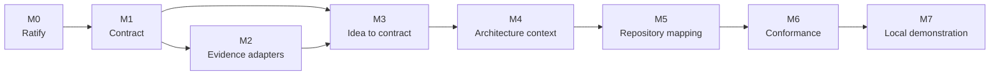

# ANVILMARK Milestone Handbook

Date: **August 19, 2026**  
Status: **Execution companion to the ratified vertical-slice plan**

This directory turns the summary in [`../04-vertical-slice-build-plan.md`](../04-vertical-slice-build-plan.md) into an executable handbook for three developers and their coding agents.

## Authority

Use the documents in this order when statements conflict:

1. [`../06-contract-ratification-decision.md`](../06-contract-ratification-decision.md) — contract, evidence, approval, security, CALM, language, and acceptance-test decisions;
2. [`../04-vertical-slice-build-plan.md`](../04-vertical-slice-build-plan.md) — milestone order, product scope, ownership, and stop triggers;
3. the detailed milestone files in this directory — execution detail;
4. older research and validation documents — historical evidence only.

Do not silently resolve a conflict by changing a milestone file. Record a new team decision and update all affected current documents.

## The complete path

Milestones overlap in calendar time only when their prerequisite contracts are merged and stable. Parallel activity is not permission to invent an interface that an earlier milestone has not established.

## Milestone index

| Milestone | Target           | Primary result                                             | Detailed guide                                                                           |
| --------- | ---------------- | ---------------------------------------------------------- | ---------------------------------------------------------------------------------------- |
| 0         | 2–3 working days | Human-ratified contract and standards boundary             | [`00-ratification-and-standards-boundary.md`](00-ratification-and-standards-boundary.md) |
| 1         | Week 1           | Executable project-contract package and Atlas fixture      | [`01-contract-package-and-fixture.md`](01-contract-package-and-fixture.md)               |
| 2         | Weeks 2–3        | Replaceable intelligence/evidence adapters with provenance | [`02-evidence-and-adapter-boundaries.md`](02-evidence-and-adapter-boundaries.md)         |
| 3         | Weeks 3–4        | Idea-to-reviewed-and-approved-contract CLI flow            | [`03-idea-to-contract-flow.md`](03-idea-to-contract-flow.md)                             |
| 4         | Weeks 4–5        | Architecture, Mermaid/CALM, agent context, read-only MCP   | [`04-architecture-and-generated-context.md`](04-architecture-and-generated-context.md)   |
| 5         | Weeks 5–7        | TypeScript/JavaScript repository map with source evidence  | [`05-repository-mapping.md`](05-repository-mapping.md)                                   |
| 6         | Weeks 7–8        | Deterministic provider and direct-data-flow conformance    | [`06-conformance-loop.md`](06-conformance-loop.md)                                       |
| 7         | Weeks 8–10       | Reproducible local end-to-end demonstration                | [`07-local-demonstration-and-usability.md`](07-local-demonstration-and-usability.md)     |

## Rules that apply to every milestone

- Preserve historical `packages/contract` version `0.1.0`.
- ANVILMARK does not provide or subsidize an intelligence model.
- Never persist a secret value.
- Missing or insufficient evidence becomes `unknown`, never `pass`.
- Generated files are views, never authoritative inputs.
- Approval remains a human, interactive local CLI operation and is absent from MCP.
- Repository content remains local unless the user sees and authorizes the exact outbound projection.
- Every deterministic repository claim links to source evidence.
- Run the Atlas path at least weekly against one contract revision.
- A milestone is complete only when its exit criteria are demonstrated, not when its files merely exist.

## Team convention

For each milestone:

1. open one tracking issue containing the exit checklist;
2. assign a directly responsible developer for each deliverable;
3. agree interfaces before parallel implementation;
4. merge through review rather than sharing an unreviewed long-lived branch;
5. record commands and evidence used to demonstrate completion;
6. update the milestone status only after the integrated acceptance test passes.

A landing page is not part of the current milestone plan. A minimal local read view remains optional in Milestone 7 only when it makes the demonstration easier to understand, and it must not claim unimplemented capabilities.
