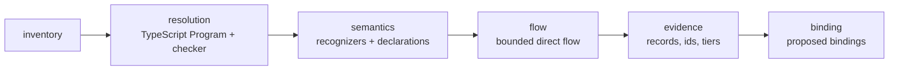

# @anvilmark/scanner

A local, deterministic TypeScript/JavaScript repository scanner (Milestone 5).
It produces source-linked **observations**, bounded **data-flow evidence**,
explicit **unknowns** and **proposed bindings** to the project's approved
architecture, in a versioned local artifact.

It does **not** evaluate conformance rules, emit pass/fail verdicts, write the
project contract, record bindings or approvals, run anything from the scanned
repository, or send anything anywhere. It makes no whole-program privacy,
runtime-enforcement or budget claim. Milestone 6 consumes its output.

Most users run it through the CLI: `anvilmark scan` (see
[`../cli/README.md`](../cli/README.md#repository-scan) and the
[Atlas walkthrough](../../docs/vnext/milestones/05-atlas-walkthrough.md)).

## Pipeline and replaceable stages



`scanRepository(input)` runs a `ScanPipeline`. Each stage is a
`StageImplementation<Input, Output>` (`id`, `version`, `run`) with a typed
input/output interface (`InventoryInput → Inventory`, `ResolutionInput →
ResolutionOutput`, `SemanticInput → SemanticOutput`, `FlowInput → FlowResult`,
`EvidenceInput → ObservationBundle`, `BindingInput → ProposedBinding[]`).
`input.pipeline` replaces any stage; the artifact records every stage's id and
version. Provider and library knowledge lives only in **recognizers**
(`input.recognizers`), which are data.

| Stage      | Responsibility                                                                                                                                                                                                                         |
| ---------- | -------------------------------------------------------------------------------------------------------------------------------------------------------------------------------------------------------------------------------------- |
| inventory  | Source roots and files, exclusions (and why), `package.json` manifests, package-manager facts, AI SDK dependencies (declared and installed versions), lockfiles (hash only), likely entry points (`main`, `module`, `bin`, `exports`). |
| resolution | tsconfig/jsconfig discovery and a real `ts.Program` with a type checker; `allowJs` forced on; module resolution through the bounded host; imports of recognized packages, unresolved imports and runtime-selected imports.             |
| semantics  | Client instantiations and provider calls from resolved declarations; environment-variable **names**; possible-operation and runtime-provider unknowns; scan declarations bound to resolved functions and checked against the contract. |
| flow       | Bounded, declaration-driven data flow into every provider call (below).                                                                                                                                                                |
| evidence   | Stable ids, repository-relative locations with source hashes, discovery kinds, evidence tiers, unknown records.                                                                                                                        |
| binding    | Proposed bindings to components, provider nodes, candidates, workloads and decisions, with hash-aware approval and confirmation standing.                                                                                              |

## Dependency record: `typescript`

The build plan requires a record before a dependency is adopted.

| Field       | Record                                                                                                                                                                                                                                                                               |
| ----------- | ------------------------------------------------------------------------------------------------------------------------------------------------------------------------------------------------------------------------------------------------------------------------------------ |
| Package     | `typescript`, pinned to exactly `5.9.3` as a **runtime** dependency of this package (it was already the workspace's build-time compiler, `^5.9.0` resolving to 5.9.3).                                                                                                               |
| Licence     | Apache-2.0 (from the installed package's `package.json`).                                                                                                                                                                                                                            |
| Maintenance | Microsoft's TypeScript project; public compiler API; regular releases. The exact version is pinned so analysis results are reproducible; the version actually loaded is recorded in every artifact (`scanner.typescript_version`) and a different version makes a stored scan stale. |
| Data flow   | Entirely in-process. The scanner gives the compiler a host whose file reads go through `RepositoryReader` (repository and TypeScript's own `lib.*.d.ts` only); the compiler emits nothing, loads no plugins, and makes no network or process calls.                                  |
| Reason      | Ratification §7 names the TypeScript compiler API with `allowJs` as the first repository detector; symbol-aware, type-resolved call sites are not achievable with text search.                                                                                                       |

No other dependency was added.

## Scan declarations (`anvilmark-scan-config/0.1.0-draft.2`)

A YAML or JSON file, by default `.anvilmark/scanner.yaml`. It is local
configuration, not part of the project contract.

`0.1.0-draft.1` files are still accepted unchanged.

```yaml
format: anvilmark-scan-config/0.1.0-draft.2
repository_root: ../app # project-relative; optional
include: ["."] # repository-relative source roots
exclude: [] # additional repository-relative exclusions
tsconfig: null # null discovers tsconfig.json, then jsconfig.json
recognizers: null # provider recognizer ids to enable; null = all
sources:
  - id: source.raw_ticket
    data_classification: raw_customer_ticket
    function: { path: src/intake.ts, export: readTicket }
    from: return # or `parameter` with `parameter: N`
    architecture_node_ref: ticket-intake
sanitizers:
  - id: sanitizer.pii
    function: { path: src/redactor.ts, export: redactTicket }
    argument: 0 # the argument whose classification is cleared
    clears: [raw_customer_ticket]
    produces: redacted_customer_ticket
    architecture_node_ref: pii-redactor
sinks:
  - id: sink.remote_provider
    recognizer: openai
    operations: [] # empty = every operation of the recognizer
    paths: [] # empty = anywhere; otherwise the files or directories to scope it to
    models: null # the values a run-time model may take, if you know them
    providers: null # the providers a run-time endpoint may reach, if you know them
    architecture_node_ref: remote-model-provider
    candidate_ref: candidate.classification.remote_unselected
components:
  - id: component.classifier
    path: src/classifier.ts
    export: null # or an exported function to restrict the component
    architecture_node_ref: ticket-classifier
    workload_ref: classification
```

- `function` is resolved through the module's export table by the checker
  (re-exports and CommonJS `module.exports` included). A same-named function
  elsewhere is never matched.
- A declaration that does not resolve, or names a node, candidate, workload or
  data classification the contract does not contain, is reported with its
  problem codes and is not used as that mapping. The scan still completes.
- A declared sanitizer is an assumption about that function. Its body is not
  analysed, and its effectiveness is never claimed.
- `models` and `providers` on a sink are **your statements** about values the
  code chooses at run time. Conformance uses them as declared evidence (T1)
  where the code alone is unresolved; the scan still records what it observed.
- `anvilmark scan draft-config` prints a draft of this file from a scan made
  without declarations: observed calls and unsupported SDK calls as comments,
  one sink per recognizer scoped to where its calls are, and commented
  suggestions for sources and components. It fills a node or candidate in only
  where the contract leaves exactly one choice.
- An invalid file is a scanner failure: nothing is scanned and nothing is
  written. Issue messages name fields, never file contents.

## Recognizers

| Id                          | Kind     | Matches                                                                                                                                                                                                                                          |
| --------------------------- | -------- | ------------------------------------------------------------------------------------------------------------------------------------------------------------------------------------------------------------------------------------------------ |
| `openai`                    | provider | package `openai`; clients `OpenAI` and `AzureOpenAI` (endpoint options `baseURL`, `endpoint`; an Azure client must have one, and reports provider `azure_openai`); every method of a class under `resources/`; default deployment `managed_api`. |
| `anthropic`                 | provider | package `@anthropic-ai/sdk`; client `Anthropic` (endpoint option `baseURL`); every method of a class under `resources/`.                                                                                                                         |
| `together`                  | provider | package `together-ai`; client `Together` (endpoint option `baseURL`); every method of a class under `resources/`.                                                                                                                                |
| `ollama`                    | provider | package `ollama`; client `Ollama` (endpoint option `host`); operations `chat`, `generate`, `embed`, including through the default-export instance; default deployment `local`.                                                                   |
| `ai-sdk`                    | provider | package `ai`: `generateText`, `streamText`, `generateObject`, `streamObject`, `embed`, `embedMany`, with the endpoint and model read from the `model:` factory call (`@ai-sdk/*`, `ollama-ai-provider`).                                         |
| `http`                      | provider | `fetch` to a known provider host: the request is a provider call, with the method and path as its operation and the model read from a literal JSON body.                                                                                         |
| `queues`                    | boundary | `bullmq`, `bull`, `amqplib`, `kafkajs`, `@aws-sdk/client-sqs`, `@google-cloud/pubsub`.                                                                                                                                                           |
| `databases`                 | boundary | `pg`, `mysql2`, `mongodb`, `mongoose`, `ioredis`, `redis`, `@prisma/client`, `better-sqlite3`, `sqlite3`, `knex`, `drizzle-orm`.                                                                                                                 |
| `node-events-and-processes` | boundary | ambient modules `events`, `worker_threads`, `child_process` (with and without `node:`); globals `postMessage`, `BroadcastChannel`, `MessagePort`, `Worker`.                                                                                      |
| `network`                   | boundary | `axios`, `got`, `node-fetch`, `undici`, `ky`; ambient `http`, `https`, `net`, `http2`; globals `fetch`, `XMLHttpRequest`, `WebSocket`, `EventSource`.                                                                                            |
| `unsupported-ai-sdks`       | list     | AI SDKs with no recognizer (for example `@google/generative-ai`, `@mistralai/mistralai`, `groq-sdk`, `@openai/agents*`, `@langchain/*`, `llamaindex`): calls into them are `unsupported_provider_sdk` unknowns.                                  |

**Where a call goes** is the endpoint, not the SDK's vendor: each call and
client records `endpoint` — how it was selected (`default`, `literal_override`,
`runtime_selected`, `unlinked`), the host, the provider that host belongs to,
and `managed_api` or `local`. An OpenAI client with Groq's base URL is a Groq
call; a host that is not in the table has no provider, and a base URL computed
at run time is `runtime_selected`, never a guess. `linkage` says how the call
reached its client (`client`, `clients`, `repository_uniform`, `factory`,
`http`, `unlinked`).

**What a call does** is its operation kind: `inference`, `embedding`,
`data_upload` or `management`. Conformance uses it to compare like with like —
an embedding call is not judged against an approved chat model, and an upload
or management call is judged on provider identity alone.

A declaration matches only by **where the compiler resolved it**: the npm
package containing the declaration file (its last `node_modules/` segment),
the owning class or interface name in that package, and the member name.
Aliased imports, namespace imports, re-exports and stored member references
(`const c = client.chat.completions; c.create(...)`) resolve to the same
declaration. Strings, comments and template text are never inspected; a local
class named `OpenAI`, a local `create` function or a parameter shadowing the
import never match.

The provider recognizers were written against the public declaration shapes of
the named packages. The unit tests exercise them only against **synthetic**
declarations that mirror those shapes (`test/fixtures/synthetic-sdks/`); no
real SDK is installed or run there. The real packages are exercised separately
by the real-repository benchmark (`benchmarks/real-repos/`), which installs
dependencies with scripts disabled and runs no repository code.

The four levels are kept apart: a dependency (`inventory.ai_dependencies`,
declared and `installed_version`), a client instantiation, a provider call,
and data reaching that call (`data_flows`).

## Bounded flow semantics (`bounded-direct-call/3`)

Data classifications come only from **declared sources**. Each value carries
facts (`classification`, `raw` or `sanitized`, the declaration, a trace and
whether it holds on only some paths) and opaque parts (unknown reasons).

Supported, deterministically within these rules:

- intraprocedural def-use through `const`/`let`/`var`, reassignment, compound
  assignment, object and array destructuring (with defaults), object literals
  (property-sensitive, including shorthand, spreads and literal computed
  keys), arrays (element-insensitive), template strings, `+`, `await`,
  parentheses and type assertions, `?:`, `&&`, `||` and `??`;
- aliases the checker resolves: imports, re-exports, `const f = g`, module
  `const` values (evaluated from their initializer, also through namespace
  imports);
- calls into TypeScript's default library propagate the receiver's and
  arguments' facts to the result (`raw.trim()`, `JSON.stringify(raw)` stay raw);
- a declared source's call result (`from: return`) or declared parameter
  (`from: parameter`) carries its classification;
- a declared sanitizer's **return value** no longer carries the cleared
  classification from the declared **argument**; it carries `produces`, marked
  `sanitized`. The argument itself is unchanged, so sending the original after
  calling the sanitizer still sends raw data. Facts in other arguments are
  carried to the result conservatively;
- `if`/`else`, `switch`, `try`/`catch`/`finally` and loops (evaluated twice)
  join both paths; a fact present on only one path is `conditional`. A
  reassignment on one branch is therefore not "definitely sanitized". Implicit
  flows (data influencing control decisions) are not tracked;
- **three levels of direct-call propagation**, defined precisely: every function
  body and every module top level is an analysis root. From a root, a call
  whose resolved signature is a repository function with a body (function,
  arrow, function expression, class method, constructor or accessor, not
  recursive) is followed once: its body is evaluated with the caller's
  argument values bound to its parameters, sinks inside it are recorded in a
  `direct_call` context, and its return values flow back to the call. Calls
  inside a followed body are followed the same way, three deep; beyond that the
  result is `call_depth_exceeded`, recorded where the call is. Declared sources
  and sanitizers are applied, not followed.

Two bounds keep a single value from growing without limit, and both may only
widen what is reported: a value carries at most **48** distinct unresolved
points (the rest become one `analysis_budget_exceeded` entry at the first
dropped span) and at most **64** tracked properties per object (the rest
collapse into the catch-all member that property reads already fall back to).

Each provider call's `data_flows` record lists every context in which the
call was reached: the function's own `intraprocedural` root (its parameters
are `parameter_value_from_caller`), `module` for top-level code, and one
`direct_call` context per followed call site. An `intraprocedural` context is
`superseded` when every in-repository reference to that function is a direct
call that was followed; superseded contexts stay visible and are excluded from
the record's status.

Status of the data reaching a call (over non-superseded contexts, in order):

| Status             | Meaning                                                                                                  |
| ------------------ | -------------------------------------------------------------------------------------------------------- |
| `raw_reaches`      | A raw declared classification reaches the call on at least one path (`conditional` says whether on all). |
| `unresolved`       | Some of what reaches the call could not be established; `unknown_reasons` say why.                       |
| `sanitized_only`   | Only sanitized classifications reach it, through declared sanitizers.                                    |
| `no_declared_data` | No declared classification was observed. This is relative to the declared sources, never "safe".         |

All arguments of a provider call are treated as sent.

## Unknown reasons

Analysis unknowns are separate from read, parse and configuration errors
(`analysis_errors`), from scope limits (`limits`) and from facts that do not
limit completeness at all (`notes`, for example editor-only tsconfig plugins or
a repository outside the contract's roots). Each unknown keeps its location,
the analysis context, the classifications it carried and the partial trace
observed so far, plus two fields that say how much it matters:

- `carries`: `declared_data`, `unresolved_data`, `no_tracked_data` or
  `not_applicable` (resolution and semantic unknowns are not flow events).
- `ai_related`: the unknown concerns an AI provider call, endpoint, model or
  SDK. `anvilmark scan show --section unknowns` lists these first; `--all`
  lists every one.

| Reason                                   | When                                                                                                      |
| ---------------------------------------- | --------------------------------------------------------------------------------------------------------- |
| `unresolved_import`                      | A module specifier did not resolve inside the repository boundary.                                        |
| `runtime_selected_import`                | `import(expr)` or `require(expr)` with a non-literal specifier.                                           |
| `unresolved_any`                         | A call or identifier whose type is `any` or unresolved.                                                   |
| `possible_provider_operation_unresolved` | An `any` call shaped like a recognized operation. Never reported as a provider call.                      |
| `runtime_selected_provider`              | A receiver whose type is a union across recognized providers (or a provider and something else).          |
| `runtime_selected_endpoint`              | A client endpoint option computed at run time.                                                            |
| `dynamic_property_access`                | `obj[key]` with a non-literal key on a value that carries data.                                           |
| `dynamic_dispatch`                       | A call through an interface, abstract or union-typed member, or a function-typed value with no body.      |
| `call_depth_exceeded`                    | A repository call deeper than the model's three levels.                                                   |
| `recursive_call`                         | A call back into a function already on the analysis stack.                                                |
| `callback_not_followed`                  | Data passed into, or received through, a callback the flow model does not follow.                         |
| `reflection_or_code_generation`          | `eval`, `Function`, `Reflect`, `Proxy`, `with`.                                                           |
| `unmodelled_handoff`                     | A queue, database, event, worker or process boundary (both the handoff and values/callbacks coming back). |
| `unmodelled_network_hop`                 | A network library or global such as `fetch`.                                                              |
| `unsupported_provider_sdk`               | A call into a known AI SDK without a recognizer.                                                          |
| `external_call_not_modelled`             | Data passed into another package or a non-analysed repository file (e.g. a declaration file).             |
| `parameter_value_from_caller`            | A root function's parameter whose callers were not all followed.                                          |
| `captured_variable_not_tracked`          | A closure or module `let`/`var` variable.                                                                 |
| `property_not_tracked`                   | `this.x` / `super.x` instance state.                                                                      |
| `unsupported_construct`                  | Syntax the flow model does not handle (generators, tagged templates, JSX, …) carrying data.               |
| `analysis_budget_exceeded`               | A root exceeded the evaluation budget, or one value carried more unresolved points than the model keeps.  |

An artifact with any unknown, analysis error, declaration problem or scope
limit such as a refused link is `completeness.status: "incomplete"`. An empty
set of observations never means the repository is safe.

## Filesystem and data boundaries

- `RepositoryReader` is the only reader. Every path is `realpath`-resolved and
  must lie below the physical repository root, or be a `lib.*.d.ts` in the
  loaded TypeScript's own `lib` directory. Links that escape the repository are
  refused and recorded by their repository-relative name; the compiler's probes
  of ancestor `node_modules` directories are refused silently and never
  recorded (they would be absolute paths).
- Denied directories (the project's `.anvilmark/`) are refused even inside the
  repository. Default exclusions: `.anvilmark`, `.cache`, `.git`, `.hg`,
  `.next`, `.nuxt`, `.output`, `.pnpm-store`, `.svelte-kit`, `.turbo`,
  `.vercel`, `.yarn`, `bower_components`, `build`, `coverage`, `dist`,
  `jspm_packages`, `node_modules` (declarations there are read only as
  resolution inputs, JavaScript never), `out`, `vendor`; `*.min.js`; `.env*`
  files are never read. The root `.gitignore` is applied (a documented subset;
  negations and nested `.gitignore` files are reported as not applied).
- The inventory walk never follows symbolic links. Files above 2 MiB are
  refused as a limit.
- tsconfig `extends` outside the repository is not read (a `tsconfig_invalid`
  error), `plugins` are never loaded and `references` are not followed (both
  limits). File selection is the scan inventory, never the tsconfig's.
- Nothing is written, spawned, fetched or evaluated. Package scripts, builds,
  executables and tsconfig plugins are never run.
- The artifact holds repository-relative paths, 1-based spans and `sha256`
  hashes. It holds no absolute path, no source excerpt (there is no excerpt
  option), no environment-variable value (names only), no dependency URL or
  local path (`<non-registry specifier>`), and no model literal that looks like
  a credential (`redacted_suspected_secret`).
- These guards bound what the scanner reads under normal conditions; they do
  not defend against a concurrent process swapping files or links mid-read.
  `recheck()` re-reads every input so a publisher can refuse a changed tree.

## The artifact (`anvilmark-repository-scan/0.1.0-draft.3`)

`ScanArtifactSchema` (Zod, strict) validates it; `readArtifact(text)` parses,
validates and recomputes its hash (`valid`, `invalid` or `tampered`).

| Field               | Content                                                                                                                                                                                                             |
| ------------------- | ------------------------------------------------------------------------------------------------------------------------------------------------------------------------------------------------------------------- |
| `format`            | `anvilmark-repository-scan/0.1.0-draft.3`                                                                                                                                                                           |
| `content_hash`      | `sha256` over the canonical JSON of every field except `content_hash` and `observation`.                                                                                                                            |
| `observation`       | `observed_at` and its `basis` (`explicit`, `clock`). The only time-derived value; reused verbatim for identical content.                                                                                            |
| `scanner`           | scanner id/version, `typescript_version`, `flow_model` (`bounded-direct-call`, `3`, `call_depth: 3`), stage ids/versions, recognizer ids/versions.                                                                  |
| `contract`          | project id, schema version, `contract_revision`, `contract_hash`, `state_revision`.                                                                                                                                 |
| `repository`        | project-relative `root`, `snapshot_hash` over `inputs`, `declared_in_contract`, and every input read (`path`, `sha256`, `role`).                                                                                    |
| `configuration`     | declaration file source/path/hash, include/exclude, recognizer selection, compiler summary (tsconfig used, key options, forced options).                                                                            |
| `inventory`         | counts, manifests and entry points, lockfiles, AI dependencies, environment-variable names with locations, exclusions.                                                                                              |
| `declarations`      | each declaration's resolution status, problems, location and architecture-node standing (`declared_mapping`, T1).                                                                                                   |
| `observations`      | `sdk_import`, `client_instantiation`, `provider_call` (provider, operation, operation kind, owner, model, `endpoint`, `linkage`, client link, default deployment, caveats), each `deterministic_observation` at T3. |
| `data_flows`        | per provider call: status, classifications, unknown reasons, contexts with facts, traces and unknowns, `trace_tier`, T1 `assumptions`, `evidence_tier`, caveats.                                                    |
| `proposed_bindings` | per provider call: component, provider node, workload, candidate, decision (status, hash-aware approval state, selected candidate), discovery, confidence, tier, unbound reasons, `contract_projection`.            |
| `unknowns`          | reason, stage, location, context, classifications, `carries`, `ai_related`, detail, observation reference, partial trace.                                                                                           |
| `analysis_errors`   | `file_read_error`, `parse_error`, `manifest_*`, `tsconfig_missing`, `tsconfig_invalid`, `compiler_option_error` with path, span and code (never message text).                                                      |
| `limits`            | scope limits (links, denied directories, oversized files, unapplied ignore rules, project references, unknown recognizer ids).                                                                                      |
| `notes`             | facts that do not limit completeness (editor-only tsconfig plugins, a repository outside the contract's roots).                                                                                                     |
| `completeness`      | `complete_within_supported_scope` or `incomplete`, with reasons.                                                                                                                                                    |
| `statement`         | the fixed statement that this is not a conformance result.                                                                                                                                                          |

Stable ids are derived from kind and location (`call.<hash>`,
`flow.<hash>`, `binding.<hash>`, `unknown.<hash>`); they change when code moves.
Ordering is deterministic throughout.

### Discovery taxonomy and evidence tiers

| Local discovery kind        | Established by                                                                                    | Tier                              |
| --------------------------- | ------------------------------------------------------------------------------------------------- | --------------------------------- |
| `deterministic_observation` | the compiler: resolved module, symbol, signature and span                                         | T3, for exactly the fact observed |
| `declared_mapping`          | a user-authored scan declaration applied to resolved code                                         | T1                                |
| `heuristic_association`     | the scanner's structural guess (a remote SDK call and the contract's only `remote_provider` node) | T0                                |
| `unresolved`                | nothing could be established                                                                      | T0                                |

A data-flow record is T3 for the traced path within this flow model and lists
the declared sources and sanitizers it relies on as T1 assumptions; an
`unresolved` record is T0. No heuristic is ever encoded as an agent's
assertion: `agent_inferred` is never produced.

## Zero-configuration inventory

`inventoryRepository({ repositoryPath })` scans a repository with **no project,
contract or declarations** and returns `aiInventory(content)`: where requests
go (provider, hosts, deployment, operation kinds, call counts), the models
named, every recognized call site, the AI SDKs without a recognizer whose calls
are not inventoried, AI dependencies, the environment-variable **names** read
in files that use those SDKs (never a value), and what stayed uncertain —
marking whether each uncertainty is about a listed call or about usage that may
be missing from the list altogether. `anvilmark inventory` renders it as text,
Markdown or JSON. It states no conformance result and writes nothing.

## Milestone 6 handoff API

- `readArtifact(text)` — validate and self-check a stored artifact.
- `assessArtifactStanding(artifact, contract)` — recheck against the current
  contract: contract hash and revision, each referenced decision's approval
  state (`approvalState`) and each referenced architecture node's content hash
  and confirmation standing (`architectureContentHash`,
  `confirmationStanding`). `current: false` means rescan first.
- `toContractRepositoryBinding(artifact, binding)` — the draft.5
  `RepositoryBinding` shape, only for a `declared_mapping` binding to a decision
  whose approval was current at scan time. `discovery.kind` is `deterministic`
  (compiler facts and user declarations applied mechanically), `detector` is
  `anvilmark-scanner@<version>`, `observed_at` is the artifact's. It returns a
  value and writes nothing; spans, hashes, traces and unknowns are only in the
  artifact, so the artifact — not the projection — is the handoff.

Milestone 6 must not promote `heuristic_association`, `unresolved`, a
`conditional` fact or a T1 assumption into a deterministic fact.

## Known limitations

- TypeScript and JavaScript only; one Program per scan; project references
  are not followed; tsconfig file selection is not used.
- The flow model is the bounded one above: no general interprocedural
  analysis, no closures or instance state, no callbacks, no async iteration,
  no queue/database/event/network semantics, element-insensitive arrays, and
  implicit flows ignored. Each such case is an explicit unknown when it
  carries data.
- Six provider recognizers (`openai`, `anthropic`, `together`, `ollama`,
  `ai-sdk`, `http`). Other AI SDKs are recognized only as unsupported, and
  their calls are reported as `unsupported_provider_sdk` unknowns rather than
  inventoried. `@google/generative-ai` is the notable one: it binds the model
  when the client makes a model object (`getGenerativeModel({ model })`) and
  calls it later, which this model has no way to carry yet.
- A model chosen at client construction rather than at the call is not resolved
  (the call reports `runtime_selected`); declare the possible values with
  `models:` on the sink if you know them.
- Endpoint overrides by environment variable are a caveat
  (`sdk_endpoint_may_be_set_by_environment:*`), not a resolved fact; the
  provider's default deployment is recognizer knowledge.
- Ignore-file handling is a subset of Git's, now including negations and
  nested `.gitignore` files; patterns it does not implement are reported.
- The boundary is a guard against misconfiguration and pre-existing links,
  not a race-proof sandbox.

## Tests

```bash
pnpm --filter @anvilmark/scanner test
```

Real compiler and type checker on fixture repositories copied to temporary
directories: the required scenarios (`test/scenarios.test.ts`), boundary
regressions (`test/boundaries.test.ts`) and the three Milestone 6 handoff
fixtures with standing and projection checks (`test/handoff.test.ts`). The
CLI package runs the same scanner through the built binary.
